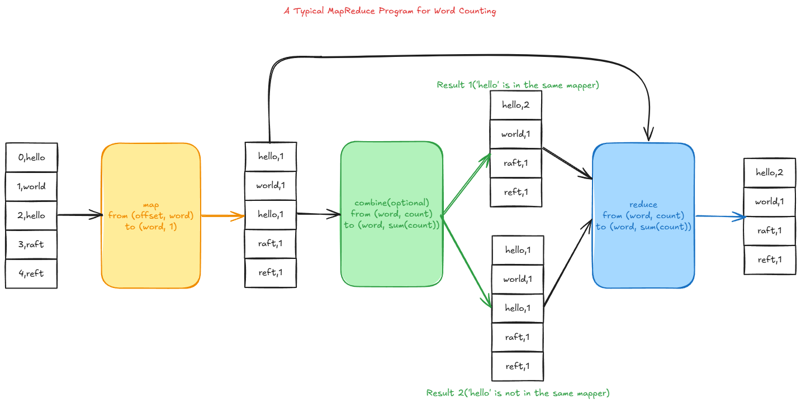
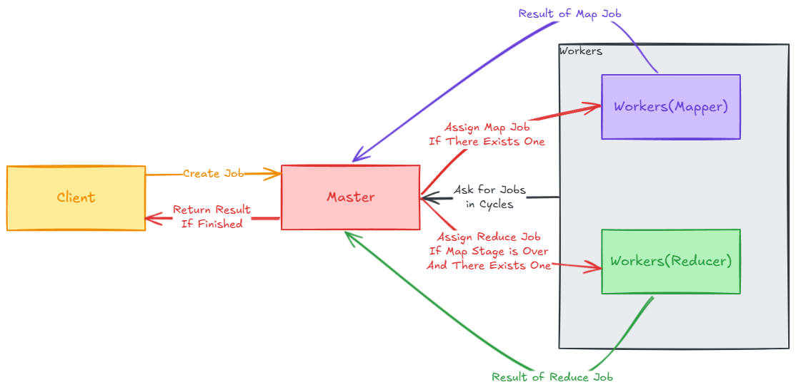
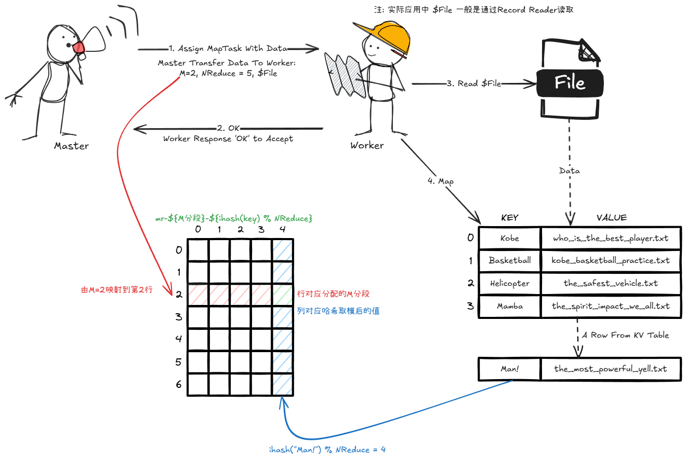
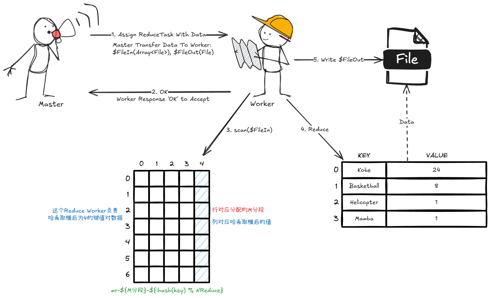
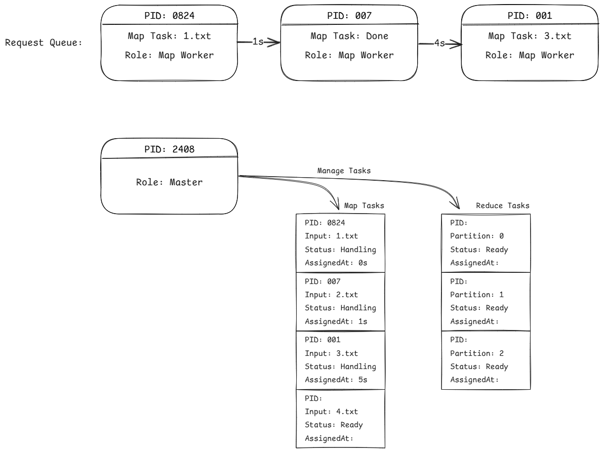
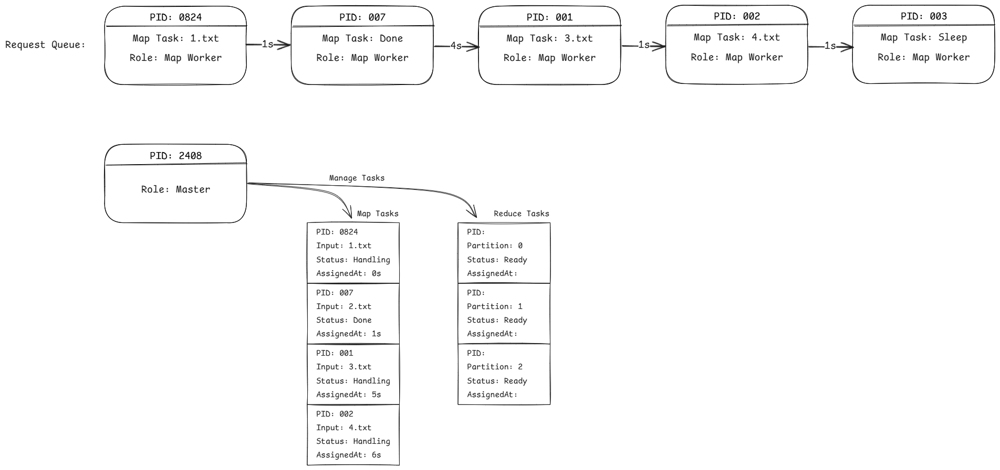
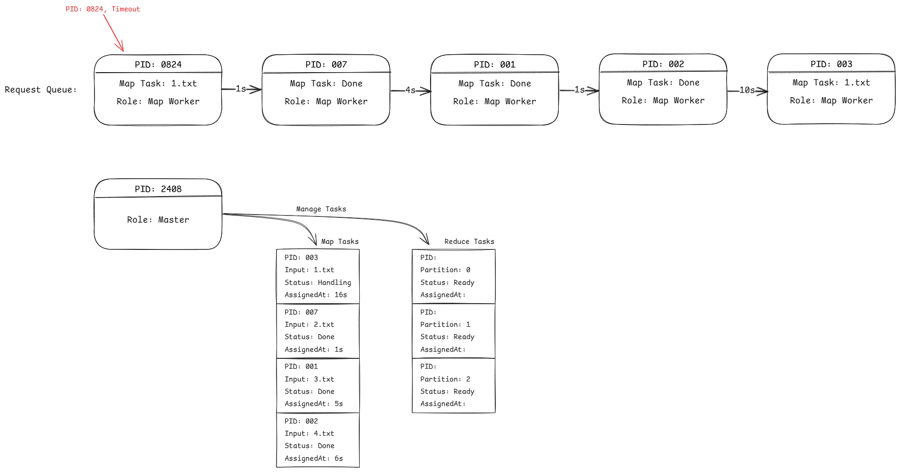
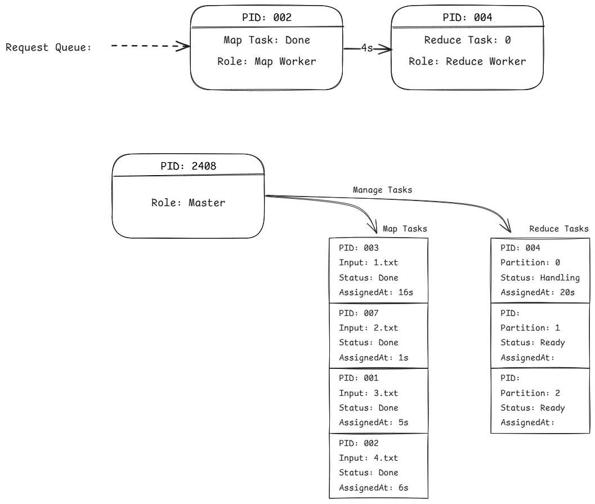
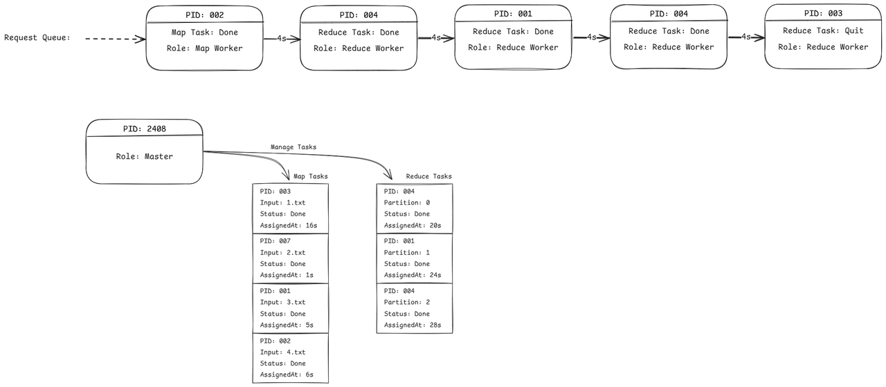
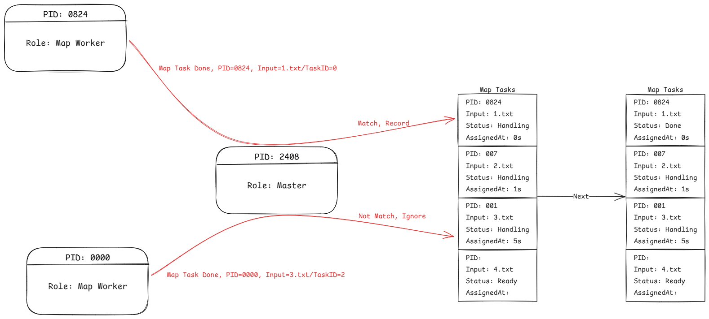

# MIT 6.5840(2024) Lab 1

## 1. 任务
Your job is to implement a distributed MapReduce, consisting of two programs, the coordinator and the worker. There will be just one coordinator process, and one or more worker processes executing in parallel. In a real system the workers would run on a bunch of different machines, but for this lab you'll run them all on a single machine. The workers will talk to the coordinator via RPC. Each worker process will, in a loop, ask the coordinator for a task, read the task's input from one or more files, execute the task, write the task's output to one or more files, and again ask the coordinator for a new task. The coordinator should notice if a worker hasn't completed its task in a reasonable amount of time (for this lab, use ten seconds), and give the same task to a different worker. (https://pdos.csail.mit.edu/6.824/labs/lab-mr.html)

你的任务是实现一个分布式MapReduce，由两个程序组成，Cooridinator和Worker。只有一个Coordinator进程和一个或多个并行执行的Worker进程。在一个真实的系统中，Worker将在一堆不同的机器上运行，但在这个实验里，你将在一台机器上运行它们。Worker将通过RPC与Coordinator对话。每个Worker进程将在一个循环中向Coordinator请求一个任务，根据任务读取一个或多个文件并将MapReduce结果写入一个或多个文件，然后再次向Coordiantor请求一个新任务。Coordiantor应该注意到一个Worker进程是否在合理的时间内没有完成其任务（在这个实验中，十秒钟为超时），并将这个任务交给其它Worker进程。 

## 2. 任务分析（粗略）
<s>如果在分析都讲完了我代码还要说什么</s>
Lab1 任务要求我们将一个MapReduce单体式程序改造为分布式程序，将其拆分为Coordinator与Worker。

### 2.1 Coordinator职责
原本单体式并不存在协调的需求，而当单体式程序转化为分布式程序时，必须要有个中间程序调整和配置每个子节点的工作，以防止出现冲突。因此Coordinator的职责就是分派与协调Worker节点们的工作，同时要应对某些异常情况。

### 2.2 Worker职责
Worker只要完成Map和Reduce操作就行了，而我们Coordinator考虑的就很多了。也就是说，Worker只需要按照任务完成Map与Reduce即可。如果发生冲突，完全是Coordinator的问题。

## 3. 论文分析
论文原文：https://pdos.csail.mit.edu/6.824/papers/mapreduce.pdf

### 3.1 MapReduce
MapReduce 是一种处理和产生大数据集的编程模型。用户指定一个mapf来处理一些键值对，并生成对应的中间键值对，然后使用reducef聚合所有mapf产生的中间键值对。
简单来说，MapReduce操作是这样的：


### 3.2 分布式逻辑
论文中解释到：
  - MapReduce客户端会将文件分为M个片段，片段大小一般来说在16MB到64MB之间。之后会在集群上运行MapReduce程序
  - 集群中有且仅有一个节点会被选举为**master**节点，剩余的节点都得听他的调配。**master**节点需要把M个Map操作所需文件片段与R个Reduce任务分派给剩余节点（我们把剩余节点称为Worker，而master节点就是Coordinator）
  - 一个执行Map操作的Worker节点需要读取分配到的文件片段，根据Partition（Lab1用ihash）将中间结果分为R个部分（Lab1为NReduce），这些结果暂存在内存里
  - 这些Map操作的结果需要周期性地依据Partition函数从内存写入到本地磁盘的对应区域。Map任务完成后，需要将文件存放的位置告知给master节点，以便master节点分配Reduce任务。
  - master节点会将Map操作的结果文件发送给需要执行Reduce操作的Worker。这些Worker接收到消息后，读取master节点所指定的文件，并将读取的数据进行排序，保证相同键值能够连续分布
  - 执行Reduce操作的Worker会为每个键聚集对应值的集合，并调用用户定义的Reduce函数，将结果放入结果文件。
  - MapReduce操作结束后，master节点会唤醒用户程序。此时，结果会返回给用户。

流程可参考如下：


## 4. 单体式实现
在实验中，单体式MapReduce实现如下：
### 4.1 Map
``` go
//
// read each input file,
// pass it to Map,
// accumulate the intermediate Map output.
//
intermediate := []mr.KeyValue{}
for _, filename := range os.Args[2:] {
    file, err := os.Open(filename)
    if err != nil {
        log.Fatalf("cannot open %v", filename)
    }
    content, err := ioutil.ReadAll(file)
    if err != nil {
        log.Fatalf("cannot read %v", filename)
    }
    file.Close()
    kva := mapf(filename, string(content))
    intermediate = append(intermediate, kva...)
}
```
这段代码通过读取一个文件用mapf函数将文件内的文本单词转换为一群键值对。
需要注意的是，Map操作只是将文本变成**键值对的集合**，而键值对的值**不一定是数字**，这是由mapf函数决定的。

### 4.2 Reduce
``` go
//
// a big difference from real MapReduce is that all the
// intermediate data is in one place, intermediate[],
// rather than being partitioned into NxM buckets.
//
sort.Sort(ByKey(intermediate))
oname := "mr-out-0"
ofile, _ := os.Create(oname)
//
// call Reduce on each distinct key in intermediate[],
// and print the result to mr-out-0.
//
i := 0
for i < len(intermediate) {
    j := i + 1
    for j < len(intermediate) && intermediate[j].Key == intermediate[i].Key {
        j++
    }
    values := []string{}
    for k := i; k < j; k++ {
        values = append(values, intermediate[k].Value)
    }
    output := reducef(intermediate[i].Key, values)
    // this is the correct format for each line of Reduce output.
    fmt.Fprintf(ofile, "%v %v\n", intermediate[i].Key, output)
    i = j
}
ofile.Close()
```
Reduce操作先将键值对排序，然后以键为特征，分类汇总为多个集合，此时生成的键值对（这里指的是Key与reducef(...)，而不是Map的Key与Value）为最终所需结果。

## 5. 分布式实现
### 5.1 RPC
#### 5.1.1 任务种类
master节点应该告知Worker任务种类。对于任务的种类，显然有Map和Reduce；当Map或Reduce仍未完成而又没有Map和Reduce可分配时，master节点应该通知Worker去休息；当Map以及Reduce全部完成时，master节点应该通知Worker下班。因此任务种类定义如下：
``` go
type TaskType int
const (
    MapTask = iota
    ReduceTask
    SleepTask
    QuitTask
)
```
#### 5.1.2 任务状态
不必多言
``` go
type Status int
const (
    Ready = iota
    Handling
    Done
)
```
#### 5.1.3 Worker发送信息的结构（Args）
Worker向Coordinator请求任务时，需要告知Coordinator自己的身份特征（这里用进程ID）。
Worker向Coordinator告知任务完成时，需要告知任务种类、任务状态（可以不加，默认没出错又能发送过来的状态为Done）、任务序号。
因此Args结构如下：
``` go
type Args struct {
    Pid        int
    TaskID     int
    TaskStatus Status
    TaskType   TaskType
}
```
#### 5.1.4 Cooridinator发送信息的结构（Reply）
Cooridinator回应Worker执行何种任务时：对于Map操作，需要告知分段序号（TaskID）、文件名（TaskInput）、Reduce大小（NReduce）；对于Reduce操作，需要告知Reduce序号（TaskID）、分段大小（MapTaskCount）；如果没有可分配的任务，若全部完成则返回Quit操作，反之则返回Sleep操作；而区分四种操作则需要任务种类（TaskType）
因此Reply结构如下：
``` go
type Reply struct {
    TaskID    int
    TaskType  TaskType
    TaskInput string
    TaskNReduce int
    MapTaskCount int
}
```
### 5.2 Worker
#### 5.2.1 Map
对于Map操作，Worker需要根据ihash由键值对的键推算出对应的序号，用这个序号存放对应的中间键值对。因此，分布式Worker的Map操作只需要将输出目标进行调整即可，这里我们采用如下格式：
```
kv => 输出到 "mr-${文件分段序号}-${ihash(kv.Key) % NReduce}" (note:也就是说输出是个二维数组)
```

流程图示意：



调整后的代码：
``` go
intermediate := make([][]KeyValue, reply.TaskNReduce)
file, err := os.Open(reply.TaskInput)
if err != nil {
    log.Fatalf("cannot open %v", reply.TaskInput)
    return
}
content, err := io.ReadAll(file)
if err != nil {
    log.Fatalf("cannot read %v", reply.TaskInput)
    return
}
file.Close()
kva := mapf(reply.TaskInput, string(content))
/*
    单体式 ihash恒为0
    ihash[0] => kva[*]
    所以单体式Reduce的output文件也只有mr-out-0
    分布式 ihash∈[0, NReduce - 1]
    ihash[0] => kva[ihash(key) = 0]
    ihash[1] => kva[ihash(key) = 1]
    ...
    ihash[NReduce - 1] => ihash[ihash(key) = NReduce - 1]
*/
for _, kv := range kva {
    hash := ihash(kv.Key) % reply.TaskNReduce
    intermediate[hash] = append(intermediate[hash], kv)
}
/*
    sort.Sort(ByKey(intermediate))
    Map不需要，因为排序应该放在Reduce操作中
*/
/*
    oname := "mr-out-0"
    ofile, _ := os.Create(oname)
    ofile.Close()
    这个是Reduce的

    Map应该是"mr-${MapTaskID}-${ihash(Key)}""
*/
for hash, kva := range intermediate {
    oname := fmt.Sprintf("mr-%v-%v", reply.TaskID, hash)
    ofile, err := os.CreateTemp("", oname)
    if err != nil {
        log.Fatalf("cannot create file %v", oname)
    }
    enc := json.NewEncoder(ofile)
    for _, kv := range kva {
        enc.Encode(kv)
    }
    ofile.Close()
    os.Rename(ofile.Name(), oname)
}
```
#### 5.2.2 Reduce
Map操作的结果为二维数组，如果单单只获得Reduce序号，Worker又该怎么遍历Map的结果值呢？在Map操作输出的文件格式已经给出了答案：`"mr-%d-%d"`，第一个`%d`必然在0到文件分段数量中取值，而第二个`%d`必然在0到NReduce中取值。那么Worker只需要遍历`"mr-*-${ReduceNumber}"`即可，读取并用reducef计算，结束后将结果输出到`"mr-out-${ReduceNumber}"`

流程图示意：


调整后的代码：
``` go
intermediate := []KeyValue{}
/*
    遍历所有"mr-*-${ihash(Key)}"
*/
intermediateFilenames := getFilenames(reply.TaskID, reply.MapTaskCount)
for _, filename := range intermediateFilenames {
    file, err := os.Open(filename)
    if err != nil {
        log.Fatalf("cannot open %v", filename)
        return
    }
    decorder := json.NewDecoder(file)
    for {
        kv := KeyValue{}
        if err := decorder.Decode(&kv); err == io.EOF {
            break
        }
        intermediate = append(intermediate, kv)
    }
    // 也就是说如果在Map操作排序就是在做无用功，此时为局部有序，整体无序
    file.Close()
}
/*
    sort.Sort(ByKey(intermediate))
*/
sort.Slice(intermediate, func(i, j int) bool {
    return intermediate[i].Key < intermediate[j].Key
})
/*
    oname := "mr-out-0"
    ofile, _ := os.Create(oname)

    这里应该是"mr-out-${ihash(Key)}"
*/
oname := fmt.Sprintf("mr-out-%v", reply.TaskID)
ofile, err := os.Create(oname)
if err != nil {
    log.Fatalf("cannot create %v", oname)
    return
}
/*
    只要实现intermediate
    i := 0
    for i < len(intermediate) {
        j := i + 1
        for j < len(intermediate) && intermediate[j].Key == intermediate[i].Key {
            j++
        }
        values := []string{}
        for k := i; k < j; k++ {
            values = append(values, intermediate[k].Value)
        }
        output := reducef(intermediate[i].Key, values)

        // this is the correct format for each line of Reduce output.
        fmt.Fprintf(ofile, "%v %v\n", intermediate[i].Key, output)

        i = j
    }
*/
for i := 0; i < len(intermediate); {
    j := i + 1
    for j < len(intermediate) && intermediate[j].Key == intermediate[i].Key {
        j++
    }
    var values []string
    for k := i; k < j; k++ {
        values = append(values, intermediate[k].Value)
    }
    output := reducef(intermediate[i].Key, values)

    // this is the correct format for each line of Reduce output.
    fmt.Fprintf(ofile, "%v %v\n", intermediate[i].Key, output)

    i = j
}
ofile.Close()
os.Rename(ofile.Name(), oname)
```
#### 5.2.3 Call
根据Lab1代码样例，可以发现，当Worker需要向Coordinator发送消息时，需要调用call函数，call函数用法如下：
``` go
func call(string("Coordinator.${Function}"), &Args{...}, &Reply{...}) bool
```
我们需要在第一个参数指定Coordinator被调用的函数，Args和Reply必须是指针，并且结果不作为返回值，而是通过指针传输到Reply参数中。call会返回布尔型参数，表示成功与否？
结构体、结构体内的属性或调用函数建议开头大写，否则可能识别不到
### 5.3 Coordinator
#### 5.3.1 逻辑流程
1. 任务均为Ready状态

2. 任务全在Handling或Done状态

3. 存在超时任务

4. Map任务全部结束后进入Reduce阶段

5. 任务全部完成

6. 汇报任务完成

#### 5.3.2 Coordinator结构
Coordinator维护两个数组：
  - 记录Map任务的数组
  - 记录Reduce任务的数组
Coordinator还应该：
  - 记录NReduce大小
  - 知道处于什么阶段
  - 拥有互斥锁
每个任务应当记录：
  - 分配给哪个Worker（用PID记录）
  - 如果是Map操作，则应该Map哪个文件
  - 任务处于什么状态
  - 任务什么时候被分配（用于超时判断）
代码如下：
``` go
type Coordinator struct {
        // Your definitions here.
        NReduce     int    // 分片结果限制
        MapTasks    []Task // MapTasks与Files一一对应
        ReduceTasks []Task // 由分片数量(NReduce)决定

        Stage int        // 分为Map(起始)、Reduce(Map结束)、End(Reduce结束)
        Mutex sync.Mutex // 互斥锁
}
type Task struct {
        Pid            int
        TaskInput      string    // 对于Map，放入对应File
        TaskStatus     Status    // Ready、Done or Handling
        TaskAssignedAt time.Time // 超时处理
}
```


> [!Note]
> <h3>sync.Mutex的替代实现</h3>
> 在Golang中，我们既可以用官方自带的sync.Mutex实现互斥锁，也可以自行利用channel实现，但必须得意识到，初始化channel锁时，必须指定大小为1，channel的大小参数不可缺少。
> 
> ``` go
> var Mutex chan int
> func Lock()   { <- Mutex   }
> func Unlock() { Mutex <- 1 } 
> func Init() {
>     Mutex = make(chan int, 1)
>     Mutex <- 1
> }
> // pass
> var Mutex chan int
> func Lock()     { Mutex <- 1 } 
> func Unlock()   { <- Mutex   }
> func Init() {
>     Mutex = make(chan int, 1)
> }
> // pass
> var Mutex chan int
> func Lock()     { Mutex <- 1 } 
> func Unlock()   { <- Mutex   }
> func Init() {
>     Mutex = make(chan int)
> }
> // bad implement
> ```

> [!important]
> 当不指定channel大小时，将会创建一个无缓冲的通道。也就是说，发送操作将会阻塞，直到有其他协程在通道上执行接收操作。而互斥锁是针对一个协程而言——如果只有这个协程能够操作锁时，不论是通过发送上锁（在上锁的过程中会导致堵塞）还是接收上锁（在初始化的过程中会导致堵塞）都会导致任务无法进行。

#### 5.3.3 任务分配
Map和Reduce的任务分配应当由任务对应状态决定，可被分配的情况如下：
  - 当任务未被分配且已就绪时
  - 当任务已被分配但超时
  - 如果是Reduce，则应当在Map操作全部完成后被分配
  - **注：至于Map与Reduce应该传什么数据，这里不再赘述**
为防止任务被重复分配，分配任务的代码块应当加锁。
而当前阶段未结束且无任务可分配时，应该告知Worker休息一会（SleepTask）再来询问。
若任务已全部结束，应该告知Worker下班（QuitTask）
实现代码如下：
``` go
func (c *Coordinator) Assignable(task *Task) bool {
        return task.TaskStatus == Ready || (task.TaskStatus == Handling && c.JudgeTimeout(&task.TaskAssignedAt))
}
func (c *Coordinator) RequestTask(args *Args, reply *Reply) error {
        c.Mutex.Lock()
        defer c.Mutex.Unlock()
        if c.Stage == StageMap {
                DoneCount := 0
                for i, task := range c.MapTasks {
                        if c.Assignable(&task) {
                                // TaskID就是文件序号
                                c.AssignMapTask(i, args.Pid, &task, reply)
                                return nil
                        } else if task.TaskStatus == Done {
                                DoneCount++
                        }
                }
                if DoneCount == len(c.MapTasks) {
                        c.Stage = StageReduce
                } else {
                        reply.TaskType = SleepTask
                        return nil
                }
        }
        if c.Stage == StageReduce {
                DoneCount := 0
                for i, task := range c.ReduceTasks {
                        if c.Assignable(&task) {
                                // TaskID就是分片序号
                                c.AssignReduceTask(i, args.Pid, &task, reply)
                                return nil
                        } else if task.TaskStatus == Done {
                                DoneCount++
                        }
                }
                if DoneCount == len(c.ReduceTasks) {
                        c.Stage = StageEnd
                } else {
                        reply.TaskType = SleepTask
                        return nil
                }
        }
        reply.TaskType = QuitTask
        return nil
}
```

#### 5.3.4 子任务结束
当Worker告知任务完成时：
  - 如果任务与Worker的PID对照相等，则将对应任务状态标记为Done
  - 如果任务与Worker的PID对照不相等，说明Worker完成的是超时任务，则无视请求

**<s>为防止意外，无脑加锁----------------------------------------其实不加锁也是可以的</s>**

代码如下：
``` go
func (c *Coordinator) ReportTask(args *Args, reply *Reply) error {
        c.Mutex.Lock()
        defer c.Mutex.Unlock()
        switch args.TaskType {
        case MapTask:
                if args.TaskStatus == Done && args.Pid == c.MapTasks[args.TaskID].Pid {
                        c.MapTasks[args.TaskID].TaskStatus = Done
                }
        case ReduceTask:
                if args.TaskStatus == Done && args.Pid == c.ReduceTasks[args.TaskID].Pid {
                        c.ReduceTasks[args.TaskID].TaskStatus = Done
                }
        }
        return nil
}
```
### 5.4 潜在问题的思考
- Coordinator对Worker超时的判断是根据处理时长是否大于规定的时长上限。如果这个上限过小，很有可能导致所有Worker均无法按时完成，那么任务就永远处在一种正在处理的状态。可以采用一种动态机制，以一个较小的时长上限i为起点：
  - 如果超时事件被多次触发，那么 `i<<=1`
  - 如果超时事件在一段连续请求内未被触发，那么 `i>>=1`，但i最小为1
- 在我所写的Worker代码内，显然没有对异常情况进行相应的处理（比如文件无法打开、文件无法创建、文件资源竞争）。举个例子，一个Worker进程执行分段1的Map任务但已超时，另一个Worker进程受Coordinator调配，同时与前者执行分段1的Map任务，由于使用同一个文件系统，当这两个Worker进程同时(Temp->Rename可能没事？)写入同一批文件时，容易出现资源竞争。