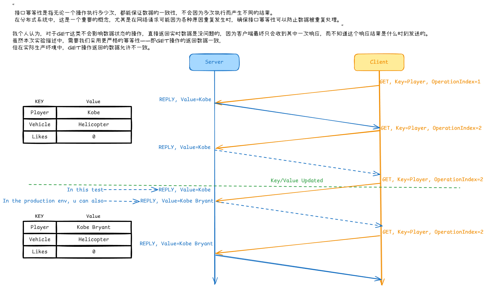
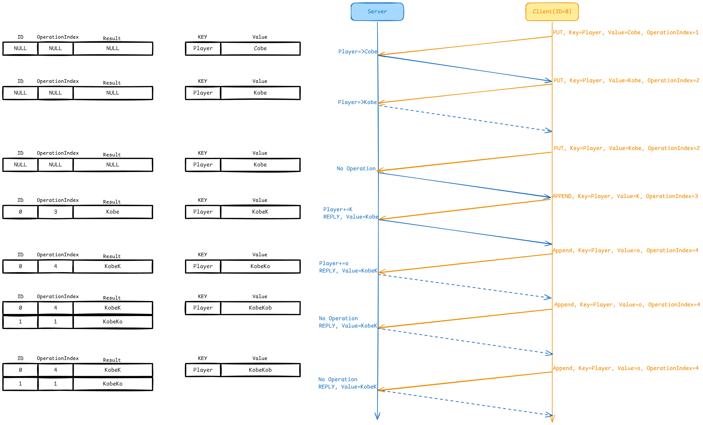

# MIT 6.5840(2024) Lab 2

## 1.  任务
In this lab you will build a key/value server for a single machine that ensures that each operation is executed exactly once despite network failures and that the operations are [linearizable](https://pdos.csail.mit.edu/6.824/papers/linearizability-faq.txt). Later labs will replicate a server like this one to handle server crashes. 

Clients can send three different RPCs to the key/value server: Put(key, value), Append(key, arg), and Get(key). The server maintains an in-memory map of key/value pairs. Keys and values are strings. Put(key, value) installs or replaces the value for a particular key in the map, Append(key, arg) appends arg to key's value <ins>and</ins> returns the old value(**注意这个and是用于并列Append的动词"appends"和"returns"，所以Put没有"returns"**), <ins>and</ins> Get(key) fetches the current value for the key. A Get for a non-existent key should return an empty string. An Append to a non-existent key should act as if the existing value were a zero-length string. Each client talks to the server through a Clerk with Put/Append/Get methods. A Clerk manages RPC interactions with the server.  

Your server must arrange that application calls   to Clerk Get/Put/Append methods be linearizable. If client requests aren't concurrent, each client Get/Put/Append call should observe the modifications to the state implied by the preceding sequence of calls. For concurrent calls, the return values and final state must be the same as if the operations had executed one at a time in some order. Calls are concurrent if they overlap in time: for example, if client X calls Clerk.Put(), and client Y calls Clerk.Append(), and then client X's call returns. A call must observe the effects of all calls that have completed before the call starts.

>[!tip] 
> <h3>Key/value server with no network failures (<a href="https://pdos.csail.mit.edu/6.824/labs/guidance.html">easy</a>)</h3>
> Your first task is to implement a solution that works when there are no dropped messages. You'll need to add RPC-sending code to the Clerk Put/Append/Get methods in client.go, and implement Put, Append() and Get() RPC handlers in server.go. You have completed this task when you pass the first two tests in the test suite: "one client" and "many clients".
> - <strong>Hint: Check that your code is race-free using <code>go test -race</code>.</strong>


>[!tip] 
> <h3>Key/value server with dropped messages (<a href="https://pdos.csail.mit.edu/6.824/labs/guidance.html">easy</a>)</h3>
> Now you should modify your solution to continue in the face of dropped messages (e.g., RPC requests and RPC replies). If a message was lost, then the client's ck.server.Call() will return false (more precisely, Call() waits for a reply message for a timeout interval, and returns false if no reply arrives within that time). One problem you'll face is that a Clerk may have to send an RPC multiple times until it succeeds. Each call to Clerk.Put() or Clerk.Append(), however, should result in just a single execution, so you will have to ensure that the re-send doesn't result in the server executing the request twice.
> 
> Add code to Clerk to retry if doesn't receive a reply, and to server.go to filter duplicates if the operation requires it. These notes include guidance on <a href="https://pdos.csail.mit.edu/6.824/notes/l-raft-QA.txt">duplicate detection.</a>
> <ul>
> <strong>
> <li>Hint: You will need to uniquely identify client operations to ensure that the key/value server executes each one just once.</li>
> <li>Hint: You will have to think carefully about what state the server must   maintain for handling duplicate Get(), Put(), and Append() requests, if any at all.</li>
> <li>Hint: Your scheme for duplicate detection should free server memory quickly, for example by having each RPC imply that the client has seen the reply for its previous RPC. It's OK to assume that a client will make only one call into a Clerk at a time.</li>
> </strong>
> </ul>


## 2. 任务分析(粗略)
### 2.1 Client
Client可以向Server发送三种操作：Get、Put、Append。Client通过Clerk.Call向Server发送请求，请求失败时，该函数返回false。需要注意的是，Put不需要返回值，而Get、Append都需要相应的返回值。
### 2.2 Server
Server维护一组Key/value数据并响应Client请求。需要注意的是，value就是个string而不是[]string，append操作只需要在字符串后面追加即可。

## 3. 实现
### 3.1 Key/value server with no network failures
无网络故障，即Clerk.Call保证返回true。此种情况下无需修改Args和Reply。
#### 3.1.1 Client
Client的Get、Put、Append的实现不必多说。

``` go
func (ck *Clerk) Get(key string) string {

    // You will have to modify this function.
    args := GetArgs{Key: key}
    reply := GetReply{}

    ck.server.Call("KVServer.Get", &args, &reply)
    
    return reply.Value
}

func (ck *Clerk) PutAppend(key string, value string, op string) string {
    // You will have to modify this function.
    
    args := PutAppendArgs{Key: key, Value: value}
    reply := PutAppendReply{}

    ck.server.Call("KVServer."+op, &args, &reply)

    return reply.Value
}
```

#### 3.1.2 Server
对于many clients，只需加上互斥锁。

``` go
func (kv *KVServer) Get(args *GetArgs, reply *GetReply) {
    // Your code here.
    kv.mu.Lock()
    defer kv.mu.Unlock()

    reply.Value = kv.data[args.Key]
}

func (kv *KVServer) Put(args *PutAppendArgs, reply *PutAppendReply) {
    // Your code here.
    kv.mu.Lock()
    defer kv.mu.Unlock()

    kv.data[args.Key] = args.Value
}

func (kv *KVServer) Append(args *PutAppendArgs, reply *PutAppendReply) {
    // Your code here.
    kv.mu.Lock()
    defer kv.mu.Unlock()
    
    reply.Value = kv.data[args.Key]
    kv.data[args.Key] += args.Value
}
```

### 3.2 Key/value server with dropped messages
有网络故障，Clerk.Call不保证传回true。可以得出以下情况：

- Client
  - Clerk.Call传回true
  - Clerk.Call传回false，需要重传
- Server
  - Client传入正常请求
  - Client传入重复请求
  - Client传入过期请求（本次实验不涉及）

#### 3.2.1 Args&Reply
要判别Server接收到的是否为重复请求，则需要判断是否为同一个Client的重复操作，因此需要一个特征码和操作序号。显而易见的是，Get操作不涉及修改数据，因此重复的Get也可以当做正常请求，Get的Args不需要增加参数。

``` go
type PutAppendArgs struct {
    Key   string
    Value string
    Nrand int64 // 特征码
    Op    int64 // 操作序号
}

type PutAppendReply struct {
    Value string
}

type GetArgs struct {
    Key string
}

type GetReply struct {
    Value string
}
```

#### 3.2.2 Client
只需要加上重传机制即可。

``` go
func (ck *Clerk) Get(key string) string {
    args := GetArgs{Key: key}
    reply := GetReply{}

    for !ck.server.Call("KVServer.Get", &args, &reply) {}

    return reply.Value
}

func (ck *Clerk) PutAppend(key string, value string, op string) string {
    ck.Op++
    args := PutAppendArgs{Key: key, Value: value, Nrand: ck.Nrand, Op: ck.Op}
    reply := PutAppendReply{}

    for !ck.server.Call("KVServer."+op, &args, &reply) {}

    return reply.Value
}
```

#### 3.2.3 Server
Server需要记录每个Client的Append操作的返回值，以便响应重复操作。

这是很好理解的，对于单个Client，它的操作是顺序执行，而其他Client对于这个Client而言是异步执行。因此，这个Client在未完成Get、Put、Append操作时只会重传而不会去做其他操作，并且，这个Client还不关心其他Client的对Key/value的修改而产生的影响。也就意味着，Server在设计的时候，互斥锁是用于实现多Client功能，而单Client功能是除了互斥锁以外的逻辑。于是，我们只需要在原有代码的基础上保存每个Client每次Append操作的返回值并完成重复操作的处理即可。

**Server无法保证数据能否正常传回Client。因此，对于Client重复发送的PutAppend请求：**

  - **Server只允许 首次接收到的请求 修改Key/Value**
  - **所有 请求的返回值 均与 Server首次接收到的请求 的 返回值 相等**

**简单来说，Server遇到重复的PutAppend请求，均采用首次请求的返回值即可，且只接受首次请求的修改（重复请求重复结果）；Server遇到任意的Get请求只需要传回当前对应的结果（重复请求正常结果）。**

``` go
type KVServer struct {
    mu sync.Mutex

    // Your definitions here.
    data    map[string]string
    oldData map[int64]*Record
}

type Record struct {
    CurrentOp int64
    Legacy    string
}

func (kv *KVServer) Get(args *GetArgs, reply *GetReply) {
    // Your code here.
    kv.mu.Lock()
    defer kv.mu.Unlock()

    reply.Value = kv.data[args.Key]
}

func (kv *KVServer) Put(args *PutAppendArgs, reply *PutAppendReply) {
    // Your code here.
    kv.mu.Lock()
    defer kv.mu.Unlock()

    old, ok := kv.oldData[args.Nrand]
    if ok && old.CurrentOp >= args.Op { // 这里也可以是old.CurrentOp == args.Op，但是不好
        return
    }

    kv.data[args.Key] = args.Value
}

func (kv *KVServer) Append(args *PutAppendArgs, reply *PutAppendReply) {
    // Your code here.
    kv.mu.Lock()
    defer kv.mu.Unlock()

    old, ok := kv.oldData[args.Nrand]
    if ok && old.CurrentOp >= args.Op { // 这里也可以是old.CurrentOp == args.Op，但是不好
        reply.Value = old.Legacy
        return
    }

    if !ok {
        kv.oldData[args.Nrand] = &Record{}
    }
    reply.Value = kv.data[args.Key]
    kv.oldData[args.Nrand].CurrentOp = args.Op
    kv.oldData[args.Nrand].Legacy = reply.Value

    kv.data[args.Key] += args.Value
}
```

### 3.3 流程图
#### 3.3.1 Get



#### 3.3.2 PutAppend

