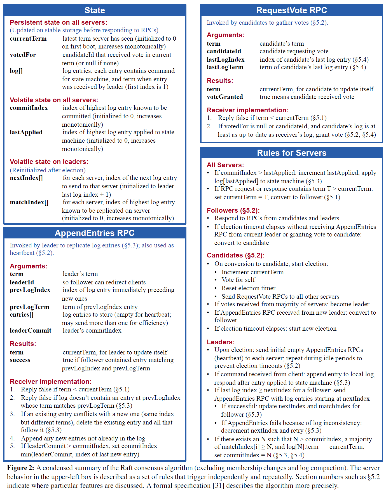
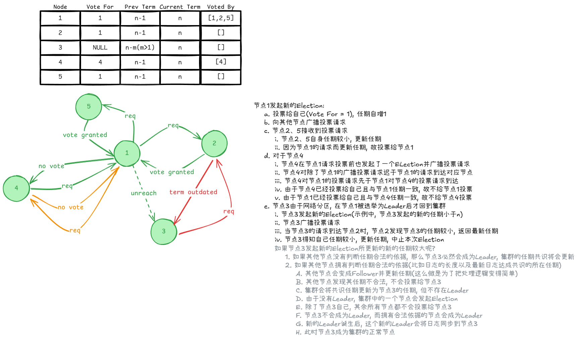
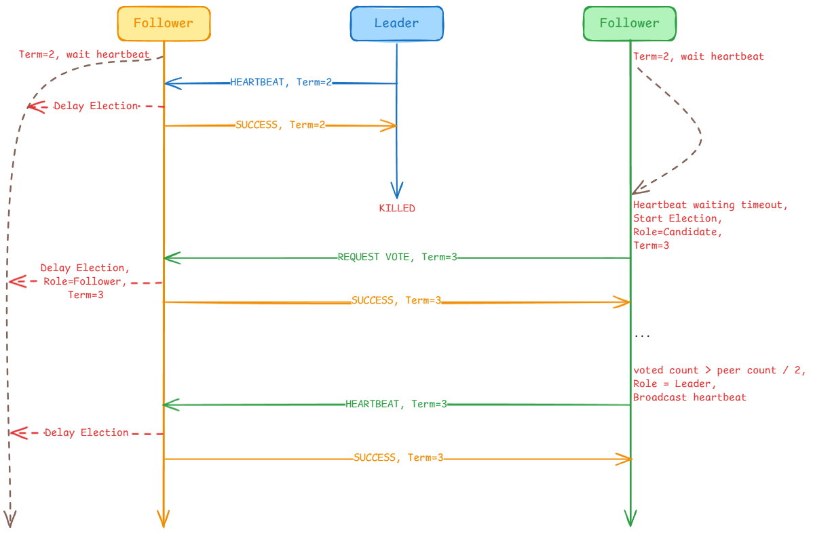
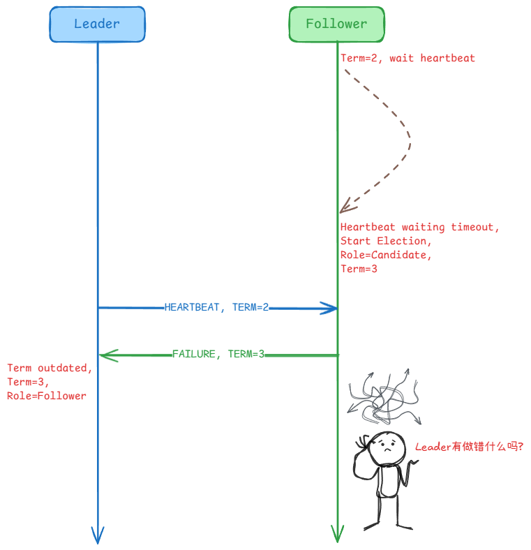
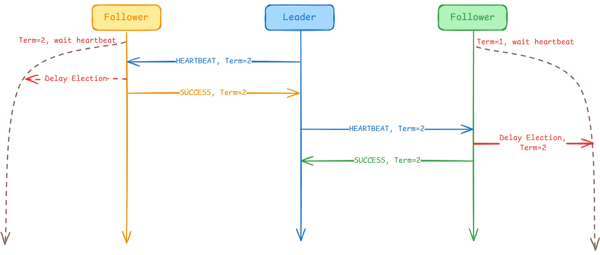
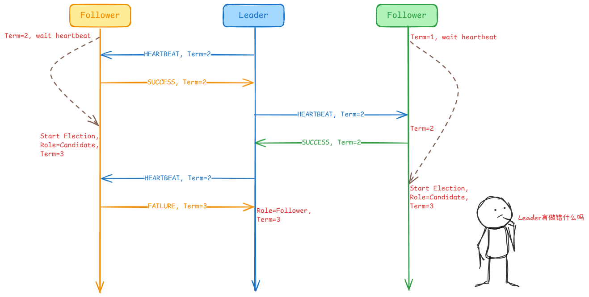

# MIT 6.5840(2024) Lab 3A (Leader election)

## 1. 任务
Implement Raft leader election and heartbeats (AppendEntries RPCs with no log entries). The goal for Part 3A is for a single leader to be elected, for the leader to remain the leader if there are no failures, and for a new leader to take over if the old leader fails or if packets to/from the old leader are lost. Run go test -run 3A  to test your 3A code.

> [!tip]
> <ol><strong>
> <li>
> You can't easily run your Raft implementation directly; instead you should run it by way of the tester, i.e. go test -run 3A .
> </li> 
> <li>
> Follow the paper's Figure 2. At this point you care about sending and receiving RequestVote RPCs, the Rules for Servers that relate to elections, and the State related to leader election.
> </li> 
> <li>
> Add the Figure 2 state for leader election to the Raft struct in raft.go. You'll also need to define a struct to hold information about each log entry. 
> </li> 
> <li> 
> Fill in the RequestVoteArgs and RequestVoteReply structs. Modify Make() to create a background goroutine that will kick off leader  election periodically by sending out RequestVote RPCs when it hasn't  heard from another peer for a while.  Implement  the RequestVote() RPC handler so that servers will vote for one  another.   
> </li> 
> <li>
> To implement heartbeats, define an AppendEntries RPC struct (though you may not need all the arguments yet), and have the leader send them out periodically. Write an AppendEntries RPC handler method.  
> </li> 
> <li>
> The tester requires that the leader send heartbeat RPCs no more than ten times per second.  
> </li> 
> <li>
> The tester requires your Raft to elect a new leader within five seconds of the failure of the old leader (if a majority of peers can still communicate).  
> </li> 
> <li>
> The paper's Section 5.2 mentions election timeouts in the range of 150 to 300 milliseconds. Such a range only makes sense if the leader sends heartbeats considerably more often than once per 150 milliseconds (e.g., once per 10 milliseconds). Because the tester limits you tens of heartbeats per second, you will have to use an election timeout larger than the paper's 150 to 300 milliseconds, but not too large, because then you may fail to elect a leader within five seconds.  
> </li> 
> <li>
> You may find Go's <a href="https://golang.org/pkg/math/rand/">rand</a> useful.  
> </li> 
> <li>
> You'll need to write code that takes actions periodically or after delays in time. The easiest way to do this is to create a goroutine with a loop that calls <a href="https://golang.org/pkg/time/#Sleep">time.Sleep()</a>; see the ticker() goroutine that Make() creates for this purpose. Don't use Go's time.Timer or time.Ticker, which are difficult to use correctly. 
> </li> 
> <li> 
> If your code has trouble passing the tests, read the paper's Figure 2 again; the full logic for leader election is spread over multiple parts of the figure. 
> </li> 
> <li> 
> Don't forget to implement GetState().  
> </li> 
> <li>
> The tester calls your Raft's rf.Kill() when it is permanently shutting down an instance. You can check whether Kill() has been called using rf.killed(). You may want to do this in all loops, to avoid having dead Raft instances print confusing messages.   
> </li> 
> <li>
> Go RPC sends only struct fields whose names start with capital letters.   Sub-structures must also have capitalized field names (e.g. fields of log records   in an array). The labgob package will warn you about this;   don't ignore the warnings.  
> </li> 
> <li>
> The most challenging part of this lab may be the debugging. Spend some time making your implementation easy to debug. Refer to the <a href="https://pdos.csail.mit.edu/6.824/labs/guidance.html">Guidance</a> page for debugging tips.
> </li> 
> </strong></ol>


## 2. 分析&实现
### 2.1 Server&RPC结构
根据此次试验中的第2、3条提示，我们应该按照论文中的Figure 2来定义RPC结构。



容易得出（本次实验不涉及LogEntries）：

``` go
// A Go object implementing a single Raft peer.
type Raft struct {
    mu        sync.Mutex          // Lock to protect shared access to this peer's state
    peers     []*labrpc.ClientEnd // RPC end points of all peers
    persister *Persister          // Object to hold this peer's persisted state
    me        int                 // this peer's index into peers[]
    dead      int32               // set by Kill()

    // Your data here (3A, 3B, 3C).
    // Look at the paper's Figure 2 for a description of what
    // state a Raft server must maintain.

    //Persistent state on all servers:
    //(Updated on stable storage before responding to RPCs)
    currentTerm int          //latest term server has seen (initialized to 0 on first boot, increases monotonically)
    votedFor    int          //candidateId that received vote in current term (or null if none)
    log         []LogEntries //log entries; each entry contains command for state machine, and term when entry was received by leader (first index is 1) Volatile state on all servers:

    commitIndex int // index of highest log entry known to be committed (initialized to 0, increases monotonically)
    lastApplied int // index of highest log entry applied to state machine (initialized to 0, increases monotonically) Volatile state on leaders: (Reinitialized after election)

    nextIndex  []int // for each server, index of the next log entry to send to that server (initialized to leader last log index + 1)
    matchIndex []int // for each server, index of highest log entry known to be replicated on server (initialized to 0, increases monotonically)

    signal chan int
    state  int
    tick   *time.Ticker // 选举计时
}

// AppendEntries RPC
// Arguments:
type AppendEntriesArgs struct {
    Term         int          // leader’s term
    LeaderId     int          // so follower can redirect clients
    PrevLogIndex int          // index of log entry immediately preceding new ones
    PrevLogTerm  int          // term of prevLogIndex entry
    Entries      []LogEntries // to store (empty for heartbeat; may send more than one for efficiency)
    LeaderCommit int          // leader’s commitIndex
}

// Results:
type AppendEnriesReply struct {
    Term    int  // currentTerm, for leader to update itself
    Success bool // true if follower contained entry matching prevLogIndex and prevLogTerm
}

// example RequestVote RPC arguments structure.
// field names must start with capital letters!
type RequestVoteArgs struct {
    // Your data here (3A, 3B).
    // Arguments:
    Term         int // candidate’s term
    CandidateId  int // candidate requesting vote
    LastLogIndex int // index of candidate’s last log entry (§5.4)
    LastLogTerm  int // term of candidate’s last log entry (§5.4)
}

// example RequestVote RPC reply structure.
// field names must start with capital letters!
type RequestVoteReply struct {
    // Your data here (3A).
    // Results:
    Term        int  // currentTerm, for candidate to update itself
    VoteGranted bool // true means candidate received vote
}
```

以及初始化

``` go
// the service or tester wants to create a Raft server. the ports
// of all the Raft servers (including this one) are in peers[]. this
// server's port is peers[me]. all the servers' peers[] arrays
// have the same order. persister is a place for this server to
// save its persistent state, and also initially holds the most
// recent saved state, if any. applyCh is a channel on which the
// tester or service expects Raft to send ApplyMsg messages.
// Make() must return quickly, so it should start goroutines
// for any long-running work.
func Make(peers []*labrpc.ClientEnd, me int,
    persister *Persister, applyCh chan ApplyMsg) *Raft {
    rf := &Raft{}
    rf.peers = peers
    rf.persister = persister
    rf.me = me

    // Your initialization code here (3A, 3B, 3C).
    rf.state = Follower
    rf.currentTerm = 0
    rf.votedFor = NoVote
    rf.tick = time.NewTicker(time.Duration(150+(rand.Int63()%150)) * time.Millisecond)

    rf.signal = make(chan int)

    // initialize from state persisted before a crash
    rf.readPersist(persister.ReadRaftState())

    // start ticker goroutine to start elections
    go rf.ticker()

    go rf.election()

    return rf
}
```

### 2.2 RequestVote
论文中给到处理RequestVote的RPC请求的方式：
  - 如果还没投票或者已经投给请求者（还有一种情况和本次实验无关），则返回true
  - 应该同时返回现在的任期（若有修改，则返回修改后的）
  - 如果返回true（投票），则应该**推迟选举**，避免出现不必要的多次选举（多次选举会破坏系统的稳定性，而且相当消耗系统资源，同时Term会快速迭代）

不难得到：

``` go
// example RequestVote RPC handler.
func (rf *Raft) RequestVote(args *RequestVoteArgs, reply *RequestVoteReply) {
    // Your code here (3A, 3B).
    if rf.killed() {
        reply.VoteGranted = false
        return
    }

    rf.mu.Lock()
    defer rf.mu.Unlock()
    reply.VoteGranted = false
    
    if args.Term > rf.currentTerm {
        rf.signal <- 1  // 推迟选举
        rf.state = Follower
        rf.currentTerm = args.Term
        rf.votedFor = args.CandidateId
        reply.VoteGranted = true
    } else if args.Term == rf.currentTerm {
        rf.signal <- 1
        if rf.votedFor == args.CandidateId || rf.votedFor == NoVote {
            rf.votedFor = args.CandidateId
            reply.VoteGranted = true
        }
    }

    reply.Term = rf.currentTerm
}
```

### 2.3 AppendEntries
虽然此次试验和Log无关，但是心跳机制需要无日志AppendEntries请求来实现。在默认无日志AppendEntries的情况下（本次实验）：
  - 自认为是Leader的节点（注意，Leader不会马上发现任期已经过期）需要给每个Follower发送AppendEntries请求
  - 发出AppendEntries请求是可并行的，允许异步地修改Leader信息（多节点保证容错），同时也能保证效率（比如某个节点网络不良，那就不必等他返回结果）
  - Follower接收到AppendEntries请求后，如果自己的任期比请求者的任期更大，则返回false并告诉请求者自己的任期；反之，同步任期并返回true
  - 自认为是Leader的节点一旦发现自己的任期已经不是最新，则转变为Follower，并同步任期。
  - ”如果Follower在下一次选举之前没有收到任何来自Leader的心跳，则假定没有可行的Leader，并开始选举来得到新的Leader。 ”等价地，当Follower接收到Leader的心跳，则**推迟选举**。

实现如下：

``` go
func (rf *Raft) AppendEntries(args *AppendEntriesArgs, reply *AppendEnriesReply) {
    if rf.killed() {
        return
    }

    rf.mu.Lock()
    defer rf.mu.Unlock()

    if args.Term < rf.currentTerm {
        reply.Term = rf.currentTerm
        reply.Success = false
        return
    }

    rf.signal <- 1 // 推迟选举
    rf.currentTerm = args.Term
    rf.state = Follower
    reply.Term = rf.currentTerm
    reply.Success = true
}

func (rf *Raft) sendAppendEntries(args *AppendEntriesArgs, reply *AppendEnriesReply) {
    if rf.killed() {
        return
    }

    for i, peer := range rf.peers {
        if i == rf.me {
            continue
        }

        if rf.state != Leader {
            break
        }
        go func(peer *labrpc.ClientEnd, args AppendEntriesArgs, reply AppendEnriesReply) {
            ok := peer.Call("Raft.AppendEntries", &args, &reply)
            rf.mu.Lock()
            defer rf.mu.Unlock()

            if ok {
                if !reply.Success {
                    if rf.state != Leader {
                        return
                    }
                    if reply.Term > rf.currentTerm {
                        DPrintf("%v find that he is no longer a leader![%v:%v]\n", rf.me, rf.currentTerm, reply.Term)
                        rf.currentTerm = reply.Term
                        rf.state = Follower
                        rf.votedFor = -1
                        return
                    }
                }
            }
        }(peer, *args, *reply)
    }
}
```

### 2.4 Leader的心跳机制
Leader每次心跳都会向全部Follower发送无日志的AppendEntriesRPC；实验建议Leader心跳的频率不能高于每秒10次——不妨让Leader每次完成心跳后，固定休息100ms。

> [!tip]
> 不管Coder怎样实现心跳机制，Leader的心跳都应该尽可能在Follower触发选举事件之前传达给所有Follower。如果Leader还没出现故障就开始选举，这毫无疑问是非常奇葩的<s>（Leader：今天你们就敢背着我搞什么选举，明天能整出什么狠活我都不敢想了！）。</s>


因此，ticker的实现为：

``` go
func (rf *Raft) ticker() {
    for !rf.killed() {
        // Your code here (3A)
        // Check if a leader election should be started.
        rf.mu.Lock()
        if rf.state == Leader {
            args := AppendEntriesArgs{
                Term:     rf.currentTerm,
                LeaderId: rf.me,
            }
            rf.sendAppendEntries(&args, &AppendEnriesReply{})
        }
        rf.mu.Unlock()
        // pause for a random amount of time between 50 and 350
        // milliseconds.
        // ms := 50 + (rand.Int63() % 300)
        time.Sleep(time.Duration(100) * time.Millisecond)
    }
}
```

### 2.5 Server的选举周期(也是个“心跳”)
#### 2.5.1 限制
- 选举不能让Leader发起
  - 如果Leader节点出现故障，则集群必然崩溃。
- 选举不应该同时发起
  - 假设每个节点同时发起选举，那么每个节点必然只会给自己投票，也就无法选出Leader
  - 让每个节点同时发起选举是不现实且困难的。这意味着需要一个统一的尺度，这会产生与“让Leader发起选举”类似的问题
- 选举的周期不应该是固定的
  - 固定的选举周期可能会导致规律性的选举结果，那么“选举”就没有必要了
  - 固定的选举周期也可能会产生类似“选举同时发起”的问题

#### 2.5.2 定义
- 选举是自发的（“心跳”）
  - Follower自我发起选举，自我发起选举时，转化为Candidate
  - 防止Leader节点出现故障时剩余节点无法自发地完成选举
  - Candidate需要给自己先投票，并更新任期
- 选举周期是随机的
  - 随机的选举周期可以降低节点只将选票投给自己的频率
- 选举周期的浮动要相对较大
  - 简单来说，如果每个节点每次任期的选举周期都十分接近，那就与固定的选举周期没有什么区别
- 选举周期与Leader的心跳机制相互独立且并行化（选举也是一次“心跳”）
  - 对于Leader而言，可以通过选举周期的“心跳”（Leader的心跳机制也能做到）发现自己的任期是否过期。如果过期，则自行变成Follower
  - 对于Follower而言，需要通过选举周期的“心跳”变成Candidate并创建新一轮任期，向所有节点发送RequestVote请求
  - 对于Candidate而言，需要通过选举周期的“心跳”发现选举处于僵持状态并创建新一轮任期，向所有节点发送RequestVote请求
- 选举结果应该取决于选票是否高于全部节点数量的一半
  - 统计所有节点持有的选票是不合理的。同时，如果想处理“未能得到某个节点选票数量”的情况反而会产生更多问题
  - 超过1/2选票的节点必然是Leader，因此不需要参考其他节点的选票数
  - 由于选举周期的随机性以及高浮动性，在出现某节点超过1/2选票情况之前的轮数会尽可能小

#### 2.5.3 实现
实验建议，由于Leader的心跳频率不高于每秒10次，因此与论文中的`150ms~300ms`不同，我们的实现需要稍微大那么点（`150ms~300ms larger`）。当然也别太大，过大的选举周期容易导致测试不通过。（权力真空的时间太长了，这不科学！）

``` go
func (rf *Raft) election() {
    for {
        select {
        case <-rf.tick.C:
            rf.delayElection()
            /*
                不能用rf.signal<-1，因为在同一个select块内
            */
            if rf.state == Follower {
                rf.state = Candidate
            }
            if rf.state == Candidate {
                rf.currentTerm++
            }
            args := RequestVoteArgs{
                Term:        rf.currentTerm,
                CandidateId: rf.me,
            }

            rf.votedFor = rf.me
            voteCount := 1

            for i := range rf.peers {
                if i == rf.me {
                    continue
                }
                go func(args RequestVoteArgs, i int, voteCount *int) {
                    reply := RequestVoteReply{}
                    if ok := rf.sendRequestVote(i, &args, &reply); ok {
                        rf.mu.Lock()
                        if reply.Term > rf.currentTerm {
                            rf.currentTerm = reply.Term
                            rf.state = Follower
                            rf.votedFor = -1
                        }

                        if reply.VoteGranted {
                            if args.Term == rf.currentTerm {
                                *voteCount++
                            }
                        }
                        if *voteCount > len(rf.peers)/2 {
                            if rf.state != Leader {
                                DPrintf("%v now is leader{%v/%v}[%v]\n", rf.me, *voteCount, len(rf.peers), rf.currentTerm)
                            }
                            rf.state = Leader
                            appendArgs := AppendEntriesArgs{
                                Term:     rf.currentTerm,
                                LeaderId: rf.me,
                            }
                            rf.sendAppendEntries(&appendArgs, &AppendEnriesReply{})
                        }
                        rf.mu.Unlock()
                    }
                }(args, i, &voteCount)
            }
        case <-rf.signal:
            rf.delayElection()
        }
    }
}

func (rf *Raft) delayElection() {
    rf.tick.Reset(time.Duration(HeartBeatMinTime+rand.Int63()%HeartBeatRangeSize) * time.Millisecond)
}
```

## 3. 测试结果
### 3.1 推迟选举

``` markdown
Test (3A): initial election ...
2024/07/18 17:53:44 0 now is leader{2/3}[1]
  ... Passed --   3.0  3  100   25276    0
Test (3A): election after network failure ...
2024/07/18 17:53:46 1 now is leader{2/3}[1]
2024/07/18 17:53:47 0 now is leader{2/3}[2]
2024/07/18 17:53:50 2 now is leader{2/3}[8]
  ... Passed --   4.4  3  166   32837    0
Test (3A): multiple elections ...
2024/07/18 17:53:51 5 now is leader{4/7}[1]
2024/07/18 17:53:51 0 now is leader{4/7}[2]
2024/07/18 17:53:52 5 find that he is no longer a leader![1:3]
2024/07/18 17:53:52 1 now is leader{4/7}[4]
2024/07/18 17:53:53 6 now is leader{4/7}[6]
2024/07/18 17:53:54 6 find that he is no longer a leader![6:7]
2024/07/18 17:53:54 6 now is leader{4/7}[8]
2024/07/18 17:53:54 3 now is leader{4/7}[9]
2024/07/18 17:53:55 3 find that he is no longer a leader![9:10]
2024/07/18 17:53:55 3 now is leader{4/7}[11]
2024/07/18 17:53:55 3 find that he is no longer a leader![11:12]
2024/07/18 17:53:56 3 now is leader{4/7}[13]
  ... Passed --   5.4  7  786  150094    0
PASS
ok      6.5840/raft     12.716s
```

超过半数选票的才能成为Leader，同时，Leader发现自己任期过期也是后知后觉的。

### 3.2 不进行任何推迟选举的操作

``` markdown
Test (3A): initial election ...
2024/07/18 17:19:40 2 now is leader{2/3}[1]
2024/07/18 17:19:40 0 now is leader{2/3}[2]
2024/07/18 17:19:40 1 now is leader{2/3}[3]
2024/07/18 17:19:40 2 now is leader{2/3}[4]
2024/07/18 17:19:40 1 now is leader{2/3}[5]
2024/07/18 17:19:40 0 now is leader{2/3}[6]
2024/07/18 17:19:41 2 now is leader{2/3}[7]
2024/07/18 17:19:41 0 now is leader{2/3}[8]
2024/07/18 17:19:41 1 now is leader{2/3}[9]
2024/07/18 17:19:41 2 now is leader{2/3}[10]
2024/07/18 17:19:41 0 now is leader{2/3}[11]
2024/07/18 17:19:41 1 now is leader{2/3}[12]
2024/07/18 17:19:41 2 now is leader{2/3}[13]
2024/07/18 17:19:41 0 now is leader{2/3}[14]
2024/07/18 17:19:42 1 now is leader{2/3}[15]
2024/07/18 17:19:42 2 now is leader{2/3}[16]
2024/07/18 17:19:42 1 now is leader{2/3}[17]
2024/07/18 17:19:42 0 now is leader{2/3}[18]
2024/07/18 17:19:42 2 now is leader{2/3}[19]
warning: term changed even though there were no failures
# 就算 passed ，看到这个提示，某种程度上也是 failed
2024/07/18 17:19:42 0 now is leader{2/3}[20]
2024/07/18 17:19:42 1 now is leader{2/3}[21]
2024/07/18 17:19:42 2 now is leader{2/3}[22]
  ... Passed --   3.0  3  198   48454    0
Test (3A): election after network failure ...
2024/07/18 17:19:43 2 now is leader{2/3}[1]
2024/07/18 17:19:43 0 now is leader{2/3}[2]
2024/07/18 17:19:43 1 now is leader{2/3}[3]
2024/07/18 17:19:43 2 now is leader{2/3}[4]
2024/07/18 17:19:43 2 find that he is no longer a leader![4:5]
2024/07/18 17:19:43 0 now is leader{2/3}[5]
2024/07/18 17:19:44 2 now is leader{2/3}[6]
2024/07/18 17:19:44 1 find that he is no longer a leader![3:6]
2024/07/18 17:19:44 0 now is leader{2/3}[7]
2024/07/18 17:19:44 1 now is leader{2/3}[8]
2024/07/18 17:19:44 2 now is leader{2/3}[9]
2024/07/18 17:19:47 0 now is leader{2/3}[17]
2024/07/18 17:19:47 1 now is leader{2/3}[18]
2024/07/18 17:19:47 0 now is leader{2/3}[19]
2024/07/18 17:19:47 1 now is leader{2/3}[20]
2024/07/18 17:19:47 0 now is leader{2/3}[21]
2024/07/18 17:19:47 1 now is leader{2/3}[22]
2024/07/18 17:19:48 2 now is leader{2/3}[23]
  ... Passed --   5.1  3  250   49785    0
Test (3A): multiple elections ...
2024/07/18 17:19:48 1 now is leader{4/7}[1]
2024/07/18 17:19:48 3 now is leader{4/7}[2]
2024/07/18 17:19:48 0 now is leader{4/7}[3]
2024/07/18 17:19:48 5 now is leader{4/7}[4]
2024/07/18 17:19:48 2 now is leader{4/7}[5]
2024/07/18 17:19:48 6 now is leader{4/7}[6]
2024/07/18 17:19:48 4 now is leader{4/7}[7]
2024/07/18 17:19:48 2 now is leader{4/7}[8]
2024/07/18 17:19:48 3 now is leader{4/7}[9]
2024/07/18 17:19:48 4 now is leader{4/7}[10]
2024/07/18 17:19:48 1 now is leader{4/7}[11]
2024/07/18 17:19:48 0 now is leader{4/7}[12]
2024/07/18 17:19:49 3 now is leader{4/7}[13]
2024/07/18 17:19:49 2 now is leader{4/7}[14]
2024/07/18 17:19:49 4 now is leader{4/7}[15]
2024/07/18 17:19:49 0 now is leader{4/7}[16]
2024/07/18 17:19:49 1 now is leader{4/7}[17]
2024/07/18 17:19:49 5 now is leader{4/7}[18]
2024/07/18 17:19:49 6 now is leader{4/7}[19]
2024/07/18 17:19:49 0 now is leader{4/7}[20]
2024/07/18 17:19:49 1 now is leader{4/7}[21]
2024/07/18 17:19:49 5 now is leader{4/7}[22]
2024/07/18 17:19:49 0 now is leader{4/7}[23]
2024/07/18 17:19:49 4 now is leader{4/7}[24]
2024/07/18 17:19:49 3 now is leader{4/7}[25]
2024/07/18 17:19:50 5 now is leader{4/7}[26]
2024/07/18 17:19:50 0 now is leader{4/7}[27]
2024/07/18 17:19:50 4 now is leader{4/7}[28]
2024/07/18 17:19:50 3 now is leader{4/7}[29]
2024/07/18 17:19:50 6 now is leader{4/7}[30]
2024/07/18 17:19:50 0 now is leader{4/7}[31]
2024/07/18 17:19:50 4 now is leader{4/7}[32]
2024/07/18 17:19:50 3 now is leader{4/7}[33]
2024/07/18 17:19:50 6 now is leader{4/7}[34]
2024/07/18 17:19:50 1 find that he is no longer a leader![21:34]
2024/07/18 17:19:50 5 now is leader{4/7}[35]
2024/07/18 17:19:51 3 now is leader{4/7}[36]
2024/07/18 17:19:51 6 now is leader{4/7}[37]
2024/07/18 17:19:51 1 now is leader{4/7}[38]
2024/07/18 17:19:51 5 now is leader{4/7}[39]
2024/07/18 17:19:51 2 now is leader{4/7}[40]
2024/07/18 17:19:51 1 now is leader{4/7}[41]
2024/07/18 17:19:51 5 now is leader{4/7}[42]
2024/07/18 17:19:51 0 now is leader{4/7}[43]
2024/07/18 17:19:51 4 now is leader{4/7}[44]
2024/07/18 17:19:51 2 now is leader{4/7}[45]
2024/07/18 17:19:51 1 now is leader{4/7}[46]
2024/07/18 17:19:52 0 now is leader{4/7}[47]
2024/07/18 17:19:52 2 now is leader{4/7}[48]
2024/07/18 17:19:52 3 now is leader{4/7}[49]
2024/07/18 17:19:52 0 now is leader{4/7}[50]
2024/07/18 17:19:52 6 now is leader{4/7}[51]
2024/07/18 17:19:52 1 now is leader{4/7}[52]
2024/07/18 17:19:52 4 now is leader{4/7}[53]
2024/07/18 17:19:52 6 now is leader{4/7}[54]
2024/07/18 17:19:52 0 now is leader{4/7}[55]
2024/07/18 17:19:52 1 now is leader{4/7}[56]
2024/07/18 17:19:53 3 find that he is no longer a leader![49:56]
2024/07/18 17:19:53 3 now is leader{4/7}[57]
2024/07/18 17:19:53 6 now is leader{4/7}[58]
2024/07/18 17:19:53 2 now is leader{4/7}[59]
2024/07/18 17:19:53 5 now is leader{4/7}[60]
2024/07/18 17:19:53 2 now is leader{4/7}[61]
2024/07/18 17:19:53 3 now is leader{4/7}[62]
2024/07/18 17:19:53 6 now is leader{4/7}[63]
2024/07/18 17:19:53 0 now is leader{4/7}[64]
2024/07/18 17:19:53 1 now is leader{4/7}[65]
2024/07/18 17:19:53 5 now is leader{4/7}[66]
2024/07/18 17:19:53 2 now is leader{4/7}[67]
2024/07/18 17:19:53 4 now is leader{4/7}[68]
2024/07/18 17:19:53 3 now is leader{4/7}[69]
2024/07/18 17:19:53 6 now is leader{4/7}[70]
2024/07/18 17:19:53 0 now is leader{4/7}[71]
2024/07/18 17:19:54 1 now is leader{4/7}[72]
  ... Passed --   5.9  7 1980  411222    0
PASS
ok      6.5840/raft     13.932s
```

尽管测试通过，但任期的迭代是很不理想的（也就是说发生了多次选举）！这相当浪费系统资源。

## 4. 图像解释（仅提及部分）
### 4.1 选举操作



### 4.2 选举（Leader发生故障）



### 4.3 Leader心跳（心跳间隔长于选举间隔）



### 4.4 Leader心跳（推迟选举）



### 4.5 Leader心跳（不推迟选举）

