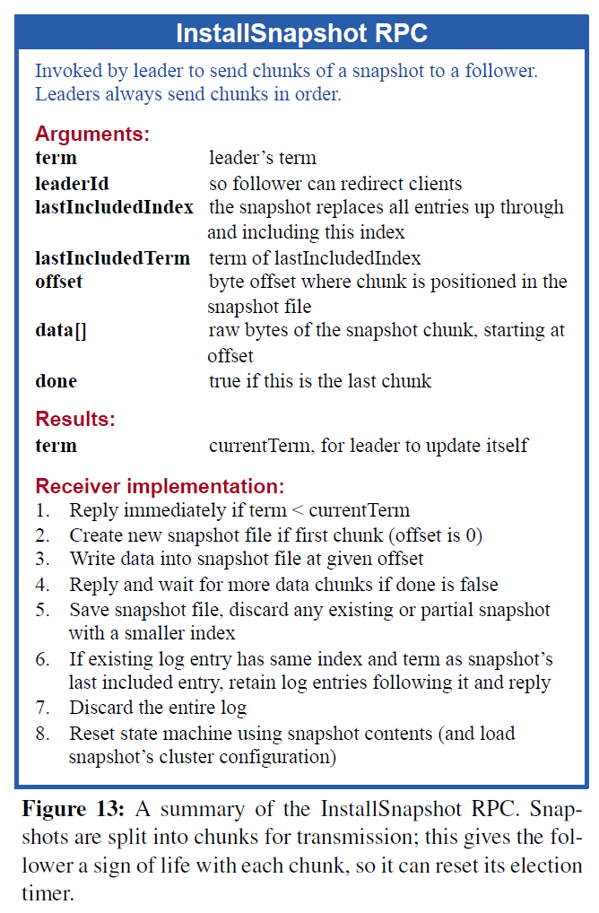

# MIT 6.5840(2024) Lab 3D (Log Compaction)
## 1. 任务
As things stand now, a rebooting server replays the complete Raft log in order to restore its state. However, it's not practical for a long-running service to remember the complete Raft log forever. Instead, you'll modify Raft to cooperate with services that persistently store a "snapshot" of their state from time to time, at which point Raft discards log entries that precede the snapshot. The result is a smaller amount of persistent data and faster restart. However, it's now possible for a follower to fall so far behind that the leader has discarded the log entries it needs to catch up; the leader must then send a snapshot plus the log starting at the time of the snapshot. <a href="https://pdos.csail.mit.edu/6.824/papers/raft-extended.pdf">Section 7</a> of the extended Raft paper outlines the scheme; you will have to design the details.  

Your Raft must provide the following function that the service can call with a serialized snapshot of its state:  

`Snapshot(index int, snapshot []byte)`

In Lab 3D, the tester calls Snapshot() periodically. In Lab 4, you will write a key/value server that calls Snapshot(); the snapshot will contain the complete table of key/value pairs. The service layer calls Snapshot() on every peer (not just on the leader).  

The index argument indicates the highest log entry that's reflected in the snapshot. Raft should discard its log entries before that point. You'll need to revise your Raft code to operate while storing only the tail of the log. You'll need to implement the InstallSnapshot RPC discussed in the paper that allows a Raft leader to tell a lagging Raft peer to replace its state with a snapshot. You will likely need to think through how InstallSnapshot should interact with the state and rules in Figure 2. When a follower's Raft code receives an InstallSnapshot RPC, it can use the applyCh to send the snapshot to the service in an ApplyMsg. The ApplyMsg struct definition already contains the fields you will need (and which the tester expects). Take care that these snapshots only advance the service's state, and don't cause it to move backwards. If a server crashes, it must restart from persisted data. Your Raft should persist both Raft state and the corresponding snapshot. Use the second argument to persister.Save() to save the snapshot. If there's no snapshot, pass nil as the second argument. When a server restarts, the application layer reads the persisted snapshot and restores its saved state.  

**Implement Snapshot() and the InstallSnapshot RPC, as well as the changes to Raft to support these (e.g, operation with a trimmed log).  Your solution is complete when it passes the 3D tests (and all the previous Lab 3 tests).**

> [!tip]
> <ul><strong>
> <li>
> git pull to make sure you have the latest software.
> </li>
> <li>
> A good place to start is to modify your code to so that it is able to store just the part of the log starting at some index X. Initially you can set X to zero and run the 3B/3C tests. Then make Snapshot(index) discard the log before index, and set X equal to index. If all goes well you should now pass the first 3D test.
> </li>
> <li>
> Next: have the leader send an InstallSnapshot RPC if it doesn't have the log entries required to bring a follower up to date.
> </li>
> <li>
> Send the entire snapshot in a single InstallSnapshot RPC. Don't implement Figure 13's offset mechanism for splitting up the snapshot.
> </li>
> <li>
> Raft must discard old log entries in a way that allows the Go garbage collector to free and re-use the memory; this requires that there be no reachable references (pointers) to the discarded log entries.
> </li>
> <li>
> A reasonable amount of time to consume for the full set of Lab 3 tests (3A+3B+3C+3D) without -race is 6 minutes of real time and one minute of CPU time. When running with -race, it is about 10 minutes of real time and two minutes of CPU time.
> </li>
> </strong></ul>

## 2. 分析&实现
### 2.1 Server&RPC结构

``` go
显然Server只需要新增Snapshot相关的部分：
type Raft struct {
    ...

    snapshot          []byte
    lastIncludedIndex int
    lastIncludedTerm  int
}
```

根据Figure13：



我们可以简要写出InstallSnapshot的RPC结构（实验用不到分片分块一类的操作，因此Offset与Done为无用数据）

``` go
type InstallSnapshotArgs struct {
    Term              int    // leader’s term
    LeaderId          int    // so follower can redirect clients
    LastIncludedIndex int    // the snapshot replaces all entries up through and including this index
    LastIncludedTerm  int    // term of lastIncludedIndex
    Data              []byte //raw bytes of the snapshot chunk, starting at offset

    // not used
    Offset int // byte offset where chunk is positioned in the snapshot file
    // Create new snapshot file if first chunk (offset is 0)
    // Write data into snapshot file at given offset

    // not used
    Done bool // true if this is the last chunk
    // Reply and wait for more data chunks if done is false

}

type InstallSnapshotReply struct {
    Term int // currentTerm, for leader to update itself
}
```

### 2.2 Persist
显然，Snapshot也是要持久化的，这里不做赘述

``` go
func (rf *Raft) persist() {
    ...
    e.Encode(rf.lastIncludedIndex)
    e.Encode(rf.lastIncludedTerm)
    raftstate := w.Bytes()
    rf.persister.Save(raftstate, rf.snapshot)
}

func (rf *Raft) readPersist(data []byte) {
    ...
    var lastIncludedIndex int
    var lastIncludedTerm int
    if ... ||
        d.Decode(&lastIncludedIndex) != nil ||
        d.Decode(&lastIncludedTerm) != nil {
        ...
    } else {
        ...
        // 3D
        // Reset state machine using snapshot contents (and load
        // snapshot’s cluster configuration)
        rf.lastIncludedIndex = lastIncludedIndex
        rf.lastIncludedTerm = lastIncludedTerm
        rf.commitIndex = lastIncludedIndex
        rf.lastApplied = lastIncludedIndex
    }
}

func (rf *Raft) readSnapshot(data []byte) {
    if data == nil || len(data) < 1 { // bootstrap without any state?
        return
    }
    // 3D
    // Reset state machine using snapshot contents (and load
    // snapshot’s cluster configuration)
    rf.snapshot = data
}

func Make(peers []*labrpc.ClientEnd, me int, persister *Persister, applyCh chan ApplyMsg) *Raft {
    ...
    // initialize from state persisted before a crash
    rf.readPersist(persister.ReadRaftState())
    rf.readSnapshot(persister.ReadSnapshot())
    ...
}
```

### 2.3 被"裁剪"的数组
日志压缩机制使得集群的Log不能直接用逻辑索引访问，因此需要进行索引变换（类似逻辑地址与物理地址）
我们很容易得出以下公式（需保证物理索引不为负数）

`LogicalIndex = LastIncludedIndex + PhysicalIndex`

容易得到以下代码：

``` go
func (rf *Raft) getPhysicalIndex(index int) int {
    return index - rf.lastIncludedIndex
}

func (rf *Raft) getLogicalIndex(index int) int {
    return index + rf.lastIncludedIndex
}
```

接下来只需要将原3C代码中，涉及的部分替换即可

### 2.4 Snapshot&commit
**注意：Snapshot()被调用的时候很坑！**

具体来说，是容易发生死锁——
  - 当提交日志到一定数目时，config.go会触发日志压缩（是的，日志压缩不是由你来做，而且日志压缩是所有节点[不管是不是Leader]都能做的），**因此这个函数最好不要提交任何日志**
  - applyCh为无缓存channel，提交者必须等待接收者；提交日志时，Raft.mu必然为commit()所拥有
    - 日志提交并触发日志时，如果Snapshot()尝试获得锁，那么config.go必然在Snapshot()处等待，此时不再有函数能够释放applyCh；下一次提交日志时，由于没有能够释放applyCh的函数，commit()也被阻塞，产生了死锁。

``` go
// periodically snapshot raft state
func (cfg *config) applierSnap(i int, applyCh chan ApplyMsg) {
    cfg.mu.Lock()
    rf := cfg.rafts[i]
    cfg.mu.Unlock()
    if rf == nil {
        return // ???
    }

    for m := range applyCh {
        err_msg := ""
        if m.SnapshotValid {
            cfg.mu.Lock()
            err_msg = cfg.ingestSnap(i, m.Snapshot, m.SnapshotIndex)
            cfg.mu.Unlock()
        } else if m.CommandValid {
            if m.CommandIndex != cfg.lastApplied[i]+1 {
                err_msg = fmt.Sprintf("server %v apply out of order, expected index %v, got %v", i, cfg.lastApplied[i]+1, m.CommandIndex)
            }

            if err_msg == "" {
                cfg.mu.Lock()
                var prevok bool
                err_msg, prevok = cfg.checkLogs(i, m)
                cfg.mu.Unlock()
                if m.CommandIndex > 1 && prevok == false {
                    err_msg = fmt.Sprintf("server %v apply out of order %v", i, m.CommandIndex)
                }
            }

            cfg.mu.Lock()
            cfg.lastApplied[i] = m.CommandIndex
            cfg.mu.Unlock()

            if (m.CommandIndex+1)%SnapShotInterval == 0 {
                w := new(bytes.Buffer)
                e := labgob.NewEncoder(w)
                e.Encode(m.CommandIndex)
                var xlog []interface{}
                for j := 0; j <= m.CommandIndex; j++ {
                    xlog = append(xlog, cfg.logs[i][j])
                }
                e.Encode(xlog)
                rf.Snapshot(m.CommandIndex, w.Bytes())
            }
        } else {
            // Ignore other types of ApplyMsg.
        }
        if err_msg != "" {
            log.Fatalf("apply error: %v", err_msg)
            cfg.applyErr[i] = err_msg
            // keep reading after error so that Raft doesn't block
            // holding locks...
        }
    }
}
```

我想到的解决方法有以下两类：
  - commit()依然保持对锁的抢占；Snapshot()尽可能获取锁，但不得抢占锁。
    - 显然，这是风险操作
  - commit()的全部操作都用锁原子化（赋值、条件判断、提交）；Snapshot()抢占锁。
    - 保证Snapshot()的安全性，但是操作十分繁杂

第一种（Lab 4会放大这个方法的风险）：

``` go
// the service says it has created a snapshot that has
// all info up to and including index. this means the
// service no longer needs the log through (and including)
// that index. Raft should now trim its log as much as possible.
func (rf *Raft) Snapshot(index int, snapshot []byte) {
    // Your code here (3D).

    // 非抢占锁
    if rf.mu.TryLock() {
        defer rf.mu.Unlock()
    } else {
        DPrintf("Warn: Snapshot() do not have a mutex lock")
    }

    // Save snapshot file, discard any existing or partial snapshot with a smaller index
    if !rf.acceptSnapshot(index) {
        DPrintf("Server reject snapshot[index: %v]: %v with [commitIndex: %v, lastIncludedIndex: %v]", index, rf.me, rf.commitIndex, rf.lastIncludedIndex)
        return
    }

    DPrintf("Server accept snapshot[index: %v]: %v[%v] with [commitIndex: %v, lastIncludedIndex: %v]", index, rf.me, getRoleString(rf), rf.commitIndex, rf.lastIncludedIndex)

    rf.snapshot = snapshot
    rf.lastIncludedTerm = rf.log[rf.getPhysicalIndex(index)].Term
    rf.log = rf.log[rf.getPhysicalIndex(index):]

    // if accept(index > rf.lastIncludedIndex) => rf.lastIncludedIndex = max(rf.lastIncludedIndex, index)
    // Snapshot()很有可能不拥有锁，因此必须遵守常规的顺序: trim log => update lastIncludedIndex
    rf.lastIncludedIndex = max(rf.lastIncludedIndex, index)
    
    rf.commitIndex = max(index, rf.commitIndex)
    rf.lastApplied = max(index, rf.lastApplied)

    if Debug {
        lastAppliedSnapshot := DApplier{}
        lastAppliedSnapshot.ApplyWithSnapshot(rf)
        DApplierPrint(rf, &lastAppliedSnapshot)
    }

    rf.persist()
}

func (rf *Raft) commit() {
    for !rf.killed() {
        rf.mu.Lock()
        for rf.commitIndex <= rf.lastApplied {
            rf.applyCond.Wait()
            // DPrintf("Commiter Wake Up: {id: %v,rf.commitIndex: %v,rf.lastApplied: %v}", rf.me, rf.commitIndex, rf.lastApplied)
        }
        /*
            sync.Cond.Wait():
                c.checker.check()
                t := runtime_notifyListAdd(&c.notify)
                c.L.Unlock()
                runtime_notifyListWait(&c.notify, t)
                c.L.Lock()
            因此会自动释放锁，并等待信号
        */

        // 如果有需要提交的日志
        // If commitIndex > lastApplied: increment lastApplied, apply log[lastApplied] to state machine (§5.3)

        // 注意,可提交的日志必须是"consense".
        // Leader Completeness: if a log entry is committed in a given term, then that entry will be present in the logs
        // of the leaders for all higher-numbered terms. §5.4

        // State Machine Safety: if a server has applied a log entry at a given index to its state machine, no other server
        // will ever apply a different log entry for the same index. §5.4.3
        for rf.commitIndex > rf.lastApplied {
            rf.lastApplied++
            if rf.hasAppliedBySnapshot() {
                continue
            }

            if Debug && rf.commitIndex == rf.lastApplied {
                lastAppliedMsg := DApplier{}
                lastAppliedMsg.ApplyWithLog(rf)
                DApplierPrint(rf, &lastAppliedMsg)
            }
            // Leader: If command received from client: append entry to local log, respond after entry applied to state machine (§5.3)
            // Follower: entry applied to state machine when leader allowing
            rf.applyCh <- ApplyMsg{
                CommandValid: true,
                Command:      rf.log[rf.getPhysicalIndex(rf.lastApplied)].Command,
                CommandIndex: rf.lastApplied,
                // Lab 4（与Lab 3无关）             
                CommandTerm:  rf.log[rf.getPhysicalIndex(rf.lastApplied)].Term,
            }
        }
        rf.mu.Unlock()
    }
}
```

第二种（推荐Lab 4用这个）：

``` go
// the service says it has created a snapshot that has
// all info up to and including index. this means the
// service no longer needs the log through (and including)
// that index. Raft should now trim its log as much as possible.
func (rf *Raft) Snapshot(index int, snapshot []byte) {
    // Your code here (3D).

    // 抢占锁
    rf.mu.Lock()
    defer rf.mu.Unlock()
    
    // Save snapshot file, discard any existing or partial snapshot with a smaller index
    if !rf.acceptSnapshot(index) {
        return
    }
    rf.snapshot = snapshot
    rf.lastIncludedIndex = index
    rf.lastIncludedTerm = rf.log[rf.getPhysicalIndex(index)].Term
    rf.log = rf.log[rf.getPhysicalIndex(index):]
    
    rf.commitIndex = max(index, rf.commitIndex)
    rf.lastApplied = max(index, rf.lastApplied)
    rf.persist()
}

func (rf *Raft) commit() {
    for !rf.killed() {
        rf.mu.Lock()
        for rf.commitIndex <= rf.lastApplied {
            rf.applyCond.Wait()
        }

        // atom op[1]: 赋值
        buffer := []*ApplyMsg{}
        lastApplied := rf.lastApplied
        for rf.commitIndex > lastApplied {
            lastApplied++
            if lastApplied <= rf.lastIncludedIndex {
                continue
            }
            buffer = append(buffer, &ApplyMsg{
                CommandValid: true,
                Command:      rf.log[rf.getPhysicalIndex(lastApplied)].Command,
                CommandIndex: lastApplied,   
                // Lab 4（与Lab 3无关）             
                CommandTerm:  rf.log[rf.getPhysicalIndex(lastApplied)].Term,
            })
        }
        rf.mu.Unlock()

        for _, msg := range buffer {
        
            // atom op[2]: 判断是否需要提交
            rf.mu.Lock()
            if msg.CommandIndex != rf.lastApplied+1 {
                rf.mu.Unlock()
                continue
            }
            rf.mu.Unlock()

            // atom op[3]: 提交（config.go保证自带锁）
            rf.applyCh <- *msg

            // atom op[4]: 更新状态（config.go触发Snapshot()可能会更改rf.lastApplied）
            rf.mu.Lock()
            if msg.CommandIndex != rf.lastApplied+1 {
                rf.mu.Unlock()
                continue
            }
            rf.lastApplied = msg.CommandIndex
            rf.mu.Unlock()
        }
    }
}
```

实际上，二者都可以通过测试。

### 2.5 postInstallSnapshot/sendInstallSnapshot
注意一下`rf.matchIndex[id] = max(rf.matchIndex[id], args.LastIncludedIndex)`即可
  - 日志同步可能快于快照安装
  - 快照安装覆盖了已同步的部分（快照是日志的压缩，所以快照可以包含未确定同步的部分）

``` go
func (rf *Raft) postInstallSnapshot(id int, args *InstallSnapshotArgs) {
    reply := &InstallSnapshotReply{}
    if ok := rf.sendInstallSnapshot(id, args, reply); !ok {
        return
    }

    rf.mu.Lock()
    defer rf.mu.Unlock()

    if rf.role != Leader {
        return
    }

    if args.Term != rf.currentTerm {
        return
    }

    if reply.Term > rf.currentTerm {
        rf.ConvertToFollower(reply.Term)
        rf.delayElection()
        rf.persist()
        return
    }

    rf.matchIndex[id] = max(rf.matchIndex[id], args.LastIncludedIndex)
    rf.nextIndex[id] = rf.matchIndex[id] + 1
}

func (rf *Raft) sendInstallSnapshot(id int, args *InstallSnapshotArgs, reply *InstallSnapshotReply) bool {
    defer DRPCPrint(rf, args)
    return rf.peers[id].Call("Raft.InstallSnapshot", args, reply)
}
```

### 2.6 InstallSnapshot
commit()是我用来提交日志的，所以快照的提交就写这了（快照和日志的提交本身就是互斥操作，开两个协程容易打架）

只需要注意以下几点：
  - Lab 3A/3B/3C对RPC请求的基本要求不要忘记
  - Follower没必要安装旧快照
  - Follower需保留快照未涵盖的部分——同样的，裁掉快照涵盖的部分
  - 同样需要**注意日志同步/提交快于或慢于快照安装的情况**

``` go
func (rf *Raft) InstallSnapshot(args *InstallSnapshotArgs, reply *InstallSnapshotReply) {
    rf.mu.Lock()
    defer rf.mu.Unlock()
    defer DRPCPrint(rf, args)

    // Reply immediately if term < currentTerm
    if args.Term < rf.currentTerm {
        reply.Term = rf.currentTerm
        return
    }

    rf.ConvertToFollower(args.Term)
    rf.delayElection()

    if rf.hasInstalled(args.LastIncludedIndex) {
        DPrintf("Server reject install snapshot[index: %v]: %v with [commitIndex: %v, lastIncludedIndex: %v]", args.LastIncludedIndex, rf.me, rf.commitIndex, rf.lastIncludedIndex)
        reply.Term = rf.currentTerm
        return
    }

    DPrintf("Server accept install snapshot[index: %v]: %v with [commitIndex: %v, lastIncludedIndex: %v]", args.LastIncludedIndex, rf.me, rf.commitIndex, rf.lastIncludedIndex)

    // If existing log entry has same index and term as snapshot’s
    // last included entry, retain log entries following it and reply
    if rf.hasExtraLogEntries(args.LastIncludedIndex) {
        rf.log = rf.log[rf.getPhysicalIndex(args.LastIncludedIndex):]
    } else {
        // Discard the entire log
        // ???
        rf.log = []Entry{
            {
                Term:    rf.lastIncludedTerm,
                Index:   rf.lastIncludedIndex,
                Command: "孩子们，这不好笑",
            },
        }
    }

    rf.snapshot = args.Data
    rf.lastIncludedIndex = args.LastIncludedIndex
    rf.lastIncludedTerm = args.LastIncludedTerm
    rf.commitIndex = max(rf.commitIndex, args.LastIncludedIndex)
    rf.lastApplied = max(rf.lastApplied, args.LastIncludedIndex)

    rf.applyCh <- ApplyMsg{
        SnapshotValid: true,
        Snapshot:      args.Data,
        SnapshotTerm:  args.LastIncludedTerm,
        SnapshotIndex: args.LastIncludedIndex,
    }

    if Debug {
        lastAppliedSnapshot := DApplier{}
        lastAppliedSnapshot.ApplyWithSnapshot(rf)
        DApplierPrint(rf, &lastAppliedSnapshot)
    }

    reply.Term = rf.currentTerm
    rf.persist()
}
```

### 2.7 Heartbeat
有一点必须说的是，当日志成为快照时，我们一般不再发送该日志，而是它的快照（这个实验里，你总不能从快照里头取出日志吧）。

> [!important]
> 如果要对`rf.matchIndex`初始化（比如在选举为Leader时），我们也应当将`matchIndex`各元素初始值设为`rf.lastIncludedIndex`。不过，毕竟会报个数组越界，很容易就能检查出来。


所以我们可以对心跳附加情况：
  - 待发送日志存在部分被快照所包含时，我们必须发送快照。（`args.PrevLogIndex < rf.lastIncludedIndex`）
    - 显然，此次操作已同步到快照的最后一个日志（`rf.lastIncludedIndex`）
  - 反之，同Lab 3A/3B/3C

``` go
func (rf *Raft) heartbeat() {
    for !rf.killed() {
        rf.mu.Lock()
        // defer rf.mu.Unlock()
        if rf.role != Leader {
            rf.mu.Unlock()
            return
        }

        // Leader Append-Only: a leader never overwrites or deletes entries in its log; it only appends new entries. §5.3
        // 所以,Leader只管发信息和append(append在Start中实现)
        for i := range rf.peers {
            if i == rf.me {
                continue
            }
            args := &AppendEntriesArgs{
                Term:         rf.currentTerm,
                LeaderId:     rf.me,
                LeaderCommit: rf.commitIndex,
                PrevLogIndex: rf.nextIndex[i] - 1,
            }

            // If last log index ≥ nextIndex for a follower: send AppendEntries RPC with log entries starting at nextIndex
            sendSnapshot := false
            if args.PrevLogIndex < rf.lastIncludedIndex {
                sendSnapshot = true
            } else if rf.getLogicalIndex(len(rf.log)-1) > args.PrevLogIndex {
                args.Log = rf.log[rf.getPhysicalIndex(args.PrevLogIndex+1):]
            } else {
                args.Log = make([]Entry, 0)
            }

            if sendSnapshot {
                go rf.postInstallSnapshot(i, &InstallSnapshotArgs{
                    Term:              rf.currentTerm,
                    LeaderId:          rf.me,
                    LastIncludedIndex: rf.lastIncludedIndex,
                    LastIncludedTerm:  rf.lastIncludedTerm,
                    Data:              rf.snapshot,
                })
            } else {
                args.PrevLogTerm = rf.log[rf.getPhysicalIndex(args.PrevLogIndex)].Term

                // if len(args.Log) == 0
                // Upon election: send initial empty AppendEntries RPCs
                // (heartbeat) to each server; repeat during idle periods to
                // prevent election timeouts (§5.2)

                go rf.postAppendEntries(i, args)
            }
        }

        rf.mu.Unlock()
        time.Sleep(time.Duration(HeartbeatInterval) * time.Millisecond)
    }
}
```

## 3. 测试结果（全部）

``` bash
$ time go test
Test (3A): initial election ...
  ... Passed --   3.0  3   56   15330    0
Test (3A): election after network failure ...
  ... Passed --   4.5  3  128   24456    0
Test (3A): multiple elections ...
  ... Passed --   5.6  7  720  138802    0
Test (3B): basic agreement ...
  ... Passed --   1.0  3   16    4376    3
Test (3B): RPC byte count ...
  ... Passed --   2.5  3   48  113796   11
Test (3B): test progressive failure of followers ...
  ... Passed --   4.8  3  124   25406    3
Test (3B): test failure of leaders ...
  ... Passed --   5.1  3  186   39725    3
Test (3B): agreement after follower reconnects ...
  ... Passed --   6.1  3  128   33013    8
Test (3B): no agreement if too many followers disconnect ...
  ... Passed --   3.6  5  204   40448    3
Test (3B): concurrent Start()s ...
  ... Passed --   0.9  3   14    3832    6
Test (3B): rejoin of partitioned leader ...
  ... Passed --   6.5  3  186   45247    4
Test (3B): leader backs up quickly over incorrect follower logs ...
  ... Passed --  26.9  5 2276 1809863  102
Test (3B): RPC counts aren't too high ...
  ... Passed --   2.3  3   42   11928   12
Test (3C): basic persistence ...
  ... Passed --   4.0  3   80   20470    6
Test (3C): more persistence ...
  ... Passed --  17.1  5  992  206914   16
Test (3C): partitioned leader and one follower crash, leader restarts ...
  ... Passed --   2.0  3   36    9070    4
Test (3C): Figure 8 ...
  ... Passed --  32.2  5 1024  206651   34
Test (3C): unreliable agreement ...
  ... Passed --   5.8  5  228   79752  246
Test (3C): Figure 8 (unreliable) ...
  ... Passed --  34.1  5 3084 6503971  301
Test (3C): churn ...
  ... Passed --  16.5  5  832  566299  363
Test (3C): unreliable churn ...
  ... Passed --  16.2  5 1040  829404   65
Test (3D): snapshots basic ...
  ... Passed --   7.0  3  136   48488  210
Test (3D): install snapshots (disconnect) ...
  ... Passed --  76.0  3 1670  728982  353
Test (3D): install snapshots (disconnect+unreliable) ...
  ... Passed --  78.0  3 1786  706947  322
Test (3D): install snapshots (crash) ...
  ... Passed --  38.5  3  734  407645  357
Test (3D): install snapshots (unreliable+crash) ...
  ... Passed --  45.2  3  878  437658  346
Test (3D): crash and restart all servers ...
  ... Passed --  13.1  3  248   70952   55
Test (3D): snapshot initialization after crash ...
  ... Passed --   3.8  3   68   19226   14
PASS
ok      6.5840/raft     462.249s

real    7m42.351s
user    0m4.491s
sys     0m1.750s
```