# MIT 6.5840(2024) Lab 3B (Log) 

## 1. 前言
本部分笔记只适用于本部分的测试。由于编写时未考虑到论文中提到的某些部分，**在更严格的Lab 3C中，本部分的代码实现存在非常大的缺陷，有较高概率无法通过，因此需要<ins>重写</ins>（尤其是AppendEntries相关）。但可以通过Lab 3B的测试。**

## 2. 任务
Implement the leader and follower code to append new log entries, so that the go test -run 3B tests pass.

> [!tip]
> <ol><strong>
> <li>
> Run git pull to get the latest lab software.
> </li>
> <li>
> Your first goal should be to pass TestBasicAgree3B(). Start by implementing Start(), then write the code to send and receive new log entries via AppendEntries RPCs, following Figure 2. Send each newly committed entry on applyCh on each peer.
> </li>
> <li>
> You will need to implement the election restriction (section 5.4.1 in the paper).
> </li>
> <li>
> Your code may have loops that repeatedly check for certain events. Don't have these loops execute continuously without pausing, since that will slow your implementation enough that it fails tests. Use Go's condition variables, or insert a time.Sleep(10 * time.Millisecond) in each loop iteration.
> </li>
> <li>
> Do yourself a favor for future labs and write (or re-write) code that's clean and clear. For ideas, re-visit our the Guidance page with tips on how to develop and debug your code.
> </li>
> <li>
> If you fail a test, look at test_test.go and config.go to understand what's being tested. config.go also illustrates how the tester uses the Raft API.
> </li>
> </strong></ol>

## 3. 分析&实现
### 3.1 Server&RPC结构
本次Lab3B与Lab3A的结构改变不大，新增了一个Log结构体

``` go
type Log struct {
    CommandTerm  int
    CommandIndex int
    Command      interface{}
}
```

以及为了完成日志提交（测试）的applyCh

``` go
type Raft struct {
    mu        sync.Mutex          // Lock to protect shared access to this peer's state
    peers     []*labrpc.ClientEnd // RPC end points of all peers
    persister *Persister          // Object to hold this peer's persisted state
    me        int                 // this peer's index into peers[]
    dead      int32               // set by Kill()

    // Your data here (3A, 3B, 3C).
    // Look at the paper's Figure 2 for a description of what
    // state a Raft server must maintain.

    //Persistent state on all servers:
    //(Updated on stable storage before responding to RPCs)
    currentTerm int   //latest term server has seen (initialized to 0 on first boot, increases monotonically)
    votedFor    int   //candidateId that received vote in current term (or null if none)
    logEntries  []Log //log entries; each entry contains command for state machine, and term when entry was received by leader (first index is 1) Volatile state on all servers:

    commitIndex int // index of highest log entry known to be committed (initialized to 0, increases monotonically)
    lastApplied int // index of highest log entry applied to state machine (initialized to 0, increases monotonically) Volatile state on leaders: (Reinitialized after election)

    nextIndex  []int // for each server, index of the next log entry to send to that server (initialized to leader last log index + 1)
    matchIndex []int // for each server, index of highest log entry known to be replicated on server (initialized to 0, increases monotonically)

    signal         chan int
    state          int
    electionTicker *time.Ticker

    applyCh chan ApplyMsg // used for logs' submission?
}
```

初始化新增以下代码

``` go
// 3B
rf.nextIndex = make([]int, len(rf.peers))
rf.matchIndex = make([]int, len(rf.peers))
rf.logEntries = make([]Log, 0)
rf.applyCh = applyCh
```

### 3.2 RequestVote
为了保证Leader的日志尽可能的比Followers一致或更新，我们需要在Lab 3A的基础上对投票规则进行更改：
  - Follower的日志若为空，则投给Candidate
  - Follower的日志任期若比Candidate的更新，则不投票
  - Follower的日志任期若与Candidate的一致但Follower的日志比Candidate更多，则不投票
  - 若非以上情况，则在Follower看来，Candidate的日志是最新、最详细的，因此Follower将票投给Candidate

对应代码：

``` go
func (rf *Raft) isVoteRequestLogValid(args *RequestVoteArgs) bool {
    // 只投给日志比自己新或一致的服务器
    if len(rf.logEntries) == 0 {
        return true
    }

    if rf.logEntries[len(rf.logEntries)-1].CommandTerm > args.LastLogTerm {
        return false
    }

    if rf.logEntries[len(rf.logEntries)-1].CommandTerm == args.LastLogTerm &&
        len(rf.logEntries)-1 > args.LastLogIndex {
        return false
    }

    return true
}
```

只需在Lab 3A的投票判断条件上追加即可。

### 3.3 Server的选举
由2.2可以得知选举信息应该较Lab 3A添加：日志任期、日志序号。

``` go
lastLogIndex := len(rf.logEntries) - 1
lastLogTerm := 0
if len(rf.logEntries) != 0 {
    lastLogTerm = rf.logEntries[lastLogIndex].CommandTerm
}
args := RequestVoteArgs{
    Term:         rf.currentTerm,
    CandidateId:  rf.me,
    LastLogTerm:  lastLogTerm,
    LastLogIndex: lastLogIndex,
}
```

在选举为Leader后，完成nextIndex数组与matchIndex数组的初始化即可。

``` go
for i := range rf.nextIndex {
    rf.nextIndex[i] = len(rf.logEntries)
    rf.matchIndex[i] = 0 // 感觉这个matchIndex没怎么用到
}
```

### 3.4 AppendEntries
如果新增Log功能，除了任期不一致外，还会对Leader的不附带日志项心跳添加几种failure的可能。

在任期一致的情况下：
  - Follower日志数量相较Leader更多
  - Follower日志数量相较Leader更少
  - Follower日志数量与Leader一致，但二者的日志任期不一致

在这三种情况下，Follower不应该告诉Leader"成功"消息（相应的，返回"失败"消息），因为Follower必须与Leader保持日志同步；Follower还应该告知Leader拷贝日志的起始序号。（注：新日志的正确性由当前Leader保证，而剩余日志的正确性由当前Leader过去的心跳、过去Leader过去的心跳以及Raft的选举机制保证）
  - Follower日志数量相较Leader更多时，Follower将日志记录裁剪至与Leader一样的大小，并告知Leader拷贝日志起始序号为裁剪后日志记录的最后一项
  - Follower日志数量相较Leader更少时（更经常出现这个情况，即日志追加），Follower回归到日志还原点（commitIndex，上次提交的日志序号），并告知Leader日志起始序号为本次的还原点（这也是论文中提及的优化）。
    - 注释代码为：Follower告知Leader拷贝日志起始序号为Follower日志记录的最后一项，实际上也能pass，但对日志完整性而言不友好
  - Follower日志数量与Leader一致，但日志任期与Leader不一致时，同日志数量更少的方法。

实际上，Follower的操作类似于数据结构里的Stack，只做弹出和压栈的操作，效率较高。

如果Follower能够返回success，应该会有两种心跳——附带日志项与不附带日志项。
  - 附带日志项，意味着Follower应该完成"压栈"操作
  - 不附带日志项，意味着Follower此时与Leader同步，则提交日志（提交到applyCh，也可以认为是应用到状态机）

代码如下：

``` go
func (rf *Raft) AppendEntries(args *AppendEntriesArgs, reply *AppendEnriesReply) {
    if rf.killed() {
        return
    }

    rf.mu.Lock()
    defer rf.mu.Unlock()

    if args.Term < rf.currentTerm {
        reply.Term = rf.currentTerm
        reply.Success = false        
        reply.RollbackIndex = rf.commitIndex
        return
    }

    rf.signal <- 1
    rf.currentTerm = args.Term
    rf.state = Follower
    reply.Term = rf.currentTerm
    reply.Success = true

    if len(rf.logEntries)-1 > args.PrevLogIndex { // 任期一致，但Follower日志多余
        rf.logEntries = rf.logEntries[:args.PrevLogIndex+1]
        reply.Success = false
        reply.RollbackIndex = len(rf.logEntries)
        return
    }

    if len(rf.logEntries)-1 < args.PrevLogIndex { // 任期一致，但Follower日志缺失
        rf.logEntries = rf.logEntries[:rf.commitIndex]
        reply.Success = false
        // reply.RollbackIndex = len(rf.logEntries)
        reply.RollbackIndex = rf.commitIndex
        return
    }

    if len(rf.logEntries)-1 == args.PrevLogIndex { // 任期、日志长度一致，但日志任期不一致
        if len(rf.logEntries) != 0 {
            if rf.logEntries[args.PrevLogIndex].CommandTerm != args.PrevLogTerm {
                rf.logEntries = rf.logEntries[:rf.commitIndex]
                reply.Success = false
                reply.RollbackIndex = rf.commitIndex
                return
            }
        }
    }

    if len(args.LogEntries) == 0 { // 无日志心跳
        // DPrintf("%v receive heartbeat", rf.me)

        // 日志全部追加完成后才会收到无日志心跳，也就是说只有在这种情况下才能认为日志完整并提交日志
        for rf.lastApplied < args.LeaderCommit {
            rf.lastApplied++
            rf.commitIndex = rf.lastApplied

            // Commit logs. For this lab, report them to the tester
            // Send each newly committed entry on applyCh on each peer.
            rf.applyCh <- ApplyMsg{
                CommandValid: true,
                Command:      rf.logEntries[rf.lastApplied-1].Command,
                CommandIndex: rf.lastApplied,
            }
        }
    } else { // 追加日志心跳
        rf.logEntries = append(rf.logEntries, args.LogEntries...)
    }
}
```

> [!caution]
> 这并不完全符合论文中提到的方法，因为没有严谨地做到"Leader 只负责自己任期的日志"，而且`commitIndex`或者`len(logEntries)`都不是解决日志冲突的好办法。在Lab 3C中需要大改。

### 3.5 Leader的心跳
从2.4可以发现，Leader发送心跳时应当附带**尾部日志序号（指的是Leader所认为的Follower日志尾部，对应追加日志组的上一个日志）、尾部日志任期、Leader已提交日志的序号、Follower应当追加的日志项。**

``` go
args.LeaderCommit = rf.commitIndex
args.PrevLogIndex = rf.nextIndex[i] - 1
if args.PrevLogIndex == -1 {
    args.LogEntries = make([]Log, len(rf.logEntries))
    args.PrevLogTerm = 0
} else {
    args.LogEntries = make([]Log, len(rf.logEntries)-rf.nextIndex[i])
    args.PrevLogTerm = rf.logEntries[args.PrevLogIndex].CommandTerm
}
if rf.nextIndex[i] < len(rf.logEntries) {
    copy(args.LogEntries, rf.logEntries[rf.nextIndex[i]:])
}
```

对于Follower返回failure的情形：
  - 如果是任期过期，则同Lab 3A
  - 如果是日志不一致，则保存至对应的nextIndex[i]，留到下一轮心跳发送（建议不要立即发送，毕竟Leader一瞬间心跳两下是不合理的）

``` go
if !reply.Success {
    if rf.state != Leader {
        return
    }
    if reply.Term > rf.currentTerm {
        // DPrintf("%v find that he is no longer a leader![%v:%v]\n", rf.me, rf.currentTerm, reply.Term)
        rf.currentTerm = reply.Term
        rf.state = Follower
        rf.votedFor = -1
        return
    }
    // 追加日志的起始序号(下一轮心跳发送日志项，不必立即处理)
    rf.nextIndex[i] = reply.RollbackIndex
}
```

对于Follower返回success的情形：
  - 可以认为Follower完成日志同步（仍未提交日志，或者说应用到状态机）
  - 当过半的节点返回success时（注意Leader默认是success，也算一个），可以认为所有节点均完成日志同步（一致性由"大多数共识"的投票机制保证），此时Leader可以提交日志

``` go
// 注: synchronized:=1
// 因为Leader默认完成作为Follower的同步
if args.LeaderCommit == rf.commitIndex {
    *synchronized++
}
next := args.PrevLogIndex + len(args.LogEntries) + 1
match := args.PrevLogIndex + len(args.LogEntries)
if next > rf.nextIndex[i] {
    rf.nextIndex[i] = next
}
if match > rf.matchIndex[i] {
    rf.matchIndex[i] = match
}
// 当大多数(>1/2)完成同步，则认为全部完成同步(由投票机制保障)，此时Leader可以提交日志
if *synchronized > len(rf.peers)/2 {
    for rf.lastApplied < rf.nextIndex[i] {
        rf.lastApplied++
        rf.commitIndex = rf.lastApplied
        rf.nextIndex[rf.me] = rf.commitIndex
        // Send each newly committed entry on applyCh on each peer.
        rf.applyCh <- ApplyMsg{
            CommandValid: true,
            Command:      rf.logEntries[rf.lastApplied-1].Command,
            CommandIndex: rf.lastApplied,
        }
    }
    // 减少重复次数
    *synchronized = 0
}
```

### 3.6 Start
只需要返回对应参数，并完成日志追加即可

``` go
func (rf *Raft) Start(command interface{}) (int, int, bool) {
        // index := -1
        term := -1
        isLeader := true
        // Your code here (3B).
        rf.mu.Lock()
        defer rf.mu.Unlock()
        term = rf.currentTerm
        isLeader = (rf.state == Leader)
        if !isLeader {
                return -1, term, isLeader
        }
        rf.logEntries = append(rf.logEntries, Log{
                CommandTerm: term,
                Command:     command,
        })
        // DPrintf("%v got command: %c", rf.me, fmt.Sprint(command)[0])
        return len(rf.logEntries), term, isLeader
}
```

### 3.7 Debug提示
在测试中，有几条command非常长

``` markdown
2024/07/26 11:09:00 leader[1] now is dead[1], logs: [{1 99} {1 CkUNnDLV...UJkdrtEqfRq_6sLuhS3v7ZaLyS7rh0wolWjRLFAGDU6bOSlAheEqoXVBjSrgLA9qyKsOIGZvQFb7R14Ij9Q9e8t}]; total: 11
```

我的做法是，只打印Command字符串形式的首字符

``` markdown
2024/07/26 11:11:02 leader[2] now is dead[1], logs: [{1 9} {1 S} {1 4} {1 R} {1 J} {1 q} {1 B} {1 J} {1 d} {1 9} {1 -}]; total: 11
```

## 4. 图像解释
### 4.1 投票（不对日志数目、日志任期进行比较）

当选举出的Leader比大多数Follower的最新日志所在任期小时，会丢失在该任期以后的所有日志


当选举出的Leader与大多数Follower的最新日志所在任期一致，但日志少一项时，会**丢失本应该存在的那一项日志**

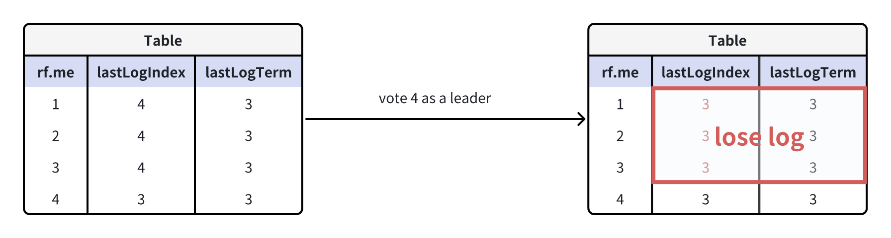

### 4.2 投票（检查日志是否满足大多数的"共识"）

选举出的Leader尽可能满足日志项一致的需求，集群不会丢失过多的日志

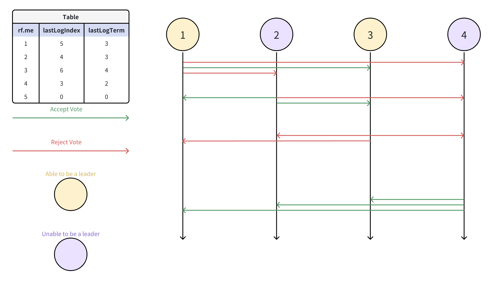

### 4.3 AppendEntries & Leader's HeartBeat

假设我们有如下状态，各个节点的commitIndex（上次提交日志项的序号）用粗红竖线表示

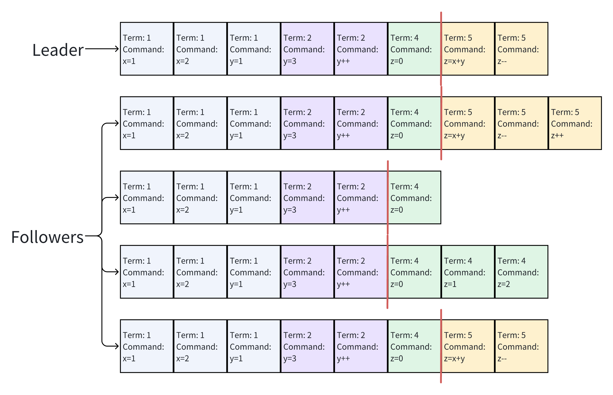

Heartbeat Turn 1:
  - Leader发送无日志心跳
  - Follower[0]发现日志过长，裁剪并返回剩余日志长度(failure)
  - Follower[1]发现日志较短，裁剪至上次提交/同步的日志项，返回commitIndex(failure)
  - Follower[2]发现日志任期不对，裁剪至上次提交/同步的日志项，返回commitIndex(failure)
  - Follower[3]发现一致，返回success

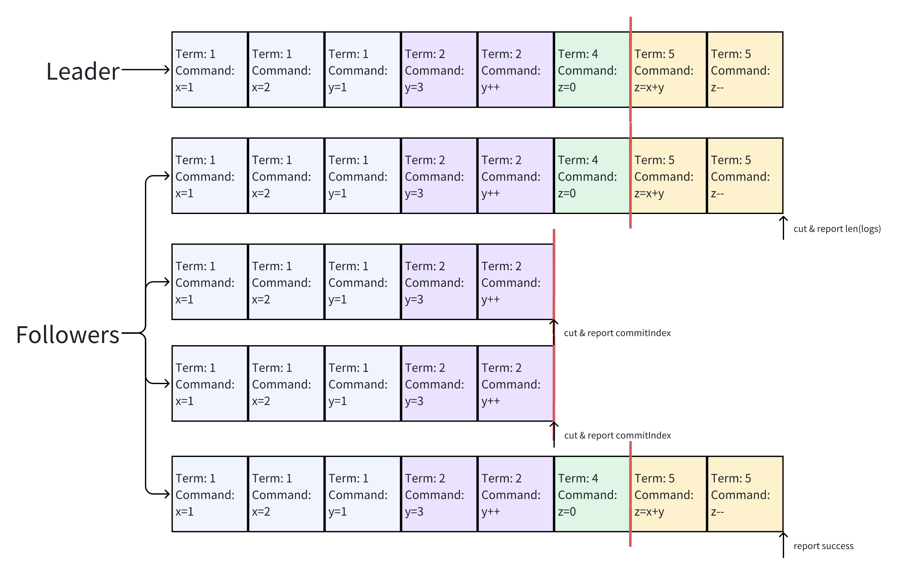

Heartbeat Turn 2：
  - Leader向Follower[1]、Follower[2]发送附带日志心跳，其余发送无日志心跳
  - Follower[0]发现一致，返回Success
  - Follower[1]追加logs[5:8]，返回Success，但不更新commitIndex（实际已同步）
  - Follower[2]追加logs[5:8]，返回Success，但不更新commitIndex（实际已同步）
  - Follower[3]发现一致，返回Success

注：此时已经是"大多数共识"的情况，Leader可以提交日志，并更新commitIndex

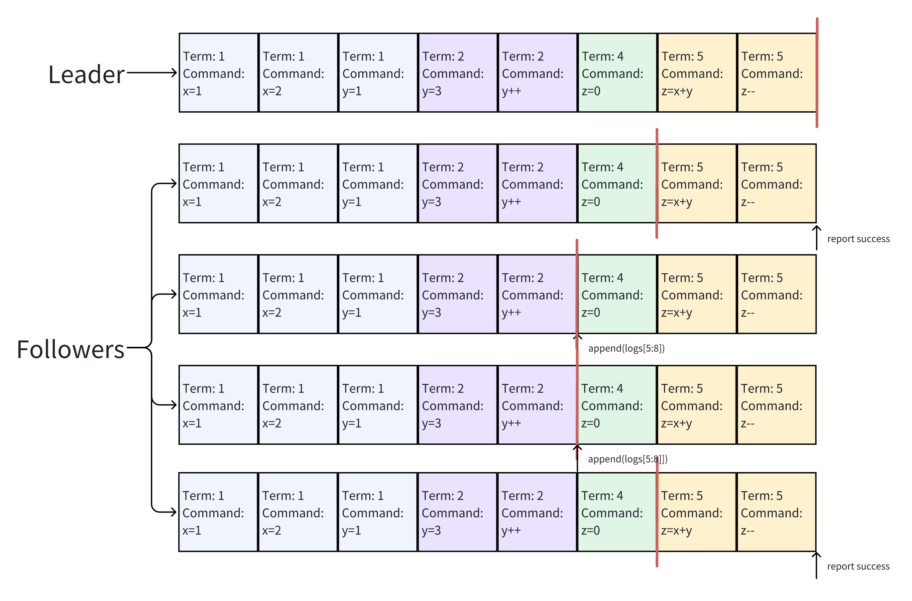

Heartbeat Turn 3:
  - Leader发送无日志心跳
  - Follower[0]发现一致，返回Success，提交日志，更新commitIndex
  - Follower[1]发现一致，返回Success，提交日志，更新commitIndex
  - Follower[2]发现一致，返回Success，提交日志，更新commitIndex
  - Follower[3]发现一致，返回Success，提交日志，更新commitIndex

注：此时commitIndex才算同步完成

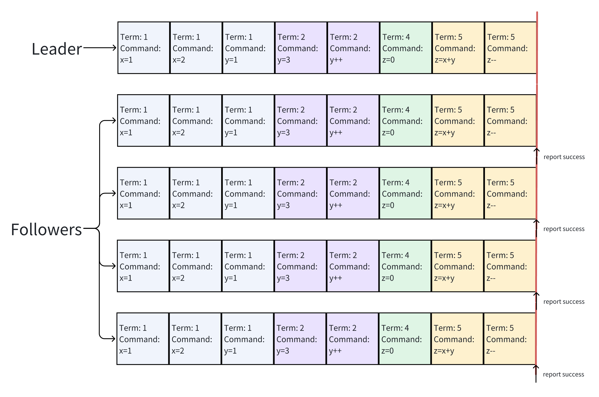

## 5. 思考
虽然`time go test -run 3B` passed且符合cpu time等指标，但有些点是值得思考的
在AppendEntries中，遇到日志缺失时，如果用commintIndex来裁剪、追加日志可能会引发一个问题——在正常AppendEntries的情况下（只在末尾追加几项），有必要把commitIndex后已经同步完成的一部分全删掉再追加吗？可能会出现这种场景：

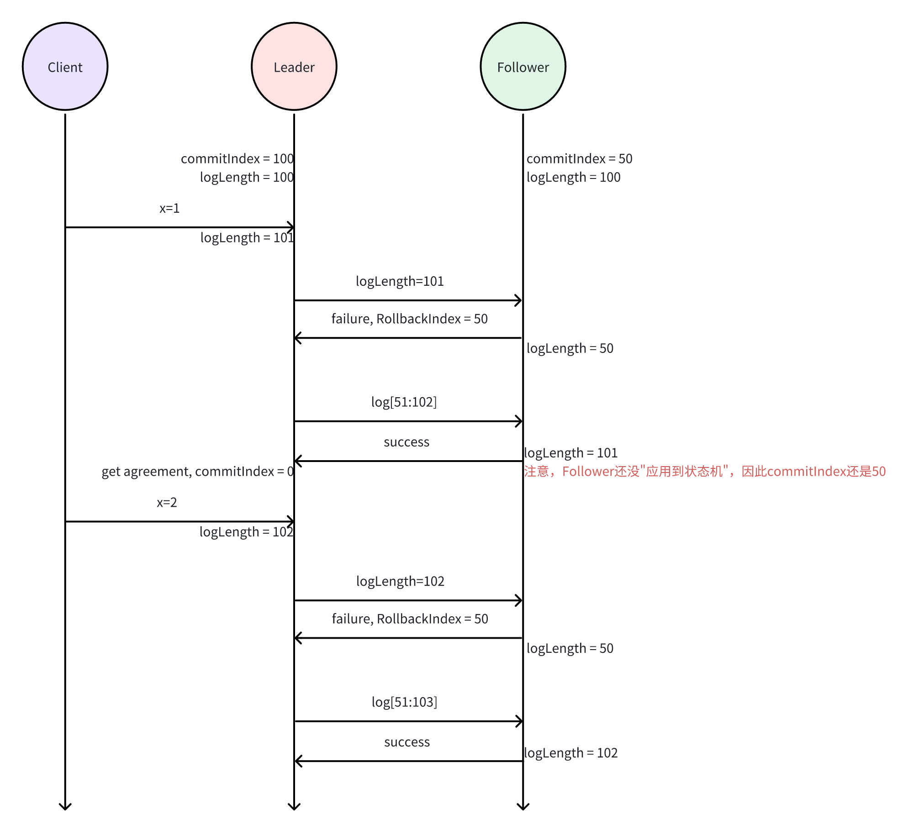

没错，如果Follower从50到100的log也是这么传的话，那么，Follower裁剪的部分会越来越大，Leader传送的数据也只会越来越大。但这种设计是符合官方博客模拟结果（见4.1、4.2）的。

### 5.1 官方博客模拟A
集群过半数同步完成（Follower未更新commitIndex[虚线]），Leader更新commitIndex；下次心跳，Follower更新commitIndex[实线]。

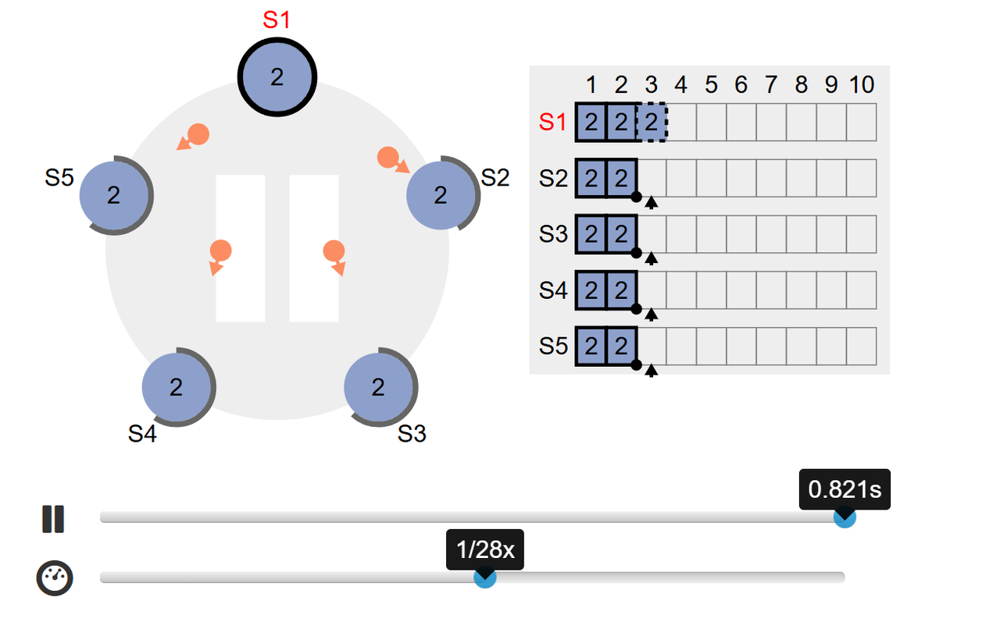

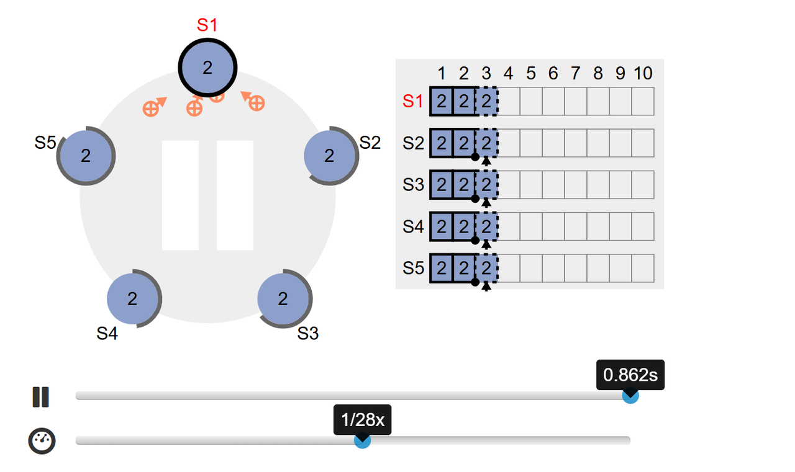

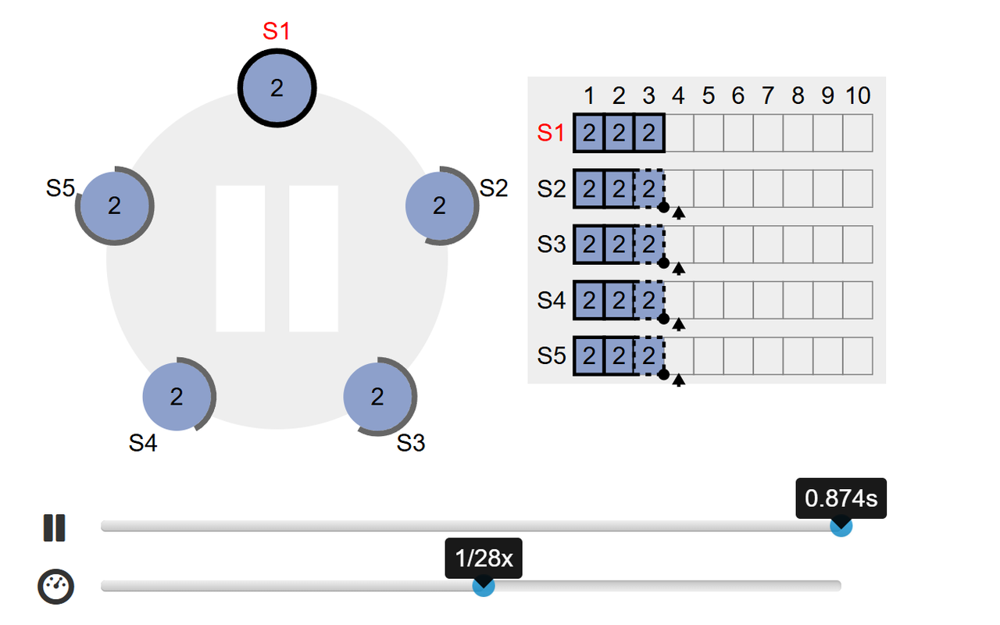

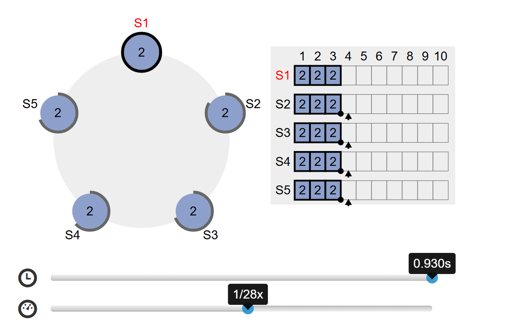

### 5.2 官方博客模拟B
在Follower缺少日志的情况下，从commitIndex开始恢复（这时commitIndex为什么只会在0？可以看论文中的Safety arguments）

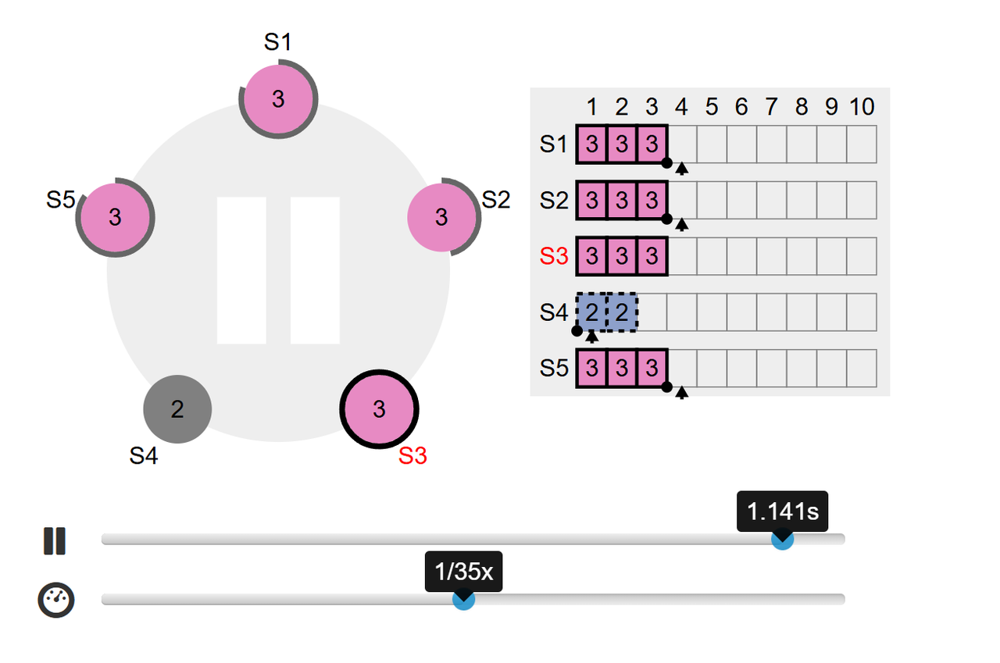

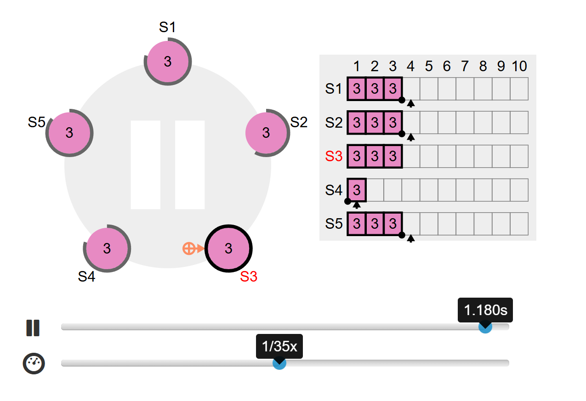