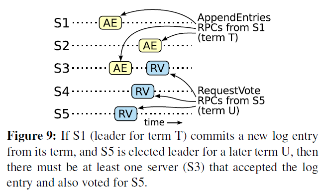

# MIT 6.5840(2024) Lab 3 (Introduction)

这个部分不涉及实验，仅提供Raft算法的介绍。

（论文地址：https://pdos.csail.mit.edu/6.824/papers/raft-extended.pdf）

（官方博客[带动画演示]：https://raft.github.io）

Raft算法大体可以分为三种角色和四个问题（在Lab3中）。
  - 三种角色，指的是Leader、Follower、Candidate；
  - 四个问题，指的是Leader Election、Log、Persistence、Log Compaction

## 1. 角色
### 1.1 Leader
接受客户端发来的请求、向Follower同步请求日志、当日志同步到大多数节点后，告诉Follower提交日志

### 1.2 Follower
接受并持久化Leader请求同步的日志，在Leader请求提交日志时，提交日志。

### 1.3 Candidate
Follower选举Leader前，需要临时成为Candidate参与选举。

## 2. 问题
### 2.1 Leader Election
在Raft共识算法中，心跳机制扮演着触发领导者选举（Leader   Election）的核心角色。算法初始化时，所有服务器（Servers）均设为追随者（Follower）状态。只要服务器接收到来自当前领导者（Leader）或候选者（Candidate）的有效远程过程调用（RPC），其便维持追随者状态。领导者定期向所有追随者发送不含日志条目的心跳RPC，以维持其领导地位。若追随者在预定的选举周期前未收到任何心跳，则假定当前无有效领导者存在，并触发选举流程以选出新的领导者。

选举过程始于追随者将其任期（Term）递增并转变为候选者状态，随后自我投票并向集群内其他服务器并行发送投票请求（RequestVote RPC）。候选者状态将持续，直至发生以下三种情形之一：
1. 成功当选
2. 确认另一候选者赢得多数选票成为领导者
3. 选举超时而无领导者产生

若候选者在当前任期内从集群中大多数服务器获得选票，则宣告选举胜利，成为新的领导者，并向所有服务器发送心跳以巩固其领导地位，防止多领导者的情形发生。每个服务器在同一任期内仅能对单个候选者投票，依据先到先得原则，多数投票规则确保了任期内领导者选举的唯一性。
在等待投票期间，候选者可能接收到来自声称已为领导者的服务器的日志条目追加（AppendEntryRPC）。若该RPC中的任期不低于候选者当前任期，则候选者承认其领导地位并回归追随者状态；反之，则拒绝RPC并保持候选者状态。

此外，若多个追随者同时转变为候选者，可能导致选票分散，无候选者能获得多数选票，从而陷入分裂投票状态。为应对此情况，Raft引入随机选举超时机制，该超时时间从预设区间（如150-300ms）内随机选取，旨在减少同时触发选举的可能性，确保大多数情况下仅有一个候选者能率先超时并发起成功选举。一旦有候选者赢得选举并发送心跳，其他候选者将因接收到更高任期的心跳而转为追随者状态，从而避免无限循环的分裂投票。通过重启随机选举超时并在每次选举开始时重置，进一步降低了后续选举中出现分裂投票的风险。

### 2.2 Log
#### 2.2.1 Log Replication
一旦领导者（Leader）被选举出来，它便开始接受并处理来自客户端（Client）的请求。每个客户端请求都携带一个命令，该命令将由复制的状态机执行。领导者将接收到的命令作为新的日志条目附加到其本地日志中，随后并行地向集群中的每个其他服务器发送AppendEntry   RPC，以复制这一新条目至所有追随者（Follower）。当确认该条目已被安全复制到足够数量的服务器（以满足一致性和可用性要求）时，领导者将条目应用到其本地状态机上，并将执行结果返回给客户端。

面对追随者崩溃、性能下降或网络数据包丢失等潜在问题，领导者会坚持不懈地重试AppendEntry RPC，即便在已经响应客户端请求之后，以确保所有追随者最终都能存储所有必要的日志条目。这种重试机制是无限期的，旨在保持系统的一致性和最终一致性。

日志的组织结构如图6所示，其中每个日志条目不仅包含状态机需要执行的命令，还记录了领导者接收该条目时的任期（Term）。日志条目中的任期信息对于检测日志间的不一致性至关重要，它确保了Raft算法中特定属性的维持。此外，每个日志条目都被赋予了一个唯一的整数索引（Index），用以标识其在日志中的具体位置，从而便于日志的复制、管理和一致性检查。


在Raft共识算法中，领导者（Leader）扮演着至关重要的角色，它负责决定何时将日志条目安全地应用于状态机，这样的条目被称为已提交。Raft确保一旦日志条目被提交，它就是持久的，并且最终会被集群中所有可用的状态机执行。提交日志条目的关键条件是，该条目必须已经被复制到集群中的大多数服务器上。这一提交过程具有传递性，即一旦某个条目被提交，其前面所有的日志条目（无论是由哪个领导者创建的）也都会被提交。

领导者会跟踪它知道的最高可提交索引，并在后续的AppendEntry  RPC（包括心跳消息）中向其他服务器广播这一信息。这样，即使跟随者（Follower）在某一时刻没有接收到最新的提交信息，它们最终也会通过心跳或新的AppendEntry  RPC得知哪些条目已被提交，并将这些条目应用到它们的状态机上。

Raft的日志机制通过维护日志之间的高度一致性来简化系统行为并确保系统的安全性。Raft保证了两个关键属性：
1. **日志条目一致性**：如果两个日志中的条目具有相同的索引（Index）和任期（Term），则它们存储的命令必然相同。这是因为在给定的任期内，领导者最多只能为一个给定的索引创建一个日志条目，且日志条目的位置是不可变的。
2. **日志匹配属性**：如果两个日志中的条目具有相同的索引和任期，则它们之前所有索引的日志条目也完全相同。这一属性通过AppendEntry  RPC的一致性检查来维护。在发送AppendEntry  RPC时，领导者会附带紧接在新条目之前的那个条目的索引和任期。如果跟随者的日志中没有找到匹配的条目，则RPC会被拒绝。通过这种方式，Raft能够确保日志的连续性和一致性。

正常情况下，领导者和跟随者的日志保持一致，因此AppendEntry  RPC的一致性检查不会失败。然而，在领导者崩溃或一系列故障事件后，日志可能会出现不一致。为了处理这种不一致性，新当选的领导者会强制跟随者复制自己的日志。这意味着如果跟随者的日志中包含与领导者日志冲突的条目（即索引和任期相同但命令不同的条目），这些冲突条目将被领导者日志中的相应条目覆盖。通过这种方式，Raft能够恢复日志的一致性，并确保所有服务器的日志最终都保持一致。

为确保Follower的日志与Leader保持同步，Leader需执行一项精确的日志同步过程。此过程始于定位两者日志中最近的共同条目（即最后一致点），随后Leader将移除该点之后Follower日志中所有不一致的条目，并通过一系列AppendEntry  RPC操作，将自身日志中该点之后的所有条目传输至Follower。这一系列操作作为AppendEntry  RPC中的一致性检查响应自动触发。Leader针对每个Follower维护一个nextIndex，标识了下一个待发送日志条目的索引位置。当某个Candidate成功转变为Leader时，它会将所有Follower的nextIndex初始化为自身日志最后一个条目的后一索引，以准备日志同步。

若Follower的日志与Leader不一致，后续的AppendEntry RPC将因一致性检查失败而被拒绝。面对此情形，Leader通过递减nextIndex并重新发起AppendEntry  RPC的方式，迭代尝试直至找到日志匹配点。一旦匹配成功，AppendEntry  RPC将成功执行，进而清除Follower中冲突的日志条目，并追加来自Leader的新日志条目（若存在）。此后，Follower的日志状态将与Leader完全一致，并在当前任期（Term）内保持此状态。为提升效率，可引入优化策略，如Follower在拒绝AppendEntry请求时，反馈冲突条目的任期（Term）及其在该任期内的首个条目索引，从而允许Leader更精准地调整nextIndex，减少不必要的RPC请求。

此日志复制机制展现了Raft在保障日志一致性和高可用性方面的卓越设计。它确保在大多数服务器活跃的情况下，Raft能够持续接受、复制并应用新的日志条目。在正常情况下，新条目的复制可通过一轮RPC高效完成至集群的大部分成员，单个慢速Follower不会显著影响整体性能。此外，Leader在接管过程中无需执行特定日志恢复操作，而是通过自然的AppendEntry   RPC及其一致性检查机制，实现日志的自动收敛。尤为重要的是，Leader始终维护其日志的完整性和历史记录，而不会覆盖或删除自身日志，从而保障了数据的一致性和完整性。

#### 2.2.2 Safety
前述部分详尽阐述了Raft如何执行Leader选举及日志条目的复制过程。然而，仅依靠这些机制尚不足以充分保障所有状态机能够严格按照相同的顺序执行完全一致的命令集。具体而言，存在一种潜在场景：当Leader成功提交多个日志条目后，若某些Follower因故未能及时同步这些条目并随后被选举为新的Leader，则新Leader可能会引入新的日志条目，从而覆盖原Leader已提交的条目。这种情况下，不同的状态机可能会基于不同的日志序列执行命令，导致系统状态的不一致。

为解决这一问题，Raft算法引入了成为Leader的额外限制条件。这一限制确保了任何在给定Term内被选举为Leader的节点，其日志必须包含该Term之前所有已成功提交的日志条目。换言之，新Leader在获得领导权之前，必须通过日志复制机制从其他节点处获取并应用足够的日志条目，直至其日志状态达到或超越集群中已提交日志的最新状态。

##### 2.2.2.1 Election Restriction
在任何基于Leader的共识算法框架内，确保Leader能够完整存储所有已提交的日志条目是至关重要的。与某些其他共识算法相比，如Viewstamped  Replication [22]，Raft采取了一种更为简洁高效的策略来处理这一问题。在Viewstamped  Replication等算法中，即便Leader在选举之初并未包含所有已提交的日志条目，也能被选举为Leader，但随后需要通过复杂的额外机制来识别并传输缺失的日志条目给新Leader，这一过程可能发生在选举期间或之后不久，从而增加了算法的复杂性和开销。

相反，Raft通过设计，确保在选举时刻，每个新当选的Leader都自然地包含了前任期内所有已提交的日志条目，无需额外的条目传输过程。这一特性极大地简化了算法逻辑，同时确保了日志条目流动的单一性——即从Leader流向Follower，且Leader永远不会覆盖其日志中的现有条目，维护了日志的完整性和历史记录。

Raft通过其独特的投票过程来强化这一日志完整性的保障。具体来说，候选人必须获得集群中大多数节点的选票才能成功当选为Leader。这一要求隐含了一个关键前提：每个已提交的日志条目至少会被集群中的一个节点所记录。因此，当候选人发起RequestVoteRPC请求投票时，它会携带自身的日志信息。如果某个选民节点的日志比候选人的日志更新，则选民会拒绝投票给该候选人。这一机制有效地阻止了那些日志不完整或落后的候选人赢得选举，从而确保了新Leader在接管时能够拥有所有必要的已提交日志条目，以维持系统状态的一致性和正确性。


Raft采用了一种日志比较机制来确定两个日志之间的新旧关系。这一机制主要基于日志中最后一个条目的Index（索引）和Term（任期）两个关键属性进行。
  - 首先检查这两个日志中最后一个条目的Term值。如果这两个条目的Term不同，则根据Raft的任期递增原则，具有较晚Term的日志被视为更新。
  - 如果两个日志的最后一个条目具有相同的Term，说明这两个条目是在同一任期内产生的。在这种情况下，通过比较这两个日志的长度（即条目的数量）来确定哪个日志更新。

##### 2.2.2.2 Committing Entries From Previous Terms
在Raft中，Leader能够确信其当前Term内生成的日志条目，在成功复制到集群中的大多数服务器后，即被视为已提交。然而，对于先前Term中的日志条目，Leader无法仅凭它们在大多数服务器上的存在就立即断定其已提交状态。这是因为存在一种潜在场景（如图8所示），其中旧日志条目虽然已存储在大多数服务器上，但仍有可能在未来的选举过程中被新Leader的日志所覆盖。

为了规避这类问题，Raft设计了一种更为谨慎的日志提交机制。具体而言，Raft从不直接通过计算副本数量来提交属于先前Term的日志条目。相反，它仅允许通过计算副本数量来提交属于Leader当前Term的日志条目。一旦当前Term的某个日志条目以这种方式被提交，那么根据Raft的日志匹配属性，所有在该条目之前的日志（无论属于哪个Term）都将被间接地视为已提交。

尽管在某些特定情况下（例如，当某个旧日志条目实际上已存储在集群中的每一台服务器上时），Leader可能能够安全地推断出该条目已提交，但Raft为了保持设计的简洁性和一致性，采取了更为保守的策略。这种策略虽然可能在某些场景下显得略微冗余，但它有效地避免了复杂性和潜在错误，确保了Raft在各种网络环境和故障场景下的可靠性和稳定性。



Raft在其提交规则中引入了一种独特的复杂性处理机制，这一机制源于其对日志条目Term编号的保留策略。在Raft中，当Leader从先前的Term中复制日志条目时，这些条目会保留其原始的Term编号，而不是被重新赋予新Leader的当前Term编号。这一做法与其他一些共识算法形成了鲜明对比，在那些算法中，新Leader重新复制旧Term的日志条目时，必须为它们分配新的Term编号。

Raft选择保留原始Term编号的做法带来了多重优势。首先，它使得对日志条目的推理变得更加直接和简单。由于日志条目的Term编号随时间推移和跨不同日志保持一致，因此可以更容易地追踪和验证日志的历史和完整性。其次，这种策略还减少了新Leader在复制和提交旧日志条目时所需的工作量。在Raft中，新Leader无需发送冗余的日志条目来重新编号旧条目，从而节省了网络带宽和计算资源。相比之下，其他算法可能需要发送大量的额外日志条目来重新编号并确认旧条目的有效性，这无疑增加了系统的复杂性和开销。

##### 2.2.2.3 Safety Arguments
在完整的Raft算法框架下，我们可以严谨地证明Leader完备性属性是成立的。为此，我们采用反证法，即假设该属性不成立，并据此推导出逻辑矛盾。
假设条件：
  - 假设在Term~T~中，Leader~T~成功提交了一个日志条目，但此条目并未被未来任何Term（设为Term~U~，其中U > T）的Leader所存储。
  - 特别地，考虑最小的Term~U~ > Term~T~，其Leader（Leader~U~）不存储该已提交的条目。
  
推导过程：
   1. **日志条目状态**：在Leader~U~的选举过程中，由于Leader从不主动删除或覆盖已提交的日志条目，因此该已提交的条目不可能存在于Leader~U~的日志中。
   2. **投票者存在性**：鉴于Leader~T~在大多数服务器上复制了该条目，并且Leader~U~从这些服务器中获得了选票，至少存在一个服务器（投票者）既接受了Leader~T~的条目又投票给了Leader~U~。此投票者是分析中的关键点。
   3. **投票者日志状态**：投票者在投票给Leader~U~之前，必须已接受并确认了Leader~T~的已提交条目，否则它会拒绝来自更高Term（如Leader~U~）的AppendEntry请求。
   4. 日志一致性：投票者在投票给Leader~U~时，仍保留该已提交的条目。这是因为根据假设，所有在Leader~U~之前的Leader都包含该条目，且Leader不删除条目，Follower也仅在日志冲突时才会进行删除操作。
   5. **日志匹配与矛盾**：
       - **情况一**：若投票者和Leader~U~的最后一个日志项相同，则根据日志匹配原则，Leader~U~的日志长度至少与投票者相同，从而包含所有投票者日志中的条目，包括已提交的条目。这与假设矛盾。
       - **情况二**：若Leader~U~的最后一个日志项索引大于投票者，且该索引大于T（因为投票者的日志包含来自Term~T~的已提交条目），则创建该日志项的早期Leader（根据假设）必须包含已提交的条目。通过日志匹配，Leader~U~的日志也应包含这些条目，再次与假设矛盾。

   6. **Conclusion**：上述推导产生了逻辑矛盾，证明了我们的初始假设是错误的。因此，所有Term大于T的Leader都必须包含Term~T~中提交的所有日志条目，即Leader完备性属性成立。
   7. **Log Matching Property**：此外，Raft的Log Matching Property进一步保证了未来的Leader将间接包含所有通过日志匹配属性间接提交的条目，如图8（d）中的Index 2所示，从而强化了系统的数据一致性和可靠性。

鉴于Raft中Leader完整性的核心原则，我们得以验证状态机的安全属性。此属性明确指出，一旦某服务器在特定Index处将日志条目成功应用于其状态机，则在该分布式系统中，其他任何服务器均不可在该Index处应用不同的日志条目。此机制确保了日志应用的一致性。具体而言，当某服务器执行日志条目的状态机应用时，其内部日志必须精确匹配Leader在该Index处的日志内容，且该条目需被正式提交。

进一步分析，考虑任何服务器首次应用给定日志Index时所处的任期（Term）下限，日志完整性属性作为保障，确保了所有后续更高任期的Leader均将维护并存储相同的日志条目序列。因此，即便在任期更迭后，任何尝试应用该Index的服务器都将遵循相同的数据值，从而维护状态机安全属性的不变性。

最后，Raft严格要求所有服务器遵循日志Index的顺序来逐一应用日志条目。这一规则与状态机安全属性相辅相成，共同确保了所有服务器将按照完全相同的顺序，对一组完全一致的日志条目集进行状态机应用，从而实现了分布式系统状态的一致性和安全性。

#### 2.2.3 Follower and Candidate Crashes
在探讨Raft的健壮性时，我们之前主要聚焦于Leader的故障场景。然而，对于Follower和Candidate节点的崩溃处理，Raft同样提供了简洁而有效的解决方案。这两类节点在崩溃时的行为模式相对简单且统一，它们均以相同的机制应对崩溃事件。

具体而言，当Follower或Candidate节点崩溃时，后续针对该节点的RequestVote和AppendEntry  RPC请求将遭遇失败。为应对此类失败，Raft设计了无限重试机制，确保请求在节点恢复后能够成功完成。一旦崩溃的服务器重新上线，先前因崩溃而未完成的RPC请求将自动重试，直至成功为止。

此外，Raft还考虑了服务器在RPC处理过程中的另一种潜在崩溃场景：即服务器在成功完成RPC逻辑但尚未发送响应之前崩溃。针对这种情况，当服务器重启后，它可能会再次接收到与之前相同的RPC请求。幸运的是，Raft中的RPC设计是幂等的，这意味着重复执行相同的RPC请求不会对系统状态产生额外的影响或损害。

以AppendEntry  RPC为例，当Follower节点接收到一个包含其日志中已存在条目的AppendEntry请求时，根据幂等性原则，它会智能地忽略这些重复的日志条目，仅处理并追加那些新的或不一致的日志条目。这种设计不仅简化了错误处理逻辑，还确保了系统状态的一致性和数据的完整性。

#### 2.2.4 Timing and Availability
在Raft的设计中，一个核心要求是确保系统的安全性不应依赖于任何特定的时间条件或时机因素。具体而言，Raft必须能够在各种不可预测的时序场景下，如某些事件比预期更快或更慢地发生时，依然能够产生正确且一致的结果。这一要求体现了Raft对分布式系统本质复杂性的深刻理解，以及其在设计之初就致力于构建稳健、可靠的分布式一致性算法的决心。

然而，值得注意的是，尽管安全性被设计为与时机无关，但系统的可用性（即系统及时响应客户端请求的能力）却不可避免地受到时机因素的影响。这是因为可用性往往与系统的响应速度、消息传递的延迟以及节点间的交互效率紧密相关。例如，在极端情况下，如果消息交换的时间显著长于服务器崩溃后重启并重新参与集群选举的时间，那么处于Candidate状态的节点可能会因为无法收集到足够的选票而无法赢得选举。缺乏稳定的Leader将导致Raft集群无法有效推进日志复制和状态机更新。

> [!note]
> 
> <strong>
> not stay up long enough to poop out（从来不会疲倦）
> </strong>
> 
> <strong>
> not stay up long enough to do（从来不会）
> </strong>
> 
> <strong>
> poop out（精疲力尽）
> </strong>
> 
> <strong>
> not stay up long enough to win an election（从来不会赢得选举）
> </strong>


Leader Election是Raft中时间敏感性最高的环节之一。为了确保Raft能够持续有效地选举并维持一个稳定的Leader，系统必须满足一系列严格的时间要求。具体而言，这些要求通过以下不等式体现：

``` math
broadcastTime << electionTimeout << MTBF
``` 

在此不等式中，broadcastTime代表服务器向集群中所有服务器并行发送RPC请求并接收其响应所需的平均时间。这个时间量主要取决于网络延迟和存储技术的性能。为了保持Leader的稳定性，broadcastTime应当远小于electionTimeout，以确保Leader能够频繁地发送心跳消息，从而有效阻止Follower节点错误地启动新的选举过程。此外，采用随机化的electionTimeout方法还进一步降低了分裂投票的风险，提高了选举过程的稳定性和可靠性。

electionTimeout则是选举超时时间，它应当设置得足够长，以允许在大多数正常操作情况下完成一次完整的选举过程，但同时又需要远小于MTBF（单个服务器的平均故障间隔时间）。这样的设置确保了当Leader崩溃时，系统能够迅速响应并选举出新的Leader，从而在最短时间内恢复服务的可用性。同时，由于electionTimeout相对较短，它也限制了系统在无Leader状态下的不可用时间，使其成为整体运行时间中的一小部分。

值得注意的是，broadcastTime和MTBF是底层系统属性的直接反映，而electionTimeout则是Raft设计者需要精心选择的参数。由于Raft的RPC请求通常要求接收者将信息持久化到稳定的存储介质中，因此broadcastTime可能会因存储技术的不同而在较大范围内波动（如0.5ms至20ms）。基于这一考虑，electionTimeout通常被设定在10ms至500ms之间，以平衡选举的快速响应与系统稳定性的需求。
最后，典型的服务器MTBF值通常为数月甚至更长，这远远超过了electionTimeout的设置范围，从而确保了Raft的时序要求在实际应用中能够得到充分满足。


### 2.3 Persistence
1. **持久化**：
   - 在Raft中，持久化是确保数据一致性和系统容错能力的关键。当系统发生故障（如节点崩溃或重启）时，持久化存储可以帮助系统恢复到故障前的状态
   - Raft需要持久化存储的信息包括：日志（Log）、当前任期号（currentTerm）、投票给的候选人ID（votedFor）等状态（State）信息[简单来说就是论文中图2提到的 Persistent state on all servers]
2. **数据一致性的实现**：
   - 节点在接收到日志条目后，会将其持久化存储到磁盘中，以确保在系统故障时不会丢失
   - 当节点重启时，它会从磁盘中读取持久化的状态信息，并恢复到故障前的状态，从而保持数据的一致性并基于这些信息重新加入到集群中

### 2.4 Log Compaction
在正常运行过程中，Raft的日志会不断增长以容纳更多的客户端请求，但在实际系统中，其增长不能是无限的。随着日志不断增长，它会占用更多空间，并需要更多时间来重放。如果没有某种机制来丢弃日志中累积的过时信息，这最终将导致可用性问题。

快照是压缩的最简单方法。在快照过程中，将整个当前系统状态写入稳定存储上的快照，然后丢弃到该点为止的整个日志。Chubby和ZooKeeper都使用了快照，本节剩余部分将描述Raft中的快照。

不仅如此，还可以采用增量压缩方法，如日志清理和日志结构合并树。这些方法一次只处理部分数据，因此它们可以将压缩负载更均匀地分散到各个时间段。它们首先选择累积了许多已删除和已覆盖对象的数据区域，然后以更紧凑的方式重写该区域中的活动对象，并释放该区域。与快照相比，这些方法需要额外的机制和复杂性，因为快照通过始终对整个数据集进行操作来简化问题。尽管日志清理需要对Raft进行修改，但状态机可以使用与快照相同的接口来实现LSM（Log-Structured-Merge-Tree）树。

图12展示了Raft中快照的基本思想。


每个服务器独立地进行快照，仅覆盖其日志中的已提交条目。大部分工作由状态机将其当前状态写入快照完成。Raft还在快照中包含少量元数据：最后包含的索引是快照替换的日志中最后一个条目的索引（状态机最后应用的条目），最后包含的任期是该条目的任期。这些信息的保留是为了支持快照后第一个日志条目的AppendEntries一致性检查，因为该条目需要一个先前的日志索引和任期。为了实现集群成员变更（第6节），快照还包括截至最后包含索引的日志中的最新配置。一旦服务器完成快照的写入，它可以删除直到最后包含索引的所有日志条目，以及任何先前的快照。

尽管服务器通常独立地进行快照，但Leader必须偶尔向落后的Follower发送快照。这种情况发生在Leader已经丢弃了它需要发送给Follower的下一个日志条目时。幸运的是，在正常操作中这种情况不太可能发生：与Leader保持同步的Follower已经拥有这个条目。然而，一个异常缓慢的Follower或新加入集群的服务器则不会。使这样的Follower更新的方法是Leader通过网络向其发送快照。

Leader使用一种新的RPC，称为InstallSnapshot，向落后的Follower发送快照。当Follower通过此RPC接收到快照时，它必须决定如何处理其现有的日志条目。通常，快照将包含接收者日志中尚未存在的新信息。在这种情况下，Follower将丢弃其整个日志；它全部被快照取代，并且可能包含与快照冲突的未提交条目。如果Follower收到的快照描述了其日志的前缀（由于重传或错误），则被快照覆盖的日志条目将被删除，但快照之后的条目仍然有效且必须保留。

这种快照方法与Raft的强Leader原则有所不同，因为Follower可以在领导者不知情的情况下进行快照。然而，我们认为这种偏离是合理的。虽然拥有Leader有助于避免在达成共识时出现决策冲突，但在进行快照时，共识已经达成，因此不会存在决策冲突。数据仍然只从Leader流向Follower，只是现在Follower可以重新组织其数据。
我们考虑了一种基于Leader的替代方法，其中只有Leader会创建快照，然后将其发送给每个Follower。然而，这种方法有两个缺点。首先，向每个Follower发送快照会浪费网络带宽并减慢快照过程。每个Follower都已经拥有生成自己快照所需的信息，而且服务器从本地状态生成快照通常比通过网络发送和接收快照要便宜得多。其次，Leader的实现会更加复杂。例如，Leader需要在向Follower复制新的日志条目的同时并行地向它们发送快照，以免阻塞新的客户端请求。

还有两个问题会影响快照性能。首先，服务器必须决定何时进行快照。如果服务器过于频繁地进行快照，会浪费磁盘带宽和能源；如果快照频率过低，则可能会耗尽存储容量，并增加重新启动时重放日志所需的时间。一种简单的策略是当日志达到固定字节大小时进行快照。如果将此大小设置为明显大于预期快照大小，则快照对磁盘带宽的开销将很小。

第二个性能问题是写入快照可能需要大量时间，而我们不希望这延迟正常操作。解决方案是使用写时复制技术，以便可以在不影响正在写入的快照的情况下接受新的更新。例如，使用函数式数据结构构建的状态机自然支持这一点。或者，也可以使用操作系统的写时复制支持（例如Linux上的fork）来创建整个状态机的内存快照