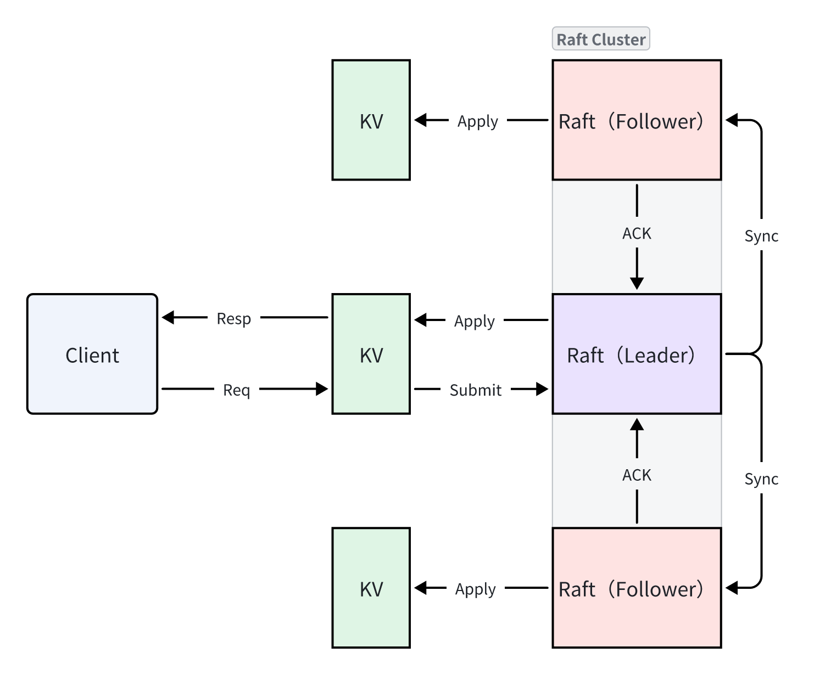
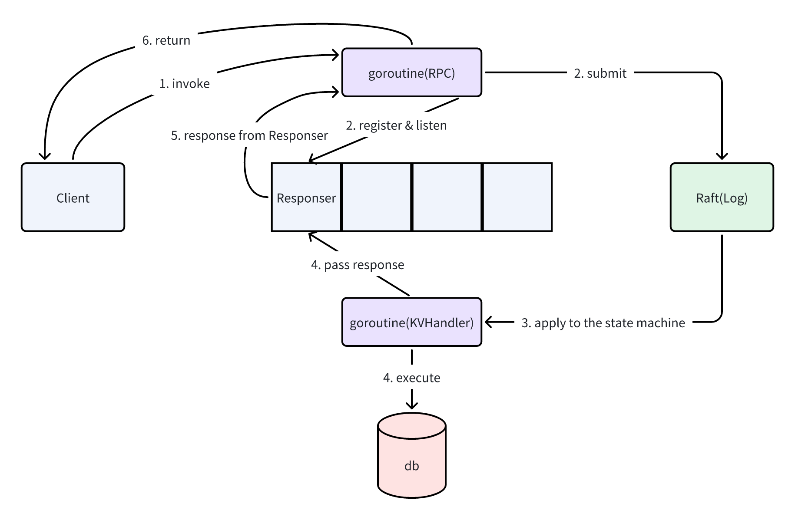

# MIT 6.5840(2024) Lab 4
这次不分A/B，因为A/B测试内容几乎差不多

## 1. 任务
### 1.1 Part A
> Each of your key/value servers ("kvservers") will have an associated Raft peer. Clerks send `Put()`, `Append()`, and `Get()` RPCs to the kvserver whose associated Raft is the leader. The kvserver code submits the Put/Append/Get operation to Raft, so that the Raft log holds a sequence of Put/Append/Get operations. All of the kvservers execute operations from the Raft log in order, applying the operations to their key/value databases; the intent is for the servers to maintain identical replicas of the key/value database. 
> 
> A `Clerk` sometimes doesn't know which kvserver is the Raft leader. If the `Clerk` sends an RPC to the wrong kvserver, or if it cannot reach the kvserver, the `Clerk` should re-try by sending to a different kvserver. If the key/value service commits the operation to its Raft log (and hence applies the operation to the key/value state machine), the leader reports the result to the `Clerk` by responding to its RPC. If the operation failed to commit (for example, if the leader was replaced), the server reports an error, and the `Clerk` retries with a different server. 
> 
> Your kvservers should not directly communicate; they should only interact with each other through Raft.  

Your first task is to implement a solution that works when there are no dropped messages, and no failed servers. 

Feel free to copy over your client code from Lab 2 (`kvsrv/client.go`) into `kvraft/client.go`. You will need to add logic for deciding which kvserver to send each RPC to. Recall that `Append()` no longer returns a value to the Clerk. 

You'll also need to implement `Put()`, `Append()`, and `Get()` RPC handlers in `server.go`. These handlers should enter an `Op` in the Raft log using `Start()`; you should fill in the Op struct definition in `server.go` so that it describes a Put/Append/Get operation. Each server should execute Op commands as Raft commits them, i.e. as they appear on the `applyCh`. An RPC handler should notice when Raft commits its `Op`, and then reply to the RPC.  

You have completed this task when you **reliably** pass the first test in the test suite: "One client". 

> [!tip] Hints
> <ol><strong>
> <li>
> After calling Start(), your  kvservers will need to wait for Raft to complete agreement. Commands that have been agreed upon arrive on the applyCh. Your code will need to keep reading applyCh while Put(), Append(), and Get() handlers submit commands to the Raft log using Start(). Beware of deadlock between the kvserver and its Raft library.  
> </li>
> <li>
> A kvserver should not complete a Get() RPC if it is not part of a majority (so that it does not serve stale data). A simple solution is to enter every Get() (as well as each Put() and Append()) in the Raft log. You don't have to implement the optimization for read-only operations that is described in Section 8.  
> </li>
> <li>
> You should not need to add any fields to to the Raft ApplyMsg, or to Raft RPCs such as AppendEntries, but you are allowed to do so.    
> </li>
> <li>  
> It's best to add locking from the start because the need to avoid deadlocks sometimes affects overall code design. Check that your code is race-free using go test -race.  
> </li>
> </strong></ol>

> Now you should modify your solution to continue in the face of network and server failures. One problem you'll face is that a `Clerk` may have to send an RPC multiple times until it finds a  kvserver that replies positively. If a leader fails just after committing an entry to the Raft log, the `Clerk` may not receive a reply, and thus may  re-send the request to another leader. Each call to `Clerk.Put()` or `Clerk.Append()` should result in just a single execution, so you will have to ensure that the re-send doesn't result in the servers executing the request twice.

Add code to handle failures, and to cope with duplicate `Clerk` requests, including situations where the `Clerk` sends a request to a kvserver leader in one term, times out waiting for a reply, and re-sends the request to a new leader in another term. The request should execute just once. These notes include guidance on <a href="https://pdos.csail.mit.edu/6.824/notes/l-raft-QA.txt">duplicate detection</a>. Your code should pass the `go test -run 4A` tests.

> [!tip] Hints
> <ol><strong>
> <li>
> Your solution needs to handle a leader that has called Start() for a Clerk's RPC, but loses its leadership before the request is committed to the log. In this case you should arrange for the Clerk to re-send the request to other servers until it finds the new leader. One way to do this is for the server to detect that it has lost leadership, by noticing that Raft's term has changed or a different request has appeared at the index returned by Start(). If the ex-leader is partitioned by itself, it won't know about new leaders; but any client in the same partition won't be able to talk to a new leader either, so it's OK in this case for the server and client to wait indefinitely until the partition heals.  
> </li>
> <li>
> You will probably have to modify your  Clerk to remember which server turned out to be the leader for the last RPC, and send the next RPC to that server first. This will avoid wasting time searching for the leader on every RPC, which may help you pass some of the tests quickly enough.  
> </li>
> <li>
> You should use a duplicate detection scheme similar to Lab 2. It should free server memory quickly, for example by having each RPC imply that the client has seen the reply for its previous RPC. It's OK to assume that a client will make only one call into a Clerk at a time. You may find that you need to make changes to what information you store in your duplicate detection table from Lab 2.  
> </li>
> </strong></ol>

### 1.2 Part B
> As things stand now, your key/value server doesn't call your Raft library's Snapshot() method, so a rebooting server has to replay the complete persisted Raft log in order to restore its state. Now you'll modify kvserver to cooperate with Raft to save log space, and reduce restart time, using Raft's Snapshot() from Lab 3D. 
> 
> The tester passes `maxraftstate` to your `StartKVServer()`. `maxraftstate` indicates the maximum allowed size of your persistent Raft state in bytes (including the log, but not including snapshots). You should compare `maxraftstate` to `persister.RaftStateSize()`. Whenever your key/value server detects that the Raft state size is approaching this threshold, it should save a snapshot by calling Raft's `Snapshot`. If `maxraftstate` is -1, you do not have to snapshot. maxraftstate applies to the GOB-encoded bytes your Raft passes as the first argument to to `persister.Save()`.  

Modify your kvserver so that it detects when the persisted Raft state grows too large, and then hands a snapshot to Raft.  When a kvserver server restarts, it should read the snapshot from persister and restore its state from the snapshot.

> [!tip] Hints
> <ol><strong>
> <li>
> Think about when a kvserver should snapshot its state and what should be included in the snapshot. Raft stores each snapshot in the persister object using <code>Save()</code>, along with corresponding Raft state. You can read the latest stored snapshot using <code>ReadSnapshot()</code>.
> </li>
> <li>
> Your kvserver must be able to detect duplicated operations in the log across checkpoints, so any state you are using to detect them must be included in the snapshots.
> </li>
> <li>
> Capitalize all fields of structures stored in the snapshot.
> </li>
> <li>
> You may have bugs in your Raft library that this lab exposes.  If   you make changes to your Raft implementation make sure it continues   to pass all of the Lab 3 tests.
> </li>
> <li>
> A reasonable amount of time to take for the Lab 4 tests is 400 seconds of real time and 700 seconds of CPU time. Further, <code>go test -run TestSnapshotSize</code> should take less than 20 seconds of real time.
> </li>
> </strong></ol>

## 2. 分析&实现
<s>没提及的都写在注释里</s>

### 2.1 整体结构
简单来说就是在Lab 2与Lab 3的基础上实现一个KVServer



不难发现，KV就是Raft论文中提到的状态机。

### 2.2 RPC结构
与Lab 2类似，不过需要额外返回一个Err，且PutAppend不需要返回原始键值。

> Err本质上只需要前三个（OK、ErrNoKey、ErrWrongLeader）。多余的Err只是为了好理解。
> 
> 如果只用前三个，则出现四种Err：
>  1. "OK"
>  2. "ErrNoKey"
>  3. "ErrWrongLeader"
>  4. ""
> 
> 我们可以认为空字符串对应着ErrOthers（不涵盖在定义的Err中），而剩余两个Err都可以用其他方法替代

``` go
package kvraft

const (
    OK             = "OK"
    ErrNoKey       = "ErrNoKey"
    ErrWrongLeader = "ErrWrongLeader"
    ErrTimeout     = "ErrTimeout"
    ErrRPCFailed   = "ErrRPCFailed"
    ErrOthers      = "ErrOthers"
)

type Err string

// Put or Append
type PutAppendArgs struct {
    Key   string
    Value string
    // You'll have to add definitions here.
    // Field names must start with capital letters,
    // otherwise RPC will break.

    Op    string
    Clerk int64
    Index int64
}

type PutAppendReply struct {
    Err Err
}

type GetArgs struct {
    Key string
    // You'll have to add definitions here.

    Clerk int64
    Index int64
}

type GetReply struct {
    Err   Err
    Value string
}
```

### 2.3 Client
Client实现很简单，与Lab 2类似，只不过多了个Err处理和Raft集群通信（Lab 2是单Server，而Lab 4是Raft集群，因此要指定Leader）

``` go
package kvraft

import (
    "crypto/rand"
    "math/big"
    "time"

    "6.5840/labrpc"
)

type Clerk struct {
    servers []*labrpc.ClientEnd
    // You will have to modify this struct.

    id     int64
    index  int64
    leader int
}

const (
    RetryInterval = 100
)

func (ck *Clerk) wait() {
    time.Sleep(time.Duration(RetryInterval) * time.Millisecond)
}

func (ck *Clerk) getIndex() int64 {
    ck.index++
    return ck.index - 1
}

func (ck *Clerk) nextLeader() {
    ck.leader = (ck.leader + 1) % len(ck.servers)
}

func MakeClerk(servers []*labrpc.ClientEnd) *Clerk {
    ck := new(Clerk)
    ck.servers = servers
    // You'll have to add code here.

    ck.id = nrand()
    ck.index = 0
    ck.leader = 0
    return ck
}

// fetch the current value for a key.
// returns "" if the key does not exist.
// keeps trying forever in the face of all other errors.
//
// you can send an RPC with code like this:
// ok := ck.servers[i].Call("KVServer."+op, &args, &reply)
//
// the types of args and reply (including whether they are pointers)
// must match the declared types of the RPC handler function's
// arguments. and reply must be passed as a pointer.
func (ck *Clerk) Get(key string) string {

    // You will have to modify this function.
    args := GetArgs{
        Key:   key,
        Clerk: ck.id,
        Index: ck.getIndex(),
    }

    for {
        reply := GetReply{}
        if ok := ck.servers[ck.leader].Call("KVServer.Get", &args, &reply); !ok {
            // RPC错误
            reply.Err = ErrRPCFailed
        }

        switch reply.Err {
        case ErrRPCFailed:
            // RPC错误可能是原Leader出现故障
            ck.nextLeader()
            ck.wait()
        case ErrWrongLeader:
            // Leader发生变动
            ck.nextLeader()
            ck.wait()
        case ErrTimeout:
            // 这里不是C/S的网络故障
            // 操作应答超时
            ck.wait()
        case ErrOthers:
            // nothing
        case OK:
            // 正常结果
            return reply.Value
        case ErrNoKey:
            // 正常结果
            return reply.Value
        default:
            DPrintf("what err?: %v", reply.Err)
        }
    }
}

// shared by Put and Append.
//
// you can send an RPC with code like this:
// ok := ck.servers[i].Call("KVServer.PutAppend", &args, &reply)
//
// the types of args and reply (including whether they are pointers)
// must match the declared types of the RPC handler function's
// arguments. and reply must be passed as a pointer.
func (ck *Clerk) PutAppend(key string, value string, op string) {
    // You will have to modify this function.
    args := PutAppendArgs{
        Key:   key,
        Value: value,
        Op:    op,
        Clerk: ck.id,
        Index: ck.getIndex(),
    }

    for {
        reply := PutAppendReply{}
        if ok := ck.servers[ck.leader].Call("KVServer.PutAppend", &args, &reply); !ok {
            // RPC错误
            reply.Err = ErrRPCFailed
        }

        switch reply.Err {
        case ErrRPCFailed:
            // RPC错误可能是原Leader出现故障
            ck.nextLeader()
            ck.wait()
        case ErrWrongLeader:
            // Leader发生变动
            ck.nextLeader()
            ck.wait()
        case ErrTimeout:
            // 这里不是C/S的网络故障
            // 操作应答超时
            ck.wait()
        case ErrOthers:
            // nothing
        case OK:
            // 正常结果
            return
        case ErrNoKey:
            // 正常结果
            return
        default:
            DPrintf("what err?: %v", reply.Err)
        }
    }
}

func (ck *Clerk) Put(key string, value string) {
    ck.PutAppend(key, value, "Put")
}
func (ck *Clerk) Append(key string, value string) {
    ck.PutAppend(key, value, "Append")
}
```

### 2.4 Op & Server结构
不同于Lab 2，此次需要将Client请求包装（Op=>Command）成日志发送至集群，同时还有性能要求——Client得到响应的平均时长不得过长（>33ms），因此我打算用异步处理的方法。



结构如下（注意存在restarts的测试，所以要有类似于readPersist的恢复步骤）：

``` go
type Op struct {
    // Your definitions here.
    // Field names must start with capital letters,
    // otherwise RPC will break.
    Key   string
    Value string
    Type  string
    Clerk int64
    Index int64
}

type KVServer struct {
    mu      sync.Mutex
    me      int
    rf      *raft.Raft
    applyCh chan raft.ApplyMsg
    dead    int32 // set by Kill()

    maxraftstate int // snapshot if log grows this big

    // Your definitions here.
    db      map[string]string // 实时数据
    history map[int64]*Record // 历史操作结果

    // 异步处理
    // 因此为局部非线性化
    // 整体线性化由Raft集群保证
    ch map[int]*chan Record
    // 当然还可以用单个channel保证完全线性化
    // ch       chan Record

    // 要是Raft.persister大写就好了(Raft.Persister)
    persister   *raft.Persister // for persister.RaftStateSize()
    lastApplied int             // 判断快照/日志是否已应用至状态机
}

type Record struct {
    Term  int    // CommandTerm
    Index int64  // OpIndex (not CommandIndex)
    Value string // OpResult
    Err   Err    // OpErr
}

// servers[] contains the ports of the set of
// servers that will cooperate via Raft to
// form the fault-tolerant key/value service.
// me is the index of the current server in servers[].
// the k/v server should store snapshots through the underlying Raft
// implementation, which should call persister.SaveStateAndSnapshot() to
// atomically save the Raft state along with the snapshot.
// the k/v server should snapshot when Raft's saved state exceeds maxraftstate bytes,
// in order to allow Raft to garbage-collect its log. if maxraftstate is -1,
// you don't need to snapshot.
// StartKVServer() must return quickly, so it should start goroutines
// for any long-running work.
func StartKVServer(servers []*labrpc.ClientEnd, me int, persister *raft.Persister, maxraftstate int) *KVServer {
    // call labgob.Register on structures you want
    // Go's RPC library to marshall/unmarshall.
    labgob.Register(Op{})

    kv := new(KVServer)
    kv.me = me
    kv.maxraftstate = maxraftstate

    // You may need initialization code here.

    kv.applyCh = make(chan raft.ApplyMsg)
    kv.rf = raft.Make(servers, me, persister, kv.applyCh)
    kv.persister = persister

    // You may need initialization code here.
    kv.db = map[string]string{}
    kv.history = map[int64]*Record{}
    kv.ch = map[int]*chan Record{}

    kv.readSnapshot(persister.ReadSnapshot())

    go kv.run()

    return kv
}
```

### 2.5 KVServer.submit
接收到请求时，处理RPC的协程会将消息提交至对应Raft节点，并注册一个responser

``` go
// 类似于数据库的提交事务
func (kv *KVServer) submit(op *Op) (result Record) {
    kv.mu.Lock()
    // 存在对应的历史记录，则认为是重复操作
    if history, exist := kv.history[op.Clerk]; exist && history.Index >= op.Index {
        kv.mu.Unlock()
        return *history
    }
    kv.mu.Unlock()

    // Raft集群的任何操作均默认占用较长时间
    // 因此需要释放锁
    commandIndex, commandTerm, isLeader := kv.rf.Start(*op)
    if !isLeader {
        result.Err = ErrWrongLeader
        result.Value = ""
        return
    }

    // 创建事务（作为返回值的接收者）
    kv.mu.Lock()
    responser := make(chan Record)
    kv.ch[commandIndex] = &responser
    kv.mu.Unlock()

    // 等待 Raft.commit()提交后 KVServer.run()应答，这是需要时间的，且必须释放锁
    ticker := time.NewTicker(time.Duration(ResponserTimeout) * time.Millisecond)
    select {
    case <-ticker.C:
        result.Err = ErrTimeout
    case msg, ok := <-responser:
        if ok && msg.Term == commandTerm {
            result = msg
        } else if !ok {
            result.Err = ErrOthers
        } else {
            // ok && msg.Term != commandTerm
            result.Err = ErrWrongLeader
            result.Value = ""
        }
    }

    // 事务超时/被应答，则认为完成事务
    kv.mu.Lock()
    delete(kv.ch, commandIndex)
    close(responser)
    kv.mu.Unlock()
    return
}
```

### 2.6 Apply to the state machine
Raft集群确认日志共识后，会提交日志/快照，此时需要有协程处理

``` go
applyMsg := <-kv.applyCh
kv.mu.Lock()
if applyMsg.CommandValid && !kv.isLogApplied(&applyMsg) {
    // 新日志
    // 理论上Command只有Op类型
    op := applyMsg.Command.(Op)
    // Raft集群保证 kv.lastApplied < applyMsg.CommandIndex
    kv.lastApplied = applyMsg.CommandIndex
    result := Record{}
        
    if record, exist := kv.history[op.Clerk]; exist && record.Index >= op.Index {
        // 重复操作
        // 一般只会有record.Index == op.Index
        // 一般也不会执行这个部分
        // 因为KVServer.submit()直接返回重复日志
        // 当然也有一种可能，KVServer.submit()短时间内重复发生多次，于是提交多份该时刻认为是新内容的日志
        result = *record
        DPrintf("[NOT ERROR]outdated content have commit to raft cluster")
    } else {
        // 新操作
        result = kv.execute(&op)
        kv.history[op.Clerk] = &result
    }
    
    // 获取响应通道
    // 应当保证响应通道只能被至多一个接收者和一个发送者拥有
    // 尤其是发送者
    // 上个大锁就能简单保证
    if responser, exist := kv.ch[applyMsg.CommandIndex]; exist {
        result.Term = applyMsg.CommandTerm
        *responser <- result
    }
    
    // 达到日志容限
    if kv.enableSnapshot() && kv.reachRaftStateLimit() {
        kv.rf.Snapshot(applyMsg.CommandIndex, kv.Snapshot())
    }
} else if applyMsg.SnapshotValid && !kv.isSnapshotApplied(&applyMsg) {
    // 新快照
    kv.readSnapshot(applyMsg.Snapshot)
    kv.lastApplied = applyMsg.SnapshotIndex
}
kv.mu.Unlock()
```

### 2.7 KVServer.execute
和Lab 2差不多

``` go
// 类似于数据库的事务处理
func (kv *KVServer) execute(op *Op) (result Record) {
    result.Index = op.Index
    switch op.Type {
    case TGet:
        if v, exist := kv.db[op.Key]; exist {
            result.Err = OK
            result.Value = v
        } else {
            result.Err = ErrNoKey
            result.Value = ""
        }
    case TPut:
        result.Err = OK
        kv.db[op.Key] = op.Value
    case TAppend:
        result.Err = OK
        kv.db[op.Key] += op.Value
    }
    return
}
```

### 2.8 Snapshot
只需要模仿Lab 3生成Snapshot和读取Snapshot（二者均可以参考config.go）
  - 日志达到容限时，制作快照并调用Raft.Snapshot()
  - 当Raft节点提交了一个快照时，按需读取Snapshot
  - KVServer恢复（restart）时，读取Snapshot

``` go
// 这并不类似于Raft.Snapshot()<-这是方法;
// 其作用是生成快照，相当于Raft.snapshot<-这是成员
func (kv *KVServer) Snapshot() []byte {
    w := new(bytes.Buffer)
    e := labgob.NewEncoder(w)

    e.Encode(kv.db)
    e.Encode(kv.history)

    return w.Bytes()
}

// KVServer.readSnapshot != Raft.readSnapshot();
// snapshot -> db;
// snapshot -> history
func (kv *KVServer) readSnapshot(data []byte) {
    if data == nil || len(data) < 1 {
        return
    }

    r := bytes.NewBuffer(data)
    d := labgob.NewDecoder(r)

    var db map[string]string
    var history map[int64]*Record
    if d.Decode(&db) != nil ||
        d.Decode(&history) != nil {
        // err
    } else {
        kv.db = db
        kv.history = history
    }
}
```

## 3. Tips
### 3.1 关于ops complete fast enough
在跑测试时我发现一个巧合——`ops complete fast enough`出现超时的情况下，ops（平均操作时间）和Leader心跳间隔几乎一致，很明显，我过不了这个测试的原因是<ins>**Leader心跳间隔过长（>33ms）**</ins>。

心跳间隔>33ms导致的平均操作时间过长（平均操作时间约等于心跳间隔），必然连锁`ops complete fast enough` 出现超时错误。所以，我们只要在Raft部分被调用Start()时，迅速完成心跳即可。
  - **Note: 不要缩短Leader的正常心跳间隔（比如从固定100ms/tick 变成 固定25ms/tick），这是极其幽默的做法**

``` go
// the service using Raft (e.g. a k/v server) wants to start
// agreement on the next command to be appended to Raft's log. if this
// server isn't the leader, returns false. otherwise start the
// agreement and return immediately. there is no guarantee that this
// command will ever be committed to the Raft log, since the leader
// may fail or lose an election. even if the Raft instance has been killed,
// this function should return gracefully.
//
// the first return value is the index that the command will appear at
// if it's ever committed. the second return value is the current
// term. the third return value is true if this server believes it is
// the leader.
func (rf *Raft) Start(command interface{}) (int, int, bool) {
    // Your code here (3B).
    rf.mu.Lock()
    defer rf.mu.Unlock()
    if rf.role != Leader {
        return -1, -1, false
    }

    newLogIndex := rf.getLogicalIndex(len(rf.log))
    rf.log = append(rf.log, Entry{
        Term:    rf.currentTerm,
        Index:   newLogIndex,
        Command: command,
    })
    rf.persist()
    rf.fastOpt()
    return newLogIndex, rf.currentTerm, true
}
```

### 3.2 关于重复操作
仅靠Raft共识并不能保证操作不会重复，即便是已提交到Raft的日志。
  - 在操作未完成前（应用到状态机），历史操作是不会更新的（`kv.history[op.Clerk].Index`）。未完成操作允许被重复提交，这点不可避免。因此，**Raft集群有可能存在重复Command的日志**。
  - 如果不作任何判断，重复操作会作为线性日志（意味着日志序号不一样但日志对应请求的客户端ID和操作序号一致）被重复应用到状态机。
  - 对重复操作的判断，不仅要在日志发送到Raft集群之前，还要在**应用到状态机之前**。
  - 不必担心重复操作的不同日志会对Raft集群产生消极影响——制作快照时只会根据当前状态机的状态，也就是说，我们需要保证重复操作只执行其中一次；这种条件下，状态机的状态是正确的，快照机制（日志压缩）会删除这些冗余日志。

在`KVServer.submit()`中，我对请求进行一次判断，但这并不能像Lab 2一样避免重复请求——因为引入了Raft集群导致的响应延滞。假设历史操作序号为9，那么客户端可以发送多个操作序号为10的请求，而这些请求都会加入到Raft的日志中。

``` go
func (kv *KVServer) submit(op *Op) (result Record) {
    kv.mu.Lock()
    // 存在对应的历史记录，则认为是重复操作
    if history, exist := kv.history[op.Clerk]; exist && history.Index >= op.Index {
        kv.mu.Unlock()
        return *history
    }
    kv.mu.Unlock()
    
    ...
}
```

因此，我必须在应用到状态机前进行二次判断。当一个操作被应用到状态机时，历史操作序号会被更新，此时即便后续日志存在重复操作，也无法影响状态机。

``` go
...
if record, exist := kv.history[op.Clerk]; exist && record.Index >= op.Index {
    // 重复操作
    // 一般只会有record.Index == op.Index
    // 一般也不会执行这个部分
    // 因为KVServer.submit()直接返回重复日志
    // 当然也有一种可能，KVServer.submit()短时间内重复发生多次，于是提交多份该时刻认为是新内容的日志
    result = *record
    DPrintf("[NOT ERROR]outdated content have commit to raft cluster")
} else {
    // 新操作
    result = kv.execute(&op)
    kv.history[op.Clerk] = &result
}
...
```

## 4. 测试结果（全部）
ElectionInterval: **[450, 600)ms**
HeartbeatInterval: **100ms**
FastOperationMethod: **HeartbeatTimeRemained \==reset==> 10ms**

``` markdown
Test: one client (4A) ...
  ... Passed --  15.2  5  6623 1320
Test: ops complete fast enough (4A) ...
  ... Passed --  11.4  3  3018    0
Test: many clients (4A) ...
  ... Passed --  15.4  5  8074 4339
Test: unreliable net, many clients (4A) ...
  ... Passed --  19.2  5  2818  499
Test: concurrent append to same key, unreliable (4A) ...
  ... Passed --   2.8  3   221   52
Test: progress in majority (4A) ...
  ... Passed --   0.9  5    73    2
Test: no progress in minority (4A) ...
  ... Passed --   1.0  5   108    3
Test: completion after heal (4A) ...
  ... Passed --   1.3  5    68    3
Test: partitions, one client (4A) ...
  ... Passed --  23.2  5  5570  977
Test: partitions, many clients (4A) ...
  ... Passed --  23.5  5  7769 3776
Test: restarts, one client (4A) ...
  ... Passed --  20.7  5  6698 1311
Test: restarts, many clients (4A) ...
  ... Passed --  20.9  5  8661 4488
Test: unreliable net, restarts, many clients (4A) ...
  ... Passed --  25.2  5  3132  501
Test: restarts, partitions, many clients (4A) ...
  ... Passed --  27.6  5  7372 3492
Test: unreliable net, restarts, partitions, many clients (4A) ...
  ... Passed --  33.3  5  2915  318
Test: unreliable net, restarts, partitions, random keys, many clients (4A) ...
  ... Passed --  36.6  7  6306  629
Test: InstallSnapshot RPC (4B) ...
  ... Passed --   3.5  3   290   63
Test: snapshot size is reasonable (4B) ...
  ... Passed --   8.9  3  2413  800
Test: ops complete fast enough (4B) ...
  ... Passed --  11.0  3  3019    0
Test: restarts, snapshots, one client (4B) ...
  ... Passed --  20.9  5  7044 1376
Test: restarts, snapshots, many clients (4B) ...
  ... Passed --  21.6  5 24400 19003
Test: unreliable net, snapshots, many clients (4B) ...
  ... Passed --  19.8  5  2797  495
Test: unreliable net, restarts, snapshots, many clients (4B) ...
  ... Passed --  22.9  5  3014  510
Test: unreliable net, restarts, partitions, snapshots, many clients (4B) ...
  ... Passed --  30.7  5  2813  344
Test: unreliable net, restarts, partitions, snapshots, random keys, many clients (4B) ...
  ... Passed --  37.3  7  6300  543
PASS
ok      6.5840/kvraft   455.494s
```