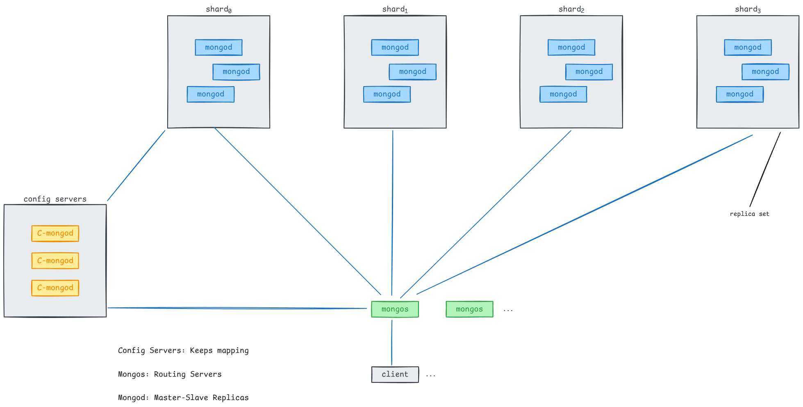

# MIT 6.5840(2024) Lab 5A
## 1. 任务
First you'll implement the shard controller, in `shardctrler/server.go` and `client.go`, and a sharded key/value server that can handle an unchanging (static) configuration.  When you're done, your code should pass all the tests in the `shardctrler/`directory, and the `5A` tests in `shardkv/`.

The shardctrler manages a sequence of numbered configurations. Each configuration describes a set of replica groups and an assignment of shards to replica groups. Whenever this assignment needs to change, the shard controller creates a new configuration with the new assignment. Key/value clients and servers contact the `shardctrler` when they want to know the current (or a past) configuration.

Your implementation must support the RPC interface described in `shardctrler/common.go`, which consists of `Join`, `Leave`, `Move`, and `Query` RPCs. These RPCs are intended to allow an administrator (and the tests) to control the shardctrler: to add new replica groups, to eliminate replica groups, and to move shards between replica groups.

The `Join` RPC is used by an administrator to add new replica groups. Its argument is a set of mappings from unique, non-zero replica group identifiers (GIDs) to lists of server names. The `shardctrler` should react by creating a new configuration that includes the new replica groups. The new configuration should divide the shards as evenly as possible among the full set of groups, and should move as few shards as possible to achieve that goal. The `shardctrler` should allow re-use of a GID if it's not part of the current configuration (i.e. a GID should be allowed to Join, then Leave, then Join again).

The `Leave` RPC's argument is a list of GIDs of previously joined groups. The `shardctrler` should create a new configuration that does not include those groups, and that assigns those groups' shards to the remaining groups. The new configuration should divide the shards as evenly as possible among the groups, and should move as few shards as possible to achieve that goal.

The `Move` RPC's arguments are a shard number and a GID. The `shardctrler` should create a new configuration in which the shard is assigned to the group. The purpose of `Move` is to allow us to test your software. A `Join` or `Leave` following a `Move` will likely un-do the `Move`, since `Join` and `Leave` re-balance.

The `Query` RPC's argument is a configuration number. The shardctrler replies with the configuration that has that number. If the number is -1 or bigger than the biggest known configuration number, the `shardctrler` should reply with the latest configuration. The result of `Query(-1)` should reflect every `Join`, `Leave`, or `Move` RPC that the `shardctrler` finished handling before it received the `Query(-1)` RPC.

The very first configuration should be numbered zero. It should contain no groups, and all shards should be assigned to GID zero (an invalid GID). The next configuration (created in response to a Join RPC) should be numbered 1, &c. There will usually be significantly more shards than groups (i.e., each group will serve more than one shard), in order that load can be shifted at a fairly fine granularity.

> You must implement the interface specified above in client.go and server.go in the shardctrler/ directory. Your shardctrler must be fault-tolerant, using your Raft library from Lab 3/4. You have completed this task when you pass all the tests in shardctrler/.

> [!tip]
> <ol><strong>
> <li>
> Start with a stripped-down copy of your kvraft server.
> </li>
> <li>                        
> You should implement duplicate client request detection for RPCs to the shard controller. The shardctrler tests don't test this, but the shardkv tests will later use your shardctrler on an unreliable network; you may have trouble passing the shardkv tests if your shardctrler doesn't filter out duplicate RPCs.
> </li>
> <li>
> The code in your state machine that performs the shard rebalancing needs to be deterministic. In Go, map iteration order is <a href="https://blog.golang.org/maps#TOC_7.">not deterministic</a>.
> </li>
> <li>
> Go maps are references. If you assign one variable of type map to another, both variables refer to the same map. Thus, if you want to create a new Config based on a previous one, you need to create a new map object (with make()) and copy the keys and values individually.
> </li>
> <li>
> The Go race detector (go test -race) may help you find bugs.
> </li>
> </strong></ol>

Next, in the `shardkv/` directory, implement enough of a sharded key/value server to pass the first two tests in `shardkv/`. Again, start by copying code from your existing `kvraft` server. You should be able to get the first test to pass without doing anything special regarding sharding, since the `shardkv/client.go` we give you takes care of sending RPCs to the group that the controller assigns to the key in question.

For the second `shardkv` test, each k/v replica group must reject requests for keys for shards for which the group is not the assigned group. At this point, it's enough for the k/v servers to periodically ask the controller for the latest configuration, and to check that configuration each time a client Get/Put/Append RPC arrives. Use `key2shard()` (in `client.go`) to find the shard number for a key.

Your server should respond with an `ErrWrongGroup` error to a client RPC with a key that the server isn't responsible for (i.e. for a key whose shard is not assigned to the server's group).

Your server should not call the shard controller's `Join()` handler. The tester will call `Join()` when appropriate.

## 2. 分析
Lab 5A从根本上来说没啥难度，需要注意的就是负载均衡。

### 2.1 配置服务器

Mongodb的分布式集群中的Config Server与Lab 5A所描述的功能十分相似，因此可以依照其结构大致了解实验要求。（本实验中，replica set可以看成raft集群）



### 2.2 Join
等同于replica set的新增，在一个负载均衡的集群中，该操作会对shard分配产生影响。

### 2.3 Leave
等同于replica set的减少，在一个负载均衡的集群中，该操作会对shard分配产生影响。

### 2.4 Query
返回集群状态（shard对应的replica set，以及replica set的servers信息）

### 2.5 Move
一般没这个操作，在本次实验中，是将分片移动到指定replica set

### 2.6 负载均衡
~~感觉没啥说的~~
  - 将负载最大的集群负责的分片转移至负载最小的集群
  - 尽可能少移动已分配的分片，至少幅度不能太大
  - 如果集群数超过最大分片数（NShard），可以不将分片分配给多余集群
  - 每次调度时获取的分片数最大的集群既可以是数组，也可以是单个元素
    - 如果是数组，可以将其看作为队列，每次出队都会将出队集群中的一个分片分配给分片数最小的集群
    - 如果是元素，则将分片分配给分片数最小的集群后，下一次循环需要再查找分片数最大的集群
    - 注意：不管是元素还是数组，调度结束的依据应该是集群分片数的极差不超过1（max - min <=1）
  - 每次调度时获取的分片数最小的集群既可以是数组，也可以是单个元素
    - 方法同上

## 3. 测试结果
``` markdown
Test: Basic leave/join ...
labgob error: lower-case field buffer of Config in RPC or persist/snapshot will break your Raft
  ... Passed
Test: Historical queries ...
  ... Passed
Test: Move ...
  ... Passed
Test: Concurrent leave/join ...
  ... Passed
Test: Minimal transfers after joins ...
  ... Passed
Test: Minimal transfers after leaves ...
  ... Passed
Test: minimal movement again ...
  ... Passed
Test: Multi-group join/leave ...
  ... Passed
Test: Concurrent multi leave/join ...
  ... Passed
Test: Minimal transfers after multijoins ...
  ... Passed
Test: Minimal transfers after multileaves ...
  ... Passed
Test: Check Same config on servers ...
  ... Passed
PASS
ok      6.5840/shardctrler      5.657s
```