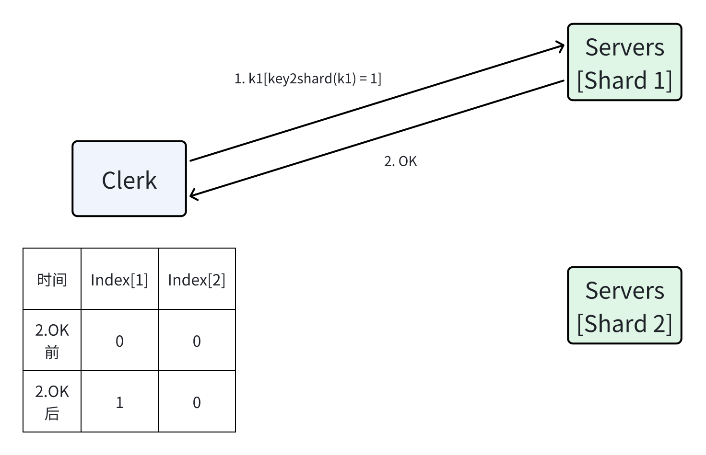

# MIT 6.5840(2024) Lab 5B


## 1. 任务
The main task in this part of the lab is to move shards among replica groups when the controller changes the sharding, and do it in a way that provides linearizable k/v client operations. 
Each of your shards is only required to make progress when a majority of servers in the shard's Raft replica group is alive and can talk to each other, and can talk to a majority of the `shardctrler` servers.  Your implementation must operate (serve requests and be able to re-configure as needed) even if a minority of servers in some replica group(s) are dead, temporarily unavailable, or slow. 

A shardkv server is a member of only a single replica group. The set of servers in a given replica group will never change. 

We supply you with `client.go` code that sends each RPC to the replica group responsible for the RPC's key. It re-tries if the replica group says it is not responsible for the key; in that case, the client code asks the shard controller for the latest configuration and tries again. You'll have to modify client.go as part of your support for dealing with duplicate client RPCs, much as in the kvraft lab.

You will need to make your servers watch for configuration changes, and when one is detected, to start the shard migration process. If a replica group loses a shard, it must stop serving requests to keys in that shard immediately, and start migrating the data for that shard to the replica group that is taking over ownership. If a replica group gains a shard, it needs to wait for the previous owner to send over the old shard data before accepting requests for that shard.

> Implement shard migration during configuration changes. Make sure that all servers in a replica group do the migration at the same point in the sequence of operations they execute, so that they all either accept or reject concurrent client requests. You should focus on passing the second test ("join then leave") before working on the later tests. You are done with this task when you pass all tests up to, but not including, `TestDelete`.
> 
> **NOTE**: Your server will need to periodically poll the shardctrler to learn about new configurations. The tests expect that your code polls roughly every 100 milliseconds; more often it is OK, but much less often may cause problems. 
> 
> **NOTE**: Servers will need to send RPCs to each other in order to transfer shards during configuration changes. The shardctrler's `Config` struct contains server names, but you need a `labrpc.ClientEnd` in order to send an RPC. You should use the `make_end()` function passed to `StartServer()` to turn a server name into a `ClientEnd`. `shardkv/client.go` contains code that does this.

> [!tip]
> <ul>
> <li>
> Process re-configurations one at a time, in order.
> </li>
> <li>
> If a test fails, check for gob errors (e.g. "gob: type not registered for interface ..."). Go doesn't consider gob errors to be fatal, although they are fatal for the lab.
> </li>
> <li>
> You'll need to provide at-most-once semantics (duplicate detection) for client requests across shard movement.
> </li>
> <li>
> Think about how the shardkv client and server should deal with <code>ErrWrongGroup</code>. Should the client change the sequence number if it receives <code>ErrWrongGroup</code>?  Should the server update the client state if it returns <code>ErrWrongGroup</code> when executing a <code>Get</code>/<code>Put</code> request?
> </li>
> <li>
> After a server has moved to a new configuration, it is acceptable for it to continue to store shards that it no longer owns (though this would be regrettable in a real system). This may help simplify your server implementation.
> </li>
> <li>
> When group G1 needs a shard from G2 during a configuration change, does it matter at what point during its processing of log entries G2 sends the shard to G1?
> </li>
> <li>
> You can send an entire map in an RPC request or reply, which may help keep the code for shard transfer simple.
> </li>
> <li>
> If one of your RPC handlers includes in its reply a map (e.g. a key/value map) that's part of your server's state, you may get bugs due to races. The RPC system has to read the map in order to send it to the caller, but it isn't holding a lock that covers the map. Your server, however, may proceed to modify the same map while the RPC system is reading it. The solution is for the RPC handler to include a copy of the map in the reply.
> </li>
> <li>
> If you put a map or a slice in a Raft log entry, and your key/value server subsequently sees the entry on the <code>applyCh</code> and saves a reference to the map/slice in your key/value server's state, you may have a race.  Make a copy of the map/slice, and store the copy in your key/value server's state. The race is between your key/value server modifying the map/slice and Raft reading it while persisting its log.
> </li>
> <li>
> During a configuration change, a pair of groups may need to move shards in both directions between them. If you see deadlock, this is a possible source.
> </li>
> </ul>

### 1.1 No-credit challenge exercises
These two features would be essential if you were to build a system like this for production use.

#### 1.1.1 Garbage collection of state
When a replica group loses ownership of a shard, that replica group should eliminate the keys that it lost from its database. It is wasteful for it to keep values that it no longer owns, and no longer serves requests for. However, this poses some issues for migration. Say we have two groups, G1 and G2, and there is a new configuration C that moves shard S from G1 to G2. If G1 erases all keys in S from its database when it transitions to C, how does G2 get the data for S when it tries to move to C?

> Cause each replica group to keep old shards no longer than absolutely necessary. Your solution must work even if all the servers in a replica group like G1 above crash and are then brought back up. You have completed this challenge if you pass TestChallenge1Delete.

#### 1.1.2 Client requests during configuration changes
The simplest way to handle configuration changes is to disallow all client operations until the transition has completed. While conceptually simple, this approach is not feasible in production-level systems; it results in long pauses for all clients whenever machines are brought in or taken out. It would be better to continue serving shards that are not affected by the ongoing configuration change.

> Modify your solution so that client operations for keys in unaffected shards continue to execute during a configuration change. You have completed this challenge when you pass TestChallenge2Unaffected.

While the optimization above is good, we can still do better. Say that some replica group G3, when                 transitioning to C, needs shard S1 from G1, and shard S2 from G2. We really want G3 to immediately start serving a shard once it has received the necessary state, even if it is still waiting for some other shards. For example, if G1 is down, G3 should still start serving requests for S2 once it receives the appropriate data from G2, despite the transition to C not yet having completed.

> Modify your solution so that replica groups start serving shards the moment they are able to, even if a configuration is still ongoing. You have completed this challenge when you pass TestChallenge2Partial.

## 2. 分析&实现
~~开始着手这个Lab 5B已经距离Lab 5A好几周了，再加上软件工程实践放到大三上学期，代码不得不重新整一套。~~

### 2.1 整体结构
Lab 5B需要组合Lab 5A(Config Server)以及Lab 4(KV Raft Cluster)，完成一个类似于Lab 5A的分析中提及的Mongodb分布式集群结构，这意味着我们需要准确地理解shardctrler各参数的作用

### 2.2 RPC
- Clerk <=> Server
  - 由于KV服务被shardctrler分片，Clerk保存的操作序号应当是数组，数组索引对应分片序号，而数组的数据对应操作序号，对每个分片的操作应当独立计数。简单来说，如果键值K1取哈希值得到整型I1，那么客户端将会对I1对应的分片进行数据操作，应该请求负责该分片的集群S1。当操作请求被集群成功执行时，应当完成I1对应操作序号的自增。
  
  

  - 显然，getIndex应该这么写

    ``` go
    func (ck *Clerk) getIndex(shard int) int64 {
        ck.index[shard]++
        return ck.index[shard]
    }
    ```

  - Clerk的结构也只需要作部分修改

    ``` go
    type Clerk struct {
        sm       *shardctrler.Clerk
        config   shardctrler.Config
        make_end func(string) *labrpc.ClientEnd
        // You will have to modify this struct.
        id    int64
        index [shardctrler.NShards]int64
    }
    ```

  - 从Lab 5A容易得知，shardctrler的基础操作是`Join`、`Leave`、`Query`，这意味着集群所负责的分片会发生变动。当Clerk发送的请求到达集群时，可能就已经不是集群负责的分片了。因此，Clerk与Server的RPC请求应该带有一个能够判断**是否为集群所负责的分片**的参数。最简单的实现应该是shard序号，而不是config版本——不同版本的config可能会将某一个分片分配至同一个集群，如果只因为版本不同而拒绝请求的话，会产生很严重的性能浪费。Clerk与Server的RPC修改如下：

    ``` go
    // Put or Append
    type PutAppendArgs struct {
        // You'll have to add definitions here.
        Key   string
        Value string
        Op    string // "Put" or "Append"
        // You'll have to add definitions here.
        // Field names must start with capital letters,
        // otherwise RPC will break.
        Shard int
        Clerk int64
        Index int64
    }

    type PutAppendReply struct {
        Err Err
    }

    type GetArgs struct {
        Key string
        // You'll have to add definitions here.
        Shard int
        Clerk int64
        Index int64
    }

    type GetReply struct {
        Err   Err
        Value string
    }
    ```

- Server <=> Server
  - 集群与shardctrler的交互不止于请求最新配置(`Query`)，还包括`Join`、`Leave`。显然，由于shardctrler会对分片的分配进行调整，集群与集群之间很有可能会发生数据转移。因此，我们还应当实现集群之间的通信手段，不妨作出以下约定
    - 各集群只需要请求拉取分片数据，而不是请求推送。
    - 推送分片数据的集群需要询问拉取分片数据的集群是否操作完成，当操作完成时，删除分片数据。
    - 集群各分片应当有几种状态：
      - `Waiting`（对配置服务器而言是空闲，可以接受Clerk的操作请求）
      - `Pulling`（正在拉取分片数据，不接受Clerk的请求）
      - `Pushing`（正在推送分片数据，不接受Clerk的请求）
      - `Removed`（分片数据被移除，停止对该分片的服务）
  - 我们可以很容易得出集群通信RPC所需要的参数：
    - 请求拉取分片时，应当带有shard序号以及Config版本；响应拉取分片时，应当返回分片数据。
    - 推送分片集群询问拉取分片集群操作是否完成时，应当带有shard序号以及Config版本。

``` go
type ShardCtrlerArgs struct {
    Shard     int
    Num       int
}
  
type ShardCtrlerReply struct {
    Data      []byte
    Err       Err
    Num       int
}
```

### 2.3 Server
较之前的Server有所改动：
- 需要引入shardctrler相关的参数
  - `mck`：与shardctrler通信
  - `prevConfig`：保存上一个版本的配置
  - `currentConfig`：保存当前版本的配置
  - `status`：各分片的状态（Waiting、Pulling...）
- 不再采用history，改用lastIndex保存历史记录，原因见注解
- ch的传递不再采用指针，换成引用
  - 如果是指针，判断非空会非常别扭(`*responser == nil`)，而且用指针导致我在写代码的过程中踩坑了
  - 引用判断非空十分简单(`responser == nil`)

``` go
type ShardKV struct {
    mu           sync.Mutex
    me           int
    rf           *raft.Raft
    applyCh      chan raft.ApplyMsg
    make_end     func(string) *labrpc.ClientEnd
    gid          int
    ctrlers      []*labrpc.ClientEnd
    maxraftstate int // snapshot if log grows this big

    // Your definitions here.
    dead int32

    db [shardctrler.NShards]map[string]string

    // 重复序号、clerk的Get不强求结果与首次发送一致，而Get不论怎么发送都无法影响数据库
    // 因此Get只需要返回当前数据库对应键值即可
    // 除了kvsrv，重复序号、clerk的PutAppend不需要返回值，所以只要对重复的请求发送Err=OK
    // 也就是说——只要能判断是不是重复请求，这完全不需要保存历史信息
    // 所以，之前的kvraft和shardctrler的history确实没用↓
    // history map[int64]*Record
    // 由于存在分片，clerk的请求可能会发送到不同的组
    // 因此应该用数组保存clerk的指令序列数（否则会影响其他分片的判断）
    lastIndex [shardctrler.NShards]map[int64]int64

    // 异步处理
    // 因此为局部非线性化
    // 整体线性化由Raft集群保证
    // kvraft的 commandIndex => chan的逻辑依然可用
    // 因为能够保证 commandIndex 唯一（依然是一个raft集群）
    ch [shardctrler.NShards]map[int]chan Record
    // 当然还可以用单个channel保证完全线性化
    // ch       chan Record

    // shardctrler
    mck           *shardctrler.Clerk
    prevConfig    shardctrler.Config
    currentConfig shardctrler.Config
    status        [shardctrler.NShards]int

    // 要是Raft.persister大写就好了(Raft.Persister)
    persister   *raft.Persister // for persister.RaftStateSize()
    lastApplied int             // 判断快照/日志是否已应用至状态机
}
```

  - Server中的submit与execute相较于之前没多大改动，Server只需要负责对应的分片数据即可（不对不负责的分区数据进行修改）

``` go
// !(Config匹配&分片可用)
if op.Num != kv.currentConfig.Num || !kv.isShardValid(op.Shard) {
    result.Err = ErrWrongGroup
    kv.response(responser, result)
    return
}
func (kv *ShardKV) isShardValid(shard int) bool {
    return kv.status[shard] == Waiting && kv.currentConfig.Shards[shard] == kv.gid
}
```

### 2.4 Shard
不得不说，这个实验中，怎么**完成配置的同步**才是重点。

#### 2.4.1 分片数据初始状态
在上面，我们下了一个定义，这里简要来说就是
- `Waiting`：分片数据完成更改，可对外服务
- `Pulling`：分片数据未完成拉取，不可对外服务
- `Pushing`：分片数据未完成推送，不可对外服务
- `Removed`：分片数据完成推送并删除，不可对外服务

在某个服务器初始化时，其各分片数据都是不可用的——毕竟还没拿到所负责的分片数据。那么该服务器的所有分片数据都不可对外服务，首先排除`Waiting`。而`Pulling`和`Pushing`显然需要获取最新版本的配置服务器才能有依据地切换至这两个状态，肯定不能一开始就是这两个状态之一。所以，分片数据的初始状态应该是`Removed`——不接受`Clerk`的`KV`请求与其他服务器的`Pulling`请求。

#### 2.4.2 兼容raft
配置服务器对分片分配的每一次调整，都有可能会对状态机的状态进行更改。从之前的实验不难发现，状态机的每一次更改都必须有一条对应的日志在raft集群中达成共识。所以，分片调整不应当直接应用到状态机，而是要和KV服务一样（以此保证一致性）：在raft集群中达成共识 => raft集群提交日志 => 应用到状态机。

在这种情况下，集群提交的日志不妨划分为以下几类：
- KV操作
- 拉取操作（应用分片数据到状态机）
- 移除操作（从状态机删除分片数据）
- 配置更新（应用配置到状态机）
- ~~nil（可能是我写出了个bug）~~

#### 2.4.3 配置更新
服务器必须定时向shardctrler发送`Query(-1)`以获取最新版本的配置，获得最新版本的配置后，将更新配置的日志提交至raft集群

定期获取最新版本配置的代码（注意只有Leader能发送这类请求，因为在之前的实验中只有Leader可以接受外部数据并提交日志到集群，这里也是同样的道理）：

``` go
func (kv *ShardKV) configPuller() {
    for !kv.killed() {
        if kv.isLeader() {
            kv.mu.Lock()
            if kv.isShardUnoccupied() {
                config := kv.mck.Query(kv.currentConfig.Num + 1)
                if config.Num == kv.currentConfig.Num+1 {
                    kv.rf.Start(Command{Type: UpdateConfig, Op: UpdateConfigOp{Config: config}})
                }
            }
            kv.mu.Unlock()
        }
        time.Sleep(CommonInterval)
    }
}
```

集群达成共识后，应用到状态机，此时状态机的分片数据可能会有**删除**、**推送**、**拉取**、**保持不变**这四个操作。
- 当`prevConfig`对应分片数据在其他状态机，而`currentConfig`对应分片数据在本状态机时，则认为需要**拉取**
  - 如果在`prevConfig`中，分片数据未被持有（`shard = 0`），则认为该分片数据为空，不需要拉取，可对外提供服务（`Waiting`）
  - 反之，则认为该分片数据被另一个状态机持有（`shard != 0`），且分片数据不为空，需要拉取（`Pulling`）
- 当`prevConfig`对应分片数据在本状态机，而`currentConfig`对应分片数据不在本状态机时，则认为**需要推送**
  - 如果在`prevConfig`中，分片数据未被持有（`shard = 0`），则认为该分片数据为空，不需要推送，可视为被删除（`Removed`）
  - 反之，则认为该分片数据需要应用到另一个状态机（`shard != 0`），且分片数据不为空，需要推送（`Pushing`）
- 除以上情况外的分片数据可视为未发生变动，状态保持为二者之一：对外提供服务（`Waiting`）、不可对外服务（`Removed`）

``` go
func (kv *ShardKV) updateConfig(op *UpdateConfigOp) {
    kv.mu.Lock()
    defer kv.mu.Unlock()
    defer kv.persist()

    config := op.Config

    // 日志需要保证是下一个
    // 否则prevConfig无法赋值
    if config.Num != kv.currentConfig.Num+1 {
        return
    }

    // 需要Shard均未被占用才可以更新
    if !kv.isShardUnoccupied() {
        return
    }

    // 更新配置
    kv.prevConfig = kv.currentConfig
    kv.currentConfig = config

    for i := range config.Shards {
        // 这个操作表明prev与current需要遵循严格的相邻关系
        // 分片在先前的节点而不在当前的节点,则需要拉取
        // kv.prevConfig.Shards[i] != kv.gid && kv.currentConfig.Shards[i] == kv.gid
        if kv.isShardNeedPull(i) {
            if !kv.isPrevShardContainData(i) {
                // The very first configuration should be numbered zero.
                // It should contain no groups, and all shards should be assigned to GID zero (an invalid GID).
                // 0代表无数据，不需要更改
                kv.status[i] = Waiting
            } else {
                kv.status[i] = Pulling
            }
        }

        // 同理，当分片在当前的节点而不在最新配置(currentConfig)选择的节点,则需要推送
        if kv.isShardNeedPush(i) {
            if !kv.isCurrentShardContainData(i) {
                // 移除分片或者声明为空
                kv.status[i] = Removed
            } else {
                kv.status[i] = Pushing
            }
        }
    }
}
```

#### 2.4.4 Waiting
上文将`Waiting`定性为可服务状态。若集群的分片数据不在该状态下，一切KV请求都将被拒绝并返回`ErrWrongGroup`以保证数据一致性。

以下是一段简单的例子：

``` go
func (kv *ShardKV) Get(args *GetArgs, reply *GetReply) {
    ...
    kv.mu.Lock()
    if !kv.isShardValid(args.Shard) {
        // 属于该shard的组
        reply.Err = ErrWrongGroup
        kv.mu.Unlock()
        return
    }
    ...
}

func (kv *ShardKV) isShardValid(shard int) bool {
    return kv.status[shard] == Waiting && kv.currentConfig.Shards[shard] == kv.gid
}
```

#### 2.4.5 Pulling
在稳定的情况下，各个repica set（或者说raft集群）的分片数据要么是`Waiting`，要么是`Removed`，对于`Pulling`而言，它的下一个状态应该是`Waiting`。

我们可以开一个协程，专门处理这种状态的数据。

当遇到Pulling状态的本集群分片数据时，向对应集群请求分片数据。

``` go
func (kv *ShardKV) shardPuller() {
    for !kv.killed() {
        if kv.isLeader() {
            kv.mu.Lock()
            for i := range kv.status {
                if kv.status[i] == Pulling {
                    args := &ShardCtrlerArgs{
                        Shard: i,
                        Num:   kv.currentConfig.Num,
                    }
                    go kv.sendPullRequest(kv.prevConfig.Groups[kv.prevConfig.Shards[i]], args)
                }
            }
            kv.mu.Unlock()
        }
        time.Sleep(CommonInterval)
    }
}

func (kv *ShardKV) sendPullRequest(group []string, args *ShardCtrlerArgs) {
    for _, server := range group {
        reply := &ShardCtrlerReply{}
        ok := kv.make_end(server).Call("ShardKV.PullRequestHandler", args, reply)
        if ok && reply.Err == OK {
            kv.rf.Start(Command{
                Type: PullShard,
                Op: PullShardOp{
                    Shard: args.Shard,
                    Data:  reply.Data,
                    Num:   args.Num,
                },
            })
            return
        }
    }
}
```

正常接收（`Err==OK`）到对应集群的分片数据时，将操作提交到集群，等待集群达成共识后，应用到状态机：

``` go
func (kv *ShardKV) pullShard(op *PullShardOp) {
    kv.mu.Lock()
    defer kv.mu.Unlock()
    defer kv.persist()

    // !(Config匹配&状态正确)
    if op.Num != kv.currentConfig.Num || kv.status[op.Shard] != Pulling {
        return
    }

    // 读取分片
    kv.readShard(op.Shard, op.Data)

    // 恢复服务
    kv.status[op.Shard] = Waiting
}
```

#### 2.4.6 Pushing
由于`Pulling`非常主动，`Pushing`只要躺着就行

**注：`Pulling`主动性在这里： `Call("ShardKV.PullRequestHandler", args, reply)`**

``` go
func (kv *ShardKV) PullRequestHandler(args *ShardCtrlerArgs, reply *ShardCtrlerReply) {
    kv.mu.Lock()
    defer kv.mu.Unlock()

    if !kv.isLeader() {
        reply.Err = ErrWrongLeader
        return
    }

    // !(Config匹配&正在推送)
    if kv.currentConfig.Num != args.Num {
        return
    }

    if kv.status[args.Shard] != Pushing {
        return
    }

    reply.Err = OK
    reply.Data = kv.Shard(args.Shard)
}
```

#### 2.4.7 Removed
有`Pulling`就有`Pushing`，有`Waiting`就有`Removed`，所以，`Pushing`的下一个状态是`Removed`。那么什么时候转变成`Removed`呢？解铃还须系铃人，谁发的`Pulling`，谁就来确认`Removed`的应用请求。

我们可以另开一个协程，专门来发`RemovedRPC`

``` go
func (kv *ShardKV) shardRemover() {
    for !kv.killed() {
        if kv.isLeader() {
            kv.mu.Lock()
            for i := range kv.status {
                if kv.status[i] == Pushing {
                    args := &ShardCtrlerArgs{
                        Shard: i,
                        Num:   kv.currentConfig.Num,
                    }
                    go kv.sendRemoveRequest(kv.currentConfig.Groups[kv.currentConfig.Shards[i]], args)
                }
            }
            kv.mu.Unlock()
        }
        time.Sleep(CommonInterval)
    }
}

func (kv *ShardKV) sendRemoveRequest(group []string, args *ShardCtrlerArgs) {
    for _, server := range group {
        reply := &ShardCtrlerReply{}
        ok := kv.make_end(server).Call("ShardKV.RemoveRequestHandler", args, reply)
        if ok && reply.Err == OK {
            kv.rf.Start(Command{
                Type: RemoveShard,
                Op: RemoveShardOp{
                    Shard: args.Shard,
                    Num:   args.Num,
                }})
            return
        }
    }
}
```

接受`RemovedRPC`的集群仅对如下请求传回`Err = OK`：
  - 请求的配置过期：在新版本配置下，旧版本配置的操作都可以认为**已完成**
  - 配置版本一致且被请求集群（也就是`Pulling`集群）已完成分片数据的迁移（状态变成`Waiting`）

``` go
func (kv *ShardKV) RemoveRequestHandler(args *ShardCtrlerArgs, reply *ShardCtrlerReply) {
    kv.mu.Lock()
    defer kv.mu.Unlock()

    if !kv.isLeader() {
        reply.Err = ErrWrongLeader
        return
    }

    if kv.isRemoveRequestHandled(args) {
        reply.Err = OK
    }
}

func (kv *ShardKV) isRemoveRequestHandled(args *ShardCtrlerArgs) bool {
    // 过期配置或操作已完成
    return (kv.currentConfig.Num == args.Num && kv.status[args.Shard] == Waiting) ||
        kv.currentConfig.Num > args.Num
}
```

正常接收（`Err == OK`）到对应集群的分片数据时，将操作提交到集群，等待集群达成共识后，应用到状态机：

``` go
func (kv *ShardKV) removeShard(op *RemoveShardOp) {
    kv.mu.Lock()
    defer kv.mu.Unlock()
    defer kv.persist()

    if kv.currentConfig.Num != op.Num {
        return
    }

    if kv.status[op.Shard] != Pushing {
        return
    }

    // 移除分片
    kv.db[op.Shard] = map[string]string{}
    kv.lastIndex[op.Shard] = map[int64]int64{}
    kv.status[op.Shard] = Removed
}
```

## 3. 测试结果

``` markdown
Test (5A): static shards ...
labgob error: lower-case field buffer of Config in RPC or persist/snapshot will break your Raft
  ... Passed
Test (5A): rejection ...
  ... Passed
Test (5B): join then leave ...
  ... Passed
Test (5B): snapshots, join, and leave ...
  ... Passed
Test (5B): servers miss configuration changes...
  ... Passed
Test (5B): concurrent puts and configuration changes...
  ... Passed
Test (5B): more concurrent puts and configuration changes...
  ... Passed
Test (5B): concurrent configuration change and restart...
  ... Passed
Test (5B): unreliable 1...
  ... Passed
Test (5B): unreliable 2...
  ... Passed
Test (5B): unreliable 3...
  ... Passed
Test: shard deletion (challenge 1) ...
  ... Passed
Test: unaffected shard access (challenge 2) ...
  ... Passed
Test: partial migration shard access (challenge 2) ...
  ... Passed
PASS
ok      6.5840/shardkv  125.732s
```